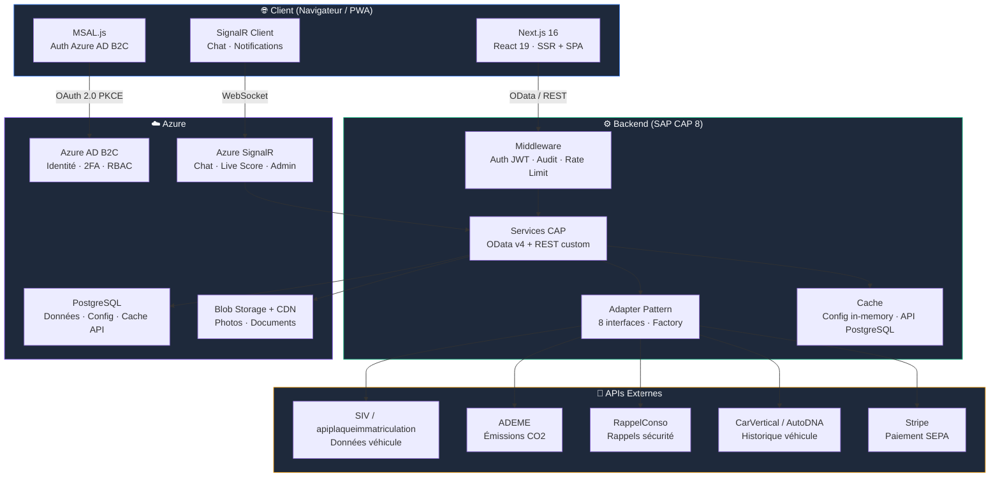
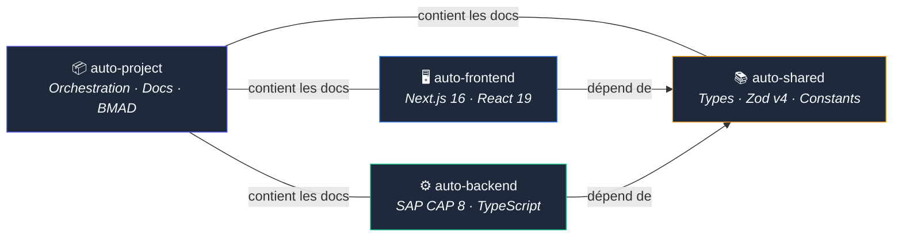
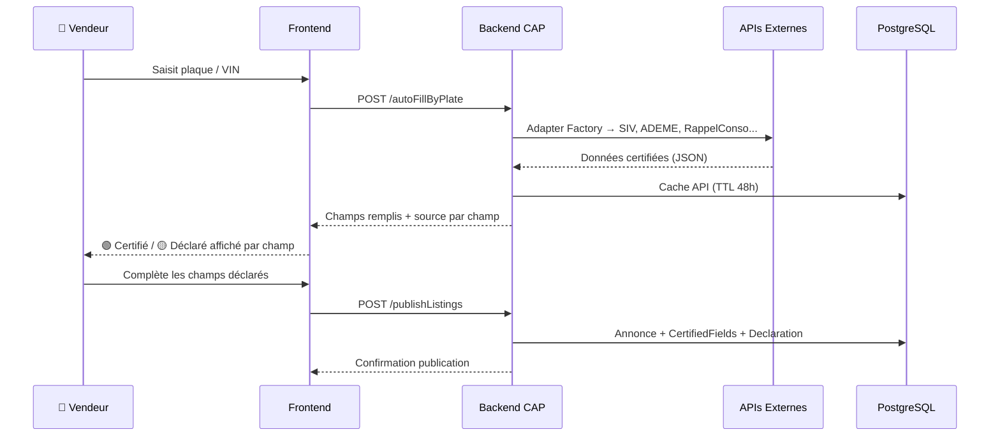
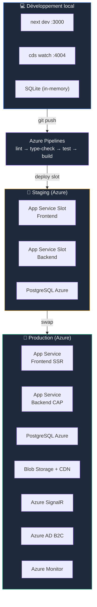
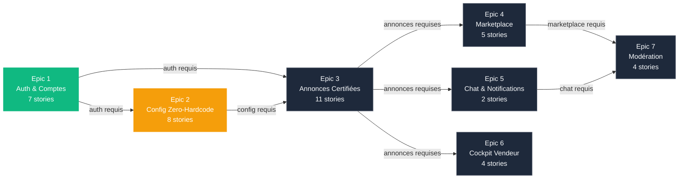

# Auto Platform

Marketplace française de véhicules d'occasion avec **certification au niveau du champ** : chaque donnée d'une annonce est marquée 🟢 Certifié (source API officielle) ou 🟡 Déclaré (saisie vendeur).

**15 EUR/annonce tout inclus** — rapport historique véhicule inclus, 2x moins cher que la concurrence.

## Architecture système



## Organisation multi-repo

Le projet est découpé en **4 dépôts Git indépendants** :



| Repo | Description | Stack | Lien |
|------|-------------|-------|------|
| **auto-project** | Orchestration, documentation, planification BMAD | — | [GitHub](https://github.com/nedjo90/auto-project) |
| **auto-frontend** | Application web (SSR pages publiques + SPA cockpits) | Next.js 16, React 19, Tailwind CSS v4, shadcn/ui, Zustand | [GitHub](https://github.com/nedjo90/auto-frontend) |
| **auto-backend** | API & logique métier | SAP CAP 8, TypeScript, PostgreSQL, Express | [GitHub](https://github.com/nedjo90/auto-backend) |
| **auto-shared** | Types, constantes, validateurs partagés | TypeScript, Zod v4 | [GitHub](https://github.com/nedjo90/auto-shared) |

`auto-frontend` et `auto-backend` dépendent de `@auto/shared` via `file:../auto-shared`.

## Flux de données : de la plaque à l'annonce certifiée



## Infrastructure & déploiement



## Documentation projet

### Planification

| Document | Description | Lien |
|----------|-------------|------|
| **PRD** | Product Requirements Document — vision, critères de succès, parcours utilisateur, 60 FRs + 37 NFRs | [prd.md](_bmad-output/planning-artifacts/prd.md) |
| **Architecture** | Décisions architecturales — stack, data model, auth, API patterns, infra, conventions | [architecture.md](_bmad-output/planning-artifacts/architecture.md) |
| **Epics & Stories** | Découpage en 7 epics / 41 stories avec traçabilité FR → Epic | [epics.md](_bmad-output/planning-artifacts/epics.md) |
| **UX Design** | Spécification UX — design system, parcours utilisateur, composants, diagrammes Mermaid | [ux-design-specification.md](_bmad-output/planning-artifacts/ux-design-specification.md) |
| **Product Brief** | Brief produit initial | [product-brief.md](_bmad-output/planning-artifacts/product-brief-auto-2026-02-08.md) |
| **Implementation Readiness** | Rapport de cohérence PRD ↔ Architecture ↔ UX ↔ Epics | [report.md](_bmad-output/planning-artifacts/implementation-readiness-report-2026-02-08.md) |

### Recherche

| Document | Lien |
|----------|------|
| APIs véhicules état français | [technical-apis-etat-vehicules-research.md](_bmad-output/planning-artifacts/research/technical-apis-etat-vehicules-research-2026-02-07.md) |
| APIs mécaniques | [technical-mechanical-apis-research.md](_bmad-output/planning-artifacts/research/technical-mechanical-apis-research-2026-02-08.md) |
| Alternatives CarVertical | [carvertical-alternatives.md](_bmad-output/planning-artifacts/research/carvertical-alternatives-europe-france-research-2026-02-08.md) |
| Investigation API CarVertical B2B | [carvertical-b2b-api.md](_bmad-output/planning-artifacts/research/carvertical-b2b-api-investigation-2026-02-08.md) |

### Implémentation

| Document | Lien |
|----------|------|
| Dev Plan | [dev-plan.md](_bmad-output/implementation-artifacts/dev-plan.md) |
| Test Plan | [test-plan.md](_bmad-output/implementation-artifacts/test-plan.md) |
| Sprint Status | [sprint-status.yaml](_bmad-output/implementation-artifacts/sprint-status.yaml) |

## Epics & avancement



| Epic | Nom | Stories | Avancement |
|------|-----|---------|------------|
| 1 | Authentification & Gestion des Comptes | 7 | 🟢 7/7 done |
| 2 | Configuration Zero-Hardcode & Administration | 8 | 🟡 7/8 done — audit-trail restant |
| 3 | Création d'Annonces Certifiées & Paiement | 11 | ⚪ ready-for-dev |
| 4 | Marketplace, Recherche & Découverte | 5 | ⚪ ready-for-dev |
| 5 | Communication Temps Réel & Notifications | 2 | ⚪ ready-for-dev |
| 6 | Cockpit Vendeur & Intelligence Marché | 4 | ⚪ ready-for-dev |
| 7 | Modération & Qualité du Contenu | 4 | ⚪ ready-for-dev |

Stories détaillées : [`_bmad-output/implementation-artifacts/`](_bmad-output/implementation-artifacts/)

## Stack technique

| Couche | Technologie |
|--------|-------------|
| Frontend | Next.js 16 (App Router), React 19, TypeScript, Tailwind CSS v4, shadcn/ui, Zustand |
| Backend | SAP CAP 8, Node.js, TypeScript, cds-typer |
| Base de données | SQLite (dev), PostgreSQL (prod) |
| Auth | Azure AD B2C, MSAL.js, JWT, RBAC hybride |
| Temps réel | Azure SignalR (4 hubs : chat, notifications, live-score, admin) |
| Paiement | Stripe (SEPA) |
| Shared | TypeScript, Zod v4, npm package `@auto/shared` |
| Tests | Vitest (frontend, shared), Jest + ts-jest (backend) |
| CI/CD | Azure Pipelines (lint → type-check → test → build → deploy) |
| Infra | Azure App Service, Blob Storage, CDN, Monitor |

## Mise en route

### Prérequis

- Node.js >= 20
- npm >= 10
- Git

### Installation

```bash
# Cloner les 4 repos
git clone https://github.com/nedjo90/auto-project.git auto
cd auto
git clone https://github.com/nedjo90/auto-shared.git
git clone https://github.com/nedjo90/auto-backend.git
git clone https://github.com/nedjo90/auto-frontend.git

# Installer les dépendances (shared en premier)
cd auto-shared && npm install && npm run build && cd ..
cd auto-backend && npm install && cd ..
cd auto-frontend && npm install && cd ..
```

### Lancer en développement

```bash
# Terminal 1 — Backend (port 4004)
cd auto-backend && npm run watch

# Terminal 2 — Frontend (port 3000)
cd auto-frontend && npm run dev
```

### Tests

```bash
cd auto-shared && npm test      # Vitest — 248 tests
cd auto-backend && npm test     # Jest — 458 tests
cd auto-frontend && npm test    # Vitest — 460 tests
```

## Convention de commits

Tous les repos utilisent [Conventional Commits](https://www.conventionalcommits.org/) avec enforcement automatique via **commitlint** + **husky** + **lint-staged**.

### Format

```
type(scope): description
```

### Types autorisés

`feat` · `fix` · `docs` · `style` · `refactor` · `perf` · `test` · `build` · `ci` · `chore` · `revert`

### Scopes par repo

| Repo | Scopes |
|------|--------|
| **auto-frontend** | `auth`, `user`, `listing`, `consent`, `config`, `messaging`, `moderation`, `ui`, `layout`, `store`, `hooks`, `deps`, `release` |
| **auto-backend** | `auth`, `user`, `listing`, `consent`, `config`, `messaging`, `moderation`, `db`, `api`, `middleware`, `deps`, `release` |
| **auto-shared** | `types`, `constants`, `validators`, `utils`, `config`, `deps`, `release` |
| **auto-project** | `bmad`, `docs`, `ci`, `config`, `deps` |

### Hooks Git

- **pre-commit** : `lint-staged` — ESLint + Prettier sur les fichiers staged
- **commit-msg** : `commitlint` — validation du format Conventional Commits

## Licence

UNLICENSED — Projet privé.
