# Auto Platform

Marketplace française de véhicules d'occasion avec **certification au niveau du champ** : chaque donnée d'une annonce est marquée 🟢 Certifié (source API officielle) ou 🟡 Déclaré (saisie vendeur).

**15 EUR/annonce tout inclus** — rapport historique véhicule inclus, 2x moins cher que la concurrence.

## Architecture système

```mermaid
graph TB
    subgraph Client["🌐 Client (Navigateur / PWA)"]
        FE["Next.js 16<br/>React 19 · SSR + SPA"]
        MSAL["MSAL.js<br/>Auth Azure AD B2C"]
        SR_C["SignalR Client<br/>Chat · Notifications"]
    end

    subgraph Backend["⚙️ Backend (SAP CAP 8)"]
        MW["Middleware<br/>Auth JWT · Audit · Rate Limit"]
        SRV["Services CAP<br/>OData v4 + REST custom"]
        ADP["Adapter Pattern<br/>8 interfaces · Factory"]
        CACHE["Cache<br/>Config in-memory · API PostgreSQL"]
    end

    subgraph External["🔌 APIs Externes"]
        SIV["SIV / apiplaqueimmatriculation<br/>Données véhicule"]
        ADEME["ADEME<br/>Émissions CO2"]
        RC["RappelConso<br/>Rappels sécurité"]
        HIS["CarVertical / AutoDNA<br/>Historique véhicule"]
        PAY["Stripe<br/>Paiement SEPA"]
    end

    subgraph Infra["☁️ Azure"]
        ADB2C["Azure AD B2C<br/>Identité · 2FA · RBAC"]
        PG["PostgreSQL<br/>Données · Config · Cache API"]
        BLOB["Blob Storage + CDN<br/>Photos · Documents"]
        SIG["Azure SignalR<br/>Chat · Live Score · Admin"]
    end

    FE -->|"OData / REST"| MW
    MSAL -->|"OAuth 2.0 PKCE"| ADB2C
    SR_C -->|"WebSocket"| SIG
    MW --> SRV
    SRV --> ADP
    SRV --> CACHE
    ADP --> SIV
    ADP --> ADEME
    ADP --> RC
    ADP --> HIS
    ADP --> PAY
    SRV --> PG
    SRV --> BLOB
    SIG --> SRV

    style Client fill:#1e293b,stroke:#3b82f6,color:#f8fafc
    style Backend fill:#1e293b,stroke:#10b981,color:#f8fafc
    style External fill:#1e293b,stroke:#f59e0b,color:#f8fafc
    style Infra fill:#1e293b,stroke:#8b5cf6,color:#f8fafc
```



## Organisation multi-repo

Le projet est découpé en **4 dépôts Git indépendants** :

```mermaid
graph LR
    ROOT["📦 auto-project<br/><i>Orchestration · Docs · BMAD</i>"]
    FE["🖥️ auto-frontend<br/><i>Next.js 16 · React 19</i>"]
    BE["⚙️ auto-backend<br/><i>SAP CAP 8 · TypeScript</i>"]
    SH["📚 auto-shared<br/><i>Types · Zod v4 · Constants</i>"]

    ROOT ---|"contient les docs"| FE
    ROOT ---|"contient les docs"| BE
    ROOT ---|"contient les docs"| SH
    FE -->|"dépend de"| SH
    BE -->|"dépend de"| SH

    click FE "https://github.com/nedjo90/auto-frontend" _blank
    click BE "https://github.com/nedjo90/auto-backend" _blank
    click SH "https://github.com/nedjo90/auto-shared" _blank

    style ROOT fill:#1e293b,stroke:#6366f1,color:#f8fafc
    style FE fill:#1e293b,stroke:#3b82f6,color:#f8fafc
    style BE fill:#1e293b,stroke:#10b981,color:#f8fafc
    style SH fill:#1e293b,stroke:#f59e0b,color:#f8fafc
```



| Repo | Description | Stack | Lien |
|------|-------------|-------|------|
| **auto-project** | Orchestration, documentation, planification BMAD | — | [GitHub](https://github.com/nedjo90/auto-project) |
| **auto-frontend** | Application web (SSR pages publiques + SPA cockpits) | Next.js 16, React 19, Tailwind CSS v4, shadcn/ui, Zustand | [GitHub](https://github.com/nedjo90/auto-frontend) |
| **auto-backend** | API & logique métier | SAP CAP 8, TypeScript, PostgreSQL, Express | [GitHub](https://github.com/nedjo90/auto-backend) |
| **auto-shared** | Types, constantes, validateurs partagés | TypeScript, Zod v4 | [GitHub](https://github.com/nedjo90/auto-shared) |

`auto-frontend` et `auto-backend` dépendent de `@auto/shared` via `file:../auto-shared`.

## Flux de données : de la plaque à l'annonce certifiée

```mermaid
sequenceDiagram
    participant V as 🚗 Vendeur
    participant FE as Frontend
    participant BE as Backend CAP
    participant API as APIs Externes
    participant DB as PostgreSQL

    V->>FE: Saisit plaque / VIN
    FE->>BE: POST /autoFillByPlate
    BE->>API: Adapter Factory → SIV, ADEME, RappelConso...
    API-->>BE: Données certifiées (JSON)
    BE->>DB: Cache API (TTL 48h)
    BE-->>FE: Champs remplis + source par champ
    FE-->>V: 🟢 Certifié / 🟡 Déclaré affiché par champ

    V->>FE: Complète les champs déclarés
    FE->>BE: POST /publishListings
    BE->>DB: Annonce + CertifiedFields + Declaration
    BE-->>FE: Confirmation publication
```



## Infrastructure & déploiement

```mermaid
graph TB
    subgraph Dev["💻 Développement local"]
        D1["next dev :3000"]
        D2["cds watch :4004"]
        D3["SQLite (in-memory)"]
    end

    subgraph Staging["🧪 Staging (Azure)"]
        S1["App Service Slot<br/>Frontend"]
        S2["App Service Slot<br/>Backend"]
        S3["PostgreSQL Azure"]
    end

    subgraph Prod["🚀 Production (Azure)"]
        P1["App Service<br/>Frontend SSR"]
        P2["App Service<br/>Backend CAP"]
        P3["PostgreSQL Azure"]
        P4["Blob Storage + CDN"]
        P5["Azure SignalR"]
        P6["Azure AD B2C"]
        P7["Azure Monitor"]
    end

    Dev -->|"git push"| CI["Azure Pipelines<br/>lint → type-check → test → build"]
    CI -->|"deploy slot"| Staging
    Staging -->|"swap"| Prod

    style Dev fill:#1e293b,stroke:#3b82f6,color:#f8fafc
    style Staging fill:#1e293b,stroke:#f59e0b,color:#f8fafc
    style Prod fill:#1e293b,stroke:#10b981,color:#f8fafc
    style CI fill:#1e293b,stroke:#8b5cf6,color:#f8fafc
```



## Documentation projet

### Planification

| Document | Description | Lien |
|----------|-------------|------|
| **PRD** | Product Requirements Document — vision, critères de succès, parcours utilisateur, 60 FRs + 37 NFRs | [prd.md](_bmad-output/planning-artifacts/prd.md) |
| **Architecture** | Décisions architecturales — stack, data model, auth, API patterns, infra, conventions | [architecture.md](_bmad-output/planning-artifacts/architecture.md) |
| **Epics & Stories** | Découpage en 7 epics / 41 stories avec traçabilité FR → Epic | [epics.md](_bmad-output/planning-artifacts/epics.md) |
| **UX Design** | Spécification UX — design system, parcours utilisateur, composants, diagrammes Mermaid | [ux-design-specification.md](_bmad-output/planning-artifacts/ux-design-specification.md) |
| **Product Brief** | Brief produit initial | [product-brief.md](_bmad-output/planning-artifacts/product-brief-auto-2026-02-08.md) |
| **Implementation Readiness** | Rapport de cohérence PRD ↔ Architecture ↔ UX ↔ Epics | [report.md](_bmad-output/planning-artifacts/implementation-readiness-report-2026-02-08.md) |

### Recherche

| Document | Lien |
|----------|------|
| APIs véhicules état français | [technical-apis-etat-vehicules-research.md](_bmad-output/planning-artifacts/research/technical-apis-etat-vehicules-research-2026-02-07.md) |
| APIs mécaniques | [technical-mechanical-apis-research.md](_bmad-output/planning-artifacts/research/technical-mechanical-apis-research-2026-02-08.md) |
| Alternatives CarVertical | [carvertical-alternatives.md](_bmad-output/planning-artifacts/research/carvertical-alternatives-europe-france-research-2026-02-08.md) |
| Investigation API CarVertical B2B | [carvertical-b2b-api.md](_bmad-output/planning-artifacts/research/carvertical-b2b-api-investigation-2026-02-08.md) |

### Implémentation

| Document | Lien |
|----------|------|
| Dev Plan | [dev-plan.md](_bmad-output/implementation-artifacts/dev-plan.md) |
| Test Plan | [test-plan.md](_bmad-output/implementation-artifacts/test-plan.md) |
| Sprint Status | [sprint-status.yaml](_bmad-output/implementation-artifacts/sprint-status.yaml) |

## Epics & avancement

```mermaid
graph LR
    E1["Epic 1<br/>Auth & Comptes<br/>7 stories"]
    E2["Epic 2<br/>Config Zero-Hardcode<br/>8 stories"]
    E3["Epic 3<br/>Annonces Certifiées<br/>11 stories"]
    E4["Epic 4<br/>Marketplace<br/>5 stories"]
    E5["Epic 5<br/>Chat & Notifications<br/>2 stories"]
    E6["Epic 6<br/>Cockpit Vendeur<br/>4 stories"]
    E7["Epic 7<br/>Modération<br/>4 stories"]

    E1 -->|"auth requis"| E2
    E1 -->|"auth requis"| E3
    E2 -->|"config requis"| E3
    E3 -->|"annonces requises"| E4
    E3 -->|"annonces requises"| E5
    E3 -->|"annonces requises"| E6
    E4 -->|"marketplace requis"| E7
    E5 -->|"chat requis"| E7

    style E1 fill:#10b981,stroke:#10b981,color:#fff
    style E2 fill:#f59e0b,stroke:#f59e0b,color:#fff
    style E3 fill:#1e293b,stroke:#6b7280,color:#f8fafc
    style E4 fill:#1e293b,stroke:#6b7280,color:#f8fafc
    style E5 fill:#1e293b,stroke:#6b7280,color:#f8fafc
    style E6 fill:#1e293b,stroke:#6b7280,color:#f8fafc
    style E7 fill:#1e293b,stroke:#6b7280,color:#f8fafc
```



| Epic | Nom | Stories | Avancement |
|------|-----|---------|------------|
| 1 | Authentification & Gestion des Comptes | 7 | 🟢 7/7 done |
| 2 | Configuration Zero-Hardcode & Administration | 8 | 🟡 7/8 done — audit-trail restant |
| 3 | Création d'Annonces Certifiées & Paiement | 11 | ⚪ ready-for-dev |
| 4 | Marketplace, Recherche & Découverte | 5 | ⚪ ready-for-dev |
| 5 | Communication Temps Réel & Notifications | 2 | ⚪ ready-for-dev |
| 6 | Cockpit Vendeur & Intelligence Marché | 4 | ⚪ ready-for-dev |
| 7 | Modération & Qualité du Contenu | 4 | ⚪ ready-for-dev |

Stories détaillées : [`_bmad-output/implementation-artifacts/`](_bmad-output/implementation-artifacts/)

## Stack technique

| Couche | Technologie |
|--------|-------------|
| Frontend | Next.js 16 (App Router), React 19, TypeScript, Tailwind CSS v4, shadcn/ui, Zustand |
| Backend | SAP CAP 8, Node.js, TypeScript, cds-typer |
| Base de données | SQLite (dev), PostgreSQL (prod) |
| Auth | Azure AD B2C, MSAL.js, JWT, RBAC hybride |
| Temps réel | Azure SignalR (4 hubs : chat, notifications, live-score, admin) |
| Paiement | Stripe (SEPA) |
| Shared | TypeScript, Zod v4, npm package `@auto/shared` |
| Tests | Vitest (frontend, shared), Jest + ts-jest (backend) |
| CI/CD | Azure Pipelines (lint → type-check → test → build → deploy) |
| Infra | Azure App Service, Blob Storage, CDN, Monitor |

## Mise en route

### Prérequis

- Node.js >= 20
- npm >= 10
- Git

### Installation

```bash
# Cloner les 4 repos
git clone https://github.com/nedjo90/auto-project.git auto
cd auto
git clone https://github.com/nedjo90/auto-shared.git
git clone https://github.com/nedjo90/auto-backend.git
git clone https://github.com/nedjo90/auto-frontend.git

# Installer les dépendances (shared en premier)
cd auto-shared && npm install && npm run build && cd ..
cd auto-backend && npm install && cd ..
cd auto-frontend && npm install && cd ..
```

### Lancer en développement

```bash
# Terminal 1 — Backend (port 4004)
cd auto-backend && npm run watch

# Terminal 2 — Frontend (port 3000)
cd auto-frontend && npm run dev
```

### Tests

```bash
cd auto-shared && npm test      # Vitest — 248 tests
cd auto-backend && npm test     # Jest — 458 tests
cd auto-frontend && npm test    # Vitest — 460 tests
```

## Convention de commits

Tous les repos utilisent [Conventional Commits](https://www.conventionalcommits.org/) avec enforcement automatique via **commitlint** + **husky** + **lint-staged**.

### Format

```
type(scope): description
```

### Types autorisés

`feat` · `fix` · `docs` · `style` · `refactor` · `perf` · `test` · `build` · `ci` · `chore` · `revert`

### Scopes par repo

| Repo | Scopes |
|------|--------|
| **auto-frontend** | `auth`, `user`, `listing`, `consent`, `config`, `messaging`, `moderation`, `ui`, `layout`, `store`, `hooks`, `deps`, `release` |
| **auto-backend** | `auth`, `user`, `listing`, `consent`, `config`, `messaging`, `moderation`, `db`, `api`, `middleware`, `deps`, `release` |
| **auto-shared** | `types`, `constants`, `validators`, `utils`, `config`, `deps`, `release` |
| **auto-project** | `bmad`, `docs`, `ci`, `config`, `deps` |

### Hooks Git

- **pre-commit** : `lint-staged` — ESLint + Prettier sur les fichiers staged
- **commit-msg** : `commitlint` — validation du format Conventional Commits

## Licence

UNLICENSED — Projet privé.
