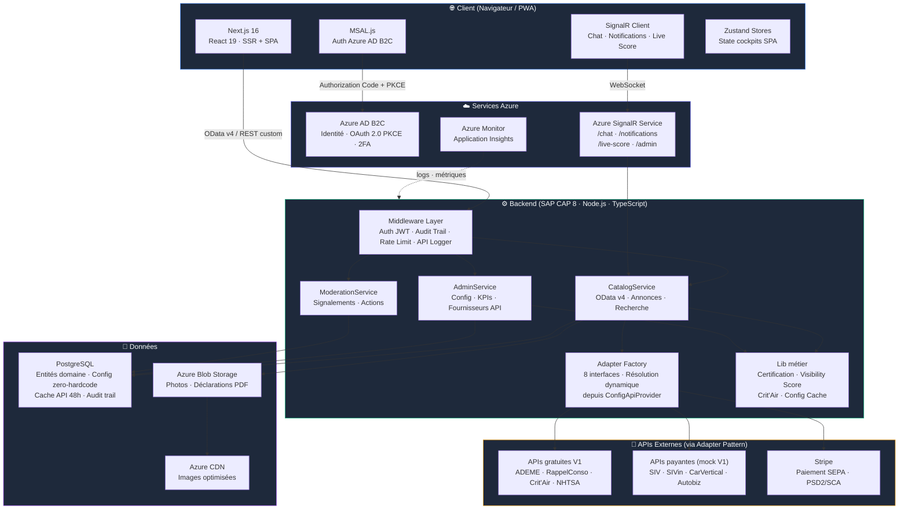
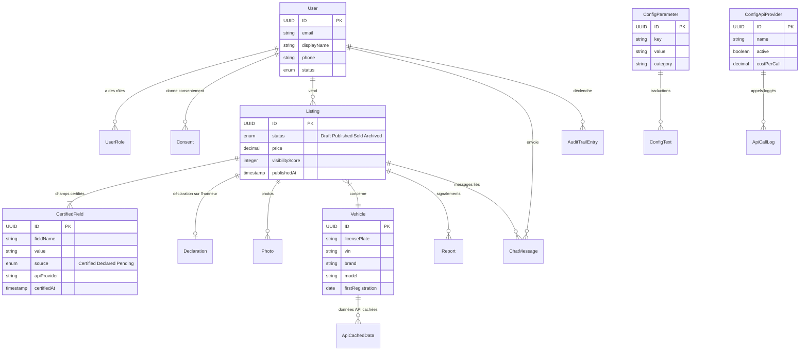
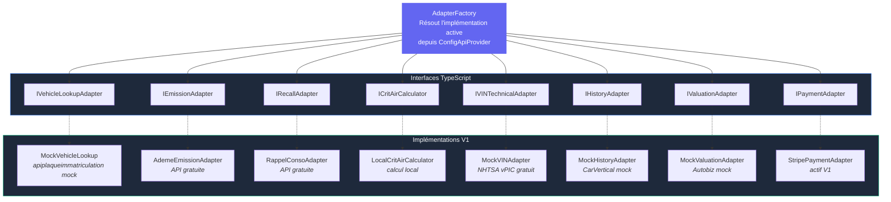
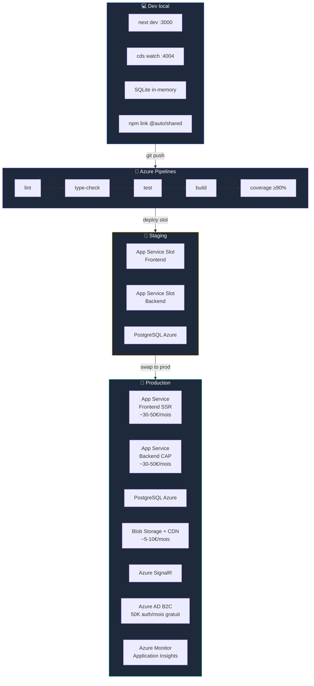

# Architecture Decision Document

_This document builds collaboratively through step-by-step discovery. Sections are appended as we work through each architectural decision together._

## Diagrammes d'architecture

### Vue d'ensemble système



### Modèle de données (entités CDS principales)



### Adapter Pattern — Intégrations API



### Infrastructure & Déploiement



### Frontière SSR / SPA (Next.js App Router)

```mermaid
graph LR
    subgraph Public["(public)/ — SSR · SEO"]
        HP["/ Homepage"]
        LS["/listing/[slug] Fiche annonce"]
        SR["/search Recherche + Filtres"]
        LP["Landing Pages"]
    end

    subgraph Auth["(auth)/"]
        LG["/login"]
        RG["/register"]
        CB["/callback"]
    end

    subgraph Dashboard["(dashboard)/ — SPA · Auth requise"]
        SE["Vendeur<br/>Cockpit · KPIs · Stock"]
        MO["Modérateur<br/>File signalements · Actions"]
        AD["Admin<br/>Config · Dashboard · APIs"]
    end

    Public -->|"mur d'inscription"| Auth
    Auth -->|"après login"| Dashboard

    style Public fill:#1e293b,stroke:#3b82f6,color:#f8fafc
    style Auth fill:#1e293b,stroke:#f59e0b,color:#f8fafc
    style Dashboard fill:#1e293b,stroke:#10b981,color:#f8fafc
```



---

## Project Context Analysis

### Requirements Overview

**Functional Requirements (60 FRs in 9 domains):**

| Domain | FRs | Architectural Impact |
|--------|-----|---------------------|
| Gestion des Annonces | FR1-FR12 | Auto-fill API, certification champ par champ, brouillons/publication par lot, déclaration sur l'honneur horodatée, score de visibilité temps réel |
| Découverte & Recherche | FR13-FR20 | Filtres multi-critères performants, comparaison prix marché, SEO SSR, cards configurables admin, Schema.org |
| Comptes & Identité | FR21-FR29 | RBAC 5 rôles, inscription configurable, RGPD (anonymisation, portabilité, consentement granulaire) |
| Communication & Notifications | FR30-FR32 | Chat temps réel lié au véhicule (SignalR), notifications push multi-device |
| Cockpit Vendeur | FR33-FR36 | Dashboard KPIs, positionnement prix marché, suivi véhicules concurrents |
| Modération & Signalement | FR37-FR42 | Cockpit modération, classification gravité/type, actions (désactiver/avertir/réactiver), historique vendeur |
| Administration & Configuration | FR43-FR54 | Dashboard KPIs temps réel, suivi coûts API/marge, config zero-hardcode complète (APIs, prix, textes, règles, features, SEO, CGU versionnées), audit trail |
| Paiement | FR55-FR57 | Paiement par annonce sélectionnée, groupé, atomicité publication ↔ paiement |
| Résilience | FR58-FR60 | Mode dégradé API, saisie manuelle fallback, re-sync automatique au retour |

**Non-Functional Requirements (37 NFRs in 6 categories):**

| Category | NFRs | Key Constraints |
|----------|------|----------------|
| Performance | NFR1-7 | LCP <2.5s (SSR), auto-fill ~3s, chat <1s, cockpits <2s, recherche <2s, CDN images |
| Sécurité | NFR8-16 | HTTPS/TLS, chiffrement au repos, 2FA pro, PCI-DSS (délégué Stripe), PSD2/SCA, sessions configurables, audit trail, RGPD, logs accès |
| Scalabilité | NFR17-21 | 3K→10K+ annonces, 100K+ visiteurs/mois, extensible sans code (types véhicules, champs, APIs, règles), i18n multi-pays, chat proportionnel |
| Accessibilité | NFR22-27 | WCAG 2.1 AA, RGAA, navigation clavier, contraste 4.5:1, badges accessibles (pas uniquement couleur), formulaires accessibles, sémantique HTML |
| Intégration | NFR28-32 | Adapter Pattern systématique, logging chaque appel API, mode mock dev, auth externe (Azure AD B2C), paiement Stripe SEPA |
| Fiabilité | NFR33-37 | Tolérance 48h API down, mode dégradé automatique, cache local, alertes admin, atomicité paiement/publication |

### Scale & Complexity

- **Primary domain:** Full-stack Web App (SaaS Marketplace/Platform)
- **Complexity level:** High
- **Estimated architectural components:** ~15-20 (auth, vehicle lookup, listing management, certification engine, visibility score engine, chat/messaging, notification service, payment, moderation, admin config, API adapter layer, cache layer, audit/logging, SEO/SSR, file storage/CDN, search/filter engine)

### Technical Constraints & Dependencies

| Constraint | Source | Impact |
|-----------|--------|--------|
| SAP CAP (Node.js) backend | Product Brief — fondateur expertise SAP/ABAP | Framework backend imposé, CDS pour modélisation, services REST auto-générés |
| PostgreSQL | Product Brief | JSONB pour config dynamique, PostGIS pour géolocalisation, full-text search |
| Next.js (React/TypeScript) | Product Brief | SSR + SPA hybride, PWA natif |
| Azure ecosystem | Product Brief | App Service, AD B2C, SignalR, Blob Storage, CDN, Monitor |
| Stripe | PRD | Paiement V1, architecture prête pour Stripe Connect futur |
| 4 APIs gratuites V1 | Research | ADEME, RappelConso, Crit'Air (calcul local), NHTSA vPIC — actives dès V1 |
| APIs payantes en mock V1 | Research | apiplaqueimmatriculation, SIVin, CarVertical/AutoDNA/Autoviza, Autobiz — mocks avec Adapter Pattern |
| Client ancre J1 | PRD | 3 000 véhicules prêts au lancement, pas de cold-start |
| Validation juridique pré-lancement | PRD | CGU/CGV par avocat, RGPD, LCEN, wording "données officielles" |

### Cross-Cutting Concerns Identified

| Concern | Scope | Description |
|---------|-------|-------------|
| **Zero-hardcode config** | Toute l'application | 10+ tables config BDD, cache mémoire invalidé à chaque modification admin, tout paramétrable sans code |
| **Audit trail** | Toutes opérations | Middleware systématique : horodatage, action, acteur sur chaque opération sensible |
| **API logging** | Toutes intégrations | Fournisseur, coût, statut, temps de réponse — pour calcul marge nette par annonce |
| **Certification tracking** | Données annonces | Chaque champ tracé à sa source (API + timestamp) — 🟢 Certifié / 🟡 Déclaré |
| **Cache multi-niveau** | Config + API | Config BDD en mémoire + cache réponses API pour résilience 48h |
| **i18n** | UI + contenus | Architecture prête multi-langue dès V1 (textes en BDD avec clé de langue) |
| **RBAC** | Toutes routes | 5 rôles (visiteur anonyme, acheteur inscrit, vendeur, modérateur, administrateur) |
| **Sécurité** | Toute l'application | HTTPS, chiffrement repos, 2FA, sessions configurables, RGPD, PSD2 |
| **Responsive/PWA** | Frontend | Mobile-first, installable, push, caméra, géolocalisation |

## Starter Template Evaluation

### Primary Technology Domain

Full-stack Web App (SaaS Marketplace/Platform) — deux composants distincts : backend API (SAP CAP) + frontend SSR/SPA (Next.js).

### Starter Options Considered

Ce projet a des choix technologiques imposés par le Product Brief (expertise fondateur SAP/ABAP, écosystème Azure). Les starters sont donc les CLIs officiels des frameworks choisis, pas des alternatives à évaluer.

### Selected Starters

#### Backend : SAP CAP (Node.js + TypeScript + PostgreSQL)

**Starter :** `cds init` — CLI officiel SAP CAP

| Aspect | Détail |
|--------|--------|
| **Version actuelle** | @sap/cds 9.6.4, @sap/cds-dk 9.6.1, @sap/cds-compiler 6.6.2 |
| **PostgreSQL** | `@cap-js/postgres` — plugin drop-in, support natif depuis v7.0.0 |
| **TypeScript** | `@cap-js/cds-types` + `cds-typer` (génération auto des types depuis le modèle CDS) |
| **Structure** | `db/` (modèles domaine), `srv/` (services), `app/` (UI) |

**Commande d'initialisation :**

```bash
cds init auto-backend --add typescript,typer,postgres,sample
```

**Décisions architecturales fournies par le starter :**

- **Language & Runtime :** TypeScript avec `cds-tsx` pour dev, precompilation JS pour production
- **Modélisation :** CDS (Core Data Services) — modèles déclaratifs compilés en DDL/OData/REST
- **Types auto-générés :** `@cds-models/` via `cds-typer` — type safety sur les entités CDS
- **Base de données :** PostgreSQL via `@cap-js/postgres` avec schema evolution automatique
- **Dev experience :** Hot reload via `cds watch`, SQLite en dev local, PostgreSQL en prod
- **API REST :** Services OData/REST auto-générés depuis les modèles CDS
- **Structure projet :** `db/` (schema.cds + data/), `srv/` (services + handlers), `app/` (UI assets)

**À ajouter manuellement :**
- Azure AD B2C auth (custom middleware CAP)
- Azure SignalR (intégration WebSocket)
- Adapter Pattern pour APIs externes
- Tables config zero-hardcode (modèles CDS)
- Audit trail middleware
- API logging middleware

#### Frontend : Next.js (React + TypeScript + App Router + PWA)

**Starter :** `create-next-app` — CLI officiel Vercel

| Aspect | Détail |
|--------|--------|
| **Version actuelle** | Next.js 16.1.6 |
| **Router** | App Router (recommandé) |
| **PWA** | Via `serwist` ou `@ducanh2912/next-pwa` |
| **Styling** | Tailwind CSS (intégré CLI) |

**Commande d'initialisation :**

```bash
npx create-next-app@latest auto-frontend --typescript --tailwind --app --src-dir
```

**Décisions architecturales fournies par le starter :**

- **Language & Runtime :** TypeScript, React 19+
- **Routing :** App Router avec `src/app/` (layouts, pages, loading, error boundaries)
- **Rendu :** SSR par défaut (Server Components), opt-in SPA (`"use client"`)
- **Styling :** Tailwind CSS configuré
- **Build :** Turbopack (dev), Webpack (prod)
- **Linting :** ESLint configuré
- **Structure :** `src/app/` avec conventions Next.js (page.tsx, layout.tsx, etc.)

**À ajouter manuellement :**
- PWA (manifest.json, service worker via `serwist`)
- Azure AD B2C auth (via MSAL ou `next-auth`)
- Azure SignalR client SDK
- Bibliothèque composants UI (shadcn/ui recommandé pour Tailwind)
- i18n (next-intl)
- State management cockpits SPA

### Architecture Multi-Repo

**3 repositories Git séparés :**

| Repository | Contenu | Déploiement |
|---|---|---|
| `auto-backend` | SAP CAP (Node.js + TypeScript + PostgreSQL) | Azure App Service (backend) |
| `auto-frontend` | Next.js (React + TypeScript + App Router + PWA) | Azure App Service (frontend) |
| `auto-shared` | Types TypeScript + Zod schemas + constants | npm package privé (Azure Artifacts) |

```
auto-backend/           # SAP CAP (cds init)
├── db/                 # Modèles CDS (domaine)
├── srv/                # Services CAP
├── test/               # Tests backend
└── package.json        # Dépendance: @auto/shared

auto-frontend/          # Next.js (create-next-app)
├── src/app/            # App Router
├── src/components/     # Composants React
├── src/__tests__/      # Tests E2E
└── package.json        # Dépendance: @auto/shared

auto-shared/            # Package npm privé
├── types/              # Interfaces TypeScript partagées
├── validators/         # Zod schemas
├── constants/          # Constantes partagées
└── package.json        # Publié sur Azure Artifacts comme @auto/shared
```

**Rationale :** Backend CAP et frontend Next.js sont deux écosystèmes distincts avec des toolchains séparées, déployés sur deux Azure App Services indépendants. Le multi-repo reflète cette réalité : CI/CD simple par repo, historique git propre, déploiements indépendants, `node_modules` léger. Le package `@auto/shared` est publié sur Azure Artifacts (registry npm privé gratuit) et consommé comme dépendance npm standard par les deux repos.

**Workflow de mise à jour `@auto/shared` :**
1. Modifier `auto-shared` → push → CI publie nouvelle version sur Azure Artifacts
2. `auto-backend` et `auto-frontend` : `npm update @auto/shared`
3. Les types sont légers et changent rarement — le coût de synchronisation est minimal

**Note :** L'initialisation des 3 repos et la configuration Azure Artifacts constituent la première story d'implémentation.

## Core Architectural Decisions

### Decision Priority Analysis

**Critical Decisions (Block Implementation):**
- Data modeling : tables CDS normalisées pour le zero-hardcode
- Auth : Azure AD B2C Authorization Code Flow + PKCE
- RBAC : Hybride (AD B2C auth + PostgreSQL autorisation)
- API exposition : Hybride OData + REST custom
- Cache API : PostgreSQL (données certifiées = données métier permanentes)

**Important Decisions (Shape Architecture):**
- Cache config : In-memory V1, interface prête Redis
- SignalR : Hubs séparés par domaine
- UI components : shadcn/ui
- State management : Zustand
- i18n : next-intl + textes BDD
- Error handling : RFC 7807

**Deferred Decisions (Post-MVP):**
- Redis (si scaling horizontal multi-instance)
- Stripe Connect (séquestre, split payments)
- App native (React Native vs Flutter)
- API publique pour logiciels gestion stock pro

### Data Architecture

| Decision | Choice | Version | Rationale |
|----------|--------|---------|-----------|
| **Database** | PostgreSQL | Via @cap-js/postgres (natif depuis CAP v7.0.0) | JSONB pour flexibilité, PostGIS pour géoloc, full-text search. Imposé par Product Brief. |
| **Modélisation config** | Tables CDS normalisées | N/A | Une table CDS par type de config (`config_parameters`, `config_texts`, `config_features`, `config_boost_factors`, `config_vehicle_types`, `config_listing_durations`, `config_report_reasons`, `config_chat_actions`, `config_moderation_rules`, `config_api_providers`). CDS génère auto les types TypeScript, APIs CRUD, et DDL. |
| **Data validation** | CDS annotations + custom handlers | N/A | Validation déclarative via annotations CDS (`@mandatory`, `@assert.range`, etc.) + validation métier dans les handlers CAP. |
| **Migration** | CDS schema evolution | N/A | `@cap-js/postgres` gère le delta automatiquement entre le modèle CDS et l'état BDD. Pas d'outil de migration tiers nécessaire. |
| **Cache config** | In-memory (singleton injectable) | N/A | Interface `IConfigCache` avec implémentation `InMemoryConfigCache`. Invalidation sur chaque mutation admin. Architecture prête pour `RedisConfigCache` si scaling horizontal. |
| **Cache API (résilience 48h)** | PostgreSQL (persisté) | N/A | Les données API sont des données métier permanentes : chaque champ certifié pointe vers l'enregistrement source (fournisseur, timestamp, valeur). Table `api_cached_data` avec TTL configurable et statut (fresh/stale/expired). Mode dégradé : sert les données stale si API down. |

### Authentication & Security

| Decision | Choice | Version | Rationale |
|----------|--------|---------|-----------|
| **Identity Provider** | Azure AD B2C (Entra External ID) | Dernier | Imposé par Product Brief. 50K auth/mois gratuit. 2FA natif. |
| **Auth flow** | Authorization Code Flow + PKCE | OAuth 2.0 | Standard recommandé par Microsoft pour SPA/PWA. Compatible 2FA. Pas de secrets côté client. |
| **Frontend auth** | MSAL.js (@azure/msal-browser) | Dernier | SDK officiel Microsoft pour SPA. Gère tokens, refresh, cache, redirections. |
| **Backend auth middleware** | Custom CAP middleware + JWT validation | N/A | Validation du token JWT Azure via JWKS endpoint. Injection du contexte utilisateur (`req.user`) dans chaque requête CAP. Pas de `@sap/xssec` (conçu pour SAP BTP, pas Azure). |
| **RBAC** | Hybride : AD B2C identité + PostgreSQL permissions | N/A | AD B2C gère l'authentification (qui es-tu). Table `user_roles` en BDD gère l'autorisation (que peux-tu faire). Cohérent avec zero-hardcode : les permissions sont configurables admin. |
| **2FA** | Azure AD B2C MFA natif | N/A | Activé pour comptes professionnels. Configurable via policies AD B2C. |
| **Session** | JWT stateless + refresh token | N/A | Access token courte durée (~1h), refresh token longue durée. Expiration configurable via `config_parameters`. |
| **Chiffrement au repos** | Azure Transparent Data Encryption (TDE) | N/A | PostgreSQL managé Azure = TDE activé par défaut. Chiffrement additionnel applicatif pour données sensibles (SIRET, coordonnées) via `pgcrypto`. |

### API & Communication Patterns

| Decision | Choice | Version | Rationale |
|----------|--------|---------|-----------|
| **API style** | Hybride OData v4 + REST custom | OData v4 | OData auto-généré par CDS pour CRUD (annonces, config, utilisateurs). Actions/fonctions CAP custom pour logique métier (auto-fill, publication+paiement, orchestration APIs). |
| **Error handling** | RFC 7807 (Problem Details) | N/A | Structure standardisée `{ type, title, status, detail, instance }`. CAP supporte nativement les erreurs structurées. |
| **API documentation** | CDS auto-generated + OpenAPI export | OpenAPI 3.0 | CAP génère automatiquement la documentation OData. Export OpenAPI possible via `cds compile --to openapi`. |
| **Rate limiting** | Middleware CAP custom | N/A | Rate limiting par rôle et par endpoint. Configurable via `config_parameters` (zero-hardcode). Stockage compteurs en mémoire V1, Redis si scaling. |
| **Real-time** | Azure SignalR Service — Hubs séparés | N/A | Hub `/chat` (messages acheteur↔vendeur liés au véhicule), Hub `/notifications` (push events), Hub `/live-score` (score visibilité création annonce), Hub `/admin` (KPIs temps réel). Isolation des préoccupations, permissions différentes par hub. |
| **Adapter Pattern** | Interfaces TypeScript + Factory | N/A | 8 interfaces adapter : `IVehicleLookupAdapter`, `IEmissionAdapter`, `IRecallAdapter`, `ICritAirCalculator`, `IVINTechnicalAdapter`, `IHistoryAdapter`, `IValuationAdapter`, `IPaymentAdapter`. Factory résout l'implémentation active depuis `config_api_providers`. |

### Frontend Architecture

| Decision | Choice | Version | Rationale |
|----------|--------|---------|-----------|
| **Component library** | shadcn/ui | Dernier | Composants Radix UI + Tailwind CSS, copiés dans le projet (pas de dépendance externe). Personnalisation totale pour le design premium des annonces. Compatible App Router. |
| **State management** | Zustand | Dernier | Léger (1.2 kB), simple, performant. Pour les cockpits SPA (vendeur, modérateur, admin) avec états complexes (KPIs, filtres, sélections). Compatible React Server Components. |
| **i18n** | next-intl + textes BDD | Dernier | next-intl gère le routing par locale et l'intégration Server Components. Les traductions viennent de la BDD (`config_texts` avec clé de langue), pas de fichiers JSON statiques — cohérent avec zero-hardcode. |
| **SSR vs SPA boundary** | Route groups Next.js | N/A | `(public)/` = SSR (annonces, recherche, landing, SEO). `(dashboard)/` = SPA derrière auth (cockpits vendeur, modérateur, admin). Séparation nette via route groups App Router. |
| **Images** | Next.js Image + Azure Blob Storage + Azure CDN | N/A | Upload vendeur → Azure Blob Storage. Serving → Azure CDN avec optimisation Next.js `<Image>` (lazy loading, formats modernes, responsive). |
| **PWA** | serwist (successeur next-pwa) | Dernier | Service worker pour installabilité, push notifications, accès caméra/géoloc. Compatible Next.js 16 App Router. |
| **Formulaires** | React Hook Form + Zod | Dernier | Formulaires performants (uncontrolled), validation schema Zod partageable avec le backend. Essentiel pour le formulaire création annonce (20+ champs, validation complexe). |

### Infrastructure & Deployment

| Decision | Choice | Version | Rationale |
|----------|--------|---------|-----------|
| **Hosting backend** | Azure App Service (Linux, Node.js) | N/A | Plan B1 en V1 (~30-50€/mois). Scaling vertical puis horizontal. Slots staging/prod pour blue-green. |
| **Hosting frontend** | Azure App Service (Linux, Node.js) | N/A | Next.js en mode standalone. Plan B1 en V1 (~30-50€/mois). SSR nécessite un serveur Node.js (pas de static hosting). |
| **CI/CD** | Azure DevOps Pipelines (YAML) | N/A | Pipelines séparés backend + frontend. Build → Test → Deploy staging → Swap to prod. Mono-repo avec path triggers. |
| **Environments** | dev (local) → staging (Azure slot) → prod (Azure) | N/A | Dev local : SQLite (CAP default) + Next.js dev server. Staging : PostgreSQL Azure + App Service slot. Prod : App Service main slot. |
| **Monitoring** | Azure Monitor + Application Insights | N/A | Logs applicatifs, métriques performance, alertes configurables (marge API, disponibilité fournisseurs, erreurs). Dashboard opérationnel Azure. |
| **CDN** | Azure CDN (Standard) | N/A | Photos véhicules, assets statiques. Endpoint devant Blob Storage. ~5-10€/mois. |
| **File storage** | Azure Blob Storage | N/A | Photos annonces, PDFs (déclarations sur l'honneur), rapports historiques. Containers séparés par type. |

### Decision Impact Analysis

**Implementation Sequence:**
1. Init 3 repos (auto-backend, auto-frontend, auto-shared) + Azure Artifacts registry
2. Modèles CDS domaine (véhicules, annonces, utilisateurs, config)
3. Auth middleware CAP + MSAL frontend
4. RBAC (table `user_roles` + middleware permissions)
5. Config zero-hardcode (10+ tables CDS + cache in-memory + admin CRUD)
6. Adapter Pattern (interfaces + mocks + APIs gratuites)
7. Gestion annonces (CRUD + certification champs + score visibilité)
8. SignalR (chat + notifications)
9. Paiement Stripe (publication conditionnelle)
10. PWA + SEO SSR

**Cross-Component Dependencies:**
- Auth middleware → requis par RBAC → requis par tous les cockpits
- Config zero-hardcode → requis par Adapter Pattern → requis par auto-fill
- Modèles CDS véhicule → requis par annonces → requis par recherche/filtres
- Adapter Pattern → requis par certification champs → requis par score visibilité
- SignalR hubs → requis par chat ET score visibilité live

## Implementation Patterns & Consistency Rules

### Critical Rule: English Technical Naming

**ALL technical naming (files, folders, components, variables, routes, CDS entities, endpoints, events) MUST be in English.** French only appears in i18n texts served from the database (`config_texts` table).

### Naming Patterns

**CDS / Database (SAP CAP conventions — mandatory):**

```cds
// Entities: PascalCase singular
entity Vehicle { ... }
entity Listing { ... }
entity ConfigParameter { ... }
entity CertifiedField { ... }
entity AuditTrailEntry { ... }
entity ApiCallLog { ... }
entity ChatMessage { ... }
entity Declaration { ... }

// Elements: camelCase
entity Vehicle {
  key ID : UUID;
  licensePlate : String(20);
  firstRegistrationDate : Date;
  certifiedFields : Composition of many CertifiedField;
}

// Associations: camelCase, descriptive name
entity Listing {
  vehicle : Association to Vehicle;
  seller  : Association to User;
}

// Enums: PascalCase
type CertificationStatus : String enum { Certified; Declared; Pending; }
type UserRole : String enum { Buyer; Seller; Moderator; Administrator; }
```

PostgreSQL output: CDS compiles to snake_case automatically (`first_registration_date`). Agents MUST NEVER touch DDL directly.

**API / OData:**

```
// Entity sets: PascalCase plural (auto-generated by CAP)
GET /odata/v4/catalog/Vehicles
GET /odata/v4/catalog/Listings?$filter=status eq 'Published'

// Custom actions: camelCase, descriptive verb
POST /odata/v4/catalog/autoFillByPlate
POST /odata/v4/catalog/publishListings
POST /odata/v4/catalog/reportAbuse
POST /odata/v4/catalog/calculateVisibilityScore

// REST custom endpoints (non-OData): kebab-case
POST /api/v1/payment/create-checkout
POST /api/v1/auth/validate-token
GET  /api/v1/market/price-comparison
```

**Frontend (TypeScript/React):**

```typescript
// Component files: kebab-case.tsx
vehicle-card.tsx
listing-form.tsx
seller-dashboard.tsx

// Components: PascalCase
export function VehicleCard({ listing }: VehicleCardProps) { ... }
export function ListingForm() { ... }

// Hooks: camelCase with "use" prefix
useVehicleLookup.ts
useConfigCache.ts
useSignalR.ts

// Utilities: camelCase
formatPrice.ts
getCritAir.ts
calculateVisibilityScore.ts

// Types/Interfaces: PascalCase, "I" prefix for adapter interfaces
interface IVehicleLookupAdapter { ... }
interface IPaymentAdapter { ... }
type ListingStatus = 'Draft' | 'Published' | 'Sold' | 'Archived';

// Variables/functions: camelCase
const listingCount = 42;
function getActiveListings() { ... }

// Constants: SCREAMING_SNAKE_CASE
const MAX_PHOTOS_PER_LISTING = 20;
const API_CACHE_TTL_HOURS = 48;
```

### Structure Patterns

**Backend CAP:**

```
backend/
├── db/
│   ├── schema.cds              # Core domain model
│   ├── config-schema.cds       # Zero-hardcode config tables
│   ├── data/                   # CSV seed data (mock + initial config)
│   │   ├── ConfigParameter.csv
│   │   ├── ConfigText.csv
│   │   └── ConfigFeature.csv
│   └── migrations/
├── srv/
│   ├── catalog-service.cds     # Public service definition (listings, search)
│   ├── catalog-service.ts      # Public service handlers
│   ├── admin-service.cds       # Admin service definition
│   ├── admin-service.ts        # Admin service handlers
│   ├── moderation-service.cds  # Moderation service definition
│   ├── moderation-service.ts   # Moderation service handlers
│   ├── adapters/               # Adapter Pattern — all API integrations
│   │   ├── interfaces/         # TypeScript interfaces (I*Adapter)
│   │   ├── vehicle-lookup/     # IVehicleLookupAdapter implementations
│   │   ├── emission/           # IEmissionAdapter implementations
│   │   ├── history/            # IHistoryAdapter implementations
│   │   └── payment/            # IPaymentAdapter implementations
│   ├── middleware/              # Custom middleware
│   │   ├── auth.ts             # Azure AD B2C JWT validation
│   │   ├── audit-trail.ts      # Systematic operation logging
│   │   ├── api-logger.ts       # API call logging (cost, status)
│   │   └── rate-limiter.ts     # Configurable rate limiting
│   ├── lib/                    # Business utilities
│   │   ├── config-cache.ts     # In-memory config cache
│   │   ├── certification.ts    # Field certification logic
│   │   ├── visibility-score.ts # Visibility score calculation
│   │   └── crit-air.ts         # Local Crit'Air calculation
│   └── external/               # CDS files for external APIs (if mock OData)
├── test/                       # Tests (co-located by service)
│   ├── catalog-service.test.ts
│   ├── admin-service.test.ts
│   └── adapters/
└── package.json
```

**Frontend Next.js:**

```
frontend/
├── src/
│   ├── app/
│   │   ├── (public)/               # SSR routes (SEO)
│   │   │   ├── page.tsx            # Homepage
│   │   │   ├── listing/[slug]/     # Listing detail page (SSR)
│   │   │   ├── search/             # Search + filters (SSR)
│   │   │   └── layout.tsx          # Public layout (header, footer)
│   │   ├── (dashboard)/            # SPA routes (behind auth)
│   │   │   ├── seller/             # Seller cockpit
│   │   │   ├── moderation/         # Moderator cockpit
│   │   │   ├── admin/              # Admin dashboard
│   │   │   └── layout.tsx          # Dashboard layout (sidebar, auth guard)
│   │   ├── (auth)/                 # Auth routes
│   │   │   ├── login/
│   │   │   ├── register/
│   │   │   └── layout.tsx
│   │   ├── api/                    # Next.js route handlers (BFF if needed)
│   │   ├── layout.tsx              # Root layout
│   │   └── globals.css
│   ├── components/
│   │   ├── ui/                     # shadcn/ui components
│   │   ├── listing/                # Listing-related components
│   │   ├── vehicle/                # Vehicle-related components
│   │   ├── chat/                   # Chat components
│   │   ├── dashboard/              # Shared cockpit components
│   │   └── layout/                 # Header, Footer, Sidebar, Nav
│   ├── hooks/                      # Custom hooks
│   ├── lib/                        # Utilities, API clients, config
│   │   ├── api-client.ts           # OData/REST client to backend CAP
│   │   ├── auth.ts                 # MSAL configuration
│   │   ├── signalr.ts              # SignalR client setup
│   │   └── utils.ts                # General utilities
│   ├── stores/                     # Zustand stores
│   │   ├── listing-store.ts
│   │   ├── config-store.ts
│   │   └── notification-store.ts
│   └── types/                      # Frontend-specific types
├── public/
│   ├── manifest.json               # PWA manifest
│   └── icons/
└── package.json
```

**Tests:** co-located in `test/` for backend, `__tests__/` or `.test.tsx` co-located for frontend.

### Format Patterns

**API Responses (custom actions, not OData):**

```typescript
// Success
{
  "success": true,
  "data": { ... },
  "meta": { "timestamp": "2026-02-08T14:30:00Z" }
}

// Error (RFC 7807)
{
  "type": "https://auto.fr/errors/payment-required",
  "title": "Payment Required",
  "status": 402,
  "detail": "Payment must be confirmed before publishing.",
  "instance": "/api/v1/listings/publish"
}
```

**Dates:** ISO 8601 in all APIs (`2026-02-08T14:30:00Z`). Localized display in frontend only.

**JSON fields:** camelCase in all APIs, consistent with TypeScript and CDS auto-generation.

**IDs:** UUID v4 everywhere (CDS `key ID : UUID;`). Never expose auto-increment.

**SEO URLs:** Public-facing slugs may contain French for SEO purposes (`/listing/peugeot-3008-2022-marseille-{id}`), but the Next.js route folder is English (`listing/[slug]/page.tsx`). The French slug is a dynamic parameter, not a route name.

### Communication Patterns

**SignalR Events:**

```typescript
// Naming: domain:action (kebab-case)
"chat:message-sent"
"chat:message-read"
"notification:new-contact"
"notification:listing-viewed"
"score:visibility-updated"
"admin:kpi-updated"

// Payload: always an object with type + data
{
  "type": "chat:message-sent",
  "data": {
    "messageId": "uuid",
    "listingId": "uuid",
    "senderId": "uuid",
    "content": "...",
    "timestamp": "2026-02-08T14:30:00Z"
  }
}
```

**Audit Trail:**

```typescript
{
  "action": "listing.published",
  "actorId": "uuid",
  "actorRole": "Seller",
  "targetType": "Listing",
  "targetId": "uuid",
  "timestamp": "2026-02-08T14:30:00Z",
  "details": { "paymentId": "stripe_pi_xxx", "amount": 1500 }
}
```

**API Call Logging (external calls):**

```typescript
{
  "adapter": "ADEMEEmissionAdapter",
  "provider": "ademe",
  "endpoint": "/records",
  "status": 200,
  "responseTimeMs": 342,
  "cost": 0,
  "listingId": "uuid",
  "timestamp": "2026-02-08T14:30:00Z"
}
```

### Process Patterns

**Error Handling:**

```typescript
// Backend: custom error classes extending CAP Error
class PaymentRequiredError extends Error { status = 402; }
class AdapterUnavailableError extends Error { status = 503; }

// CAP handlers catch and transform to RFC 7807
// Frontend displays user-friendly message based on error "type"

// RULE: NEVER expose stack traces or internal details to the client
// RULE: ALWAYS log the full error server-side via audit trail
```

**Loading States (frontend):**

```typescript
// Zustand convention: each store has explicit loading state
interface ListingStore {
  listings: Listing[];
  isLoading: boolean;       // true during fetch
  isSubmitting: boolean;    // true during mutation
  error: string | null;     // user-friendly error message
}
```

**Validation:**

```
// Shared Zod schemas (shared/ workspace) for critical forms
// Client-side validation (immediate UX) + server-side validation (security)
// RULE: Server validation is authoritative. Client validation is convenience.
```

### Enforcement Guidelines

**All AI Agents MUST:**

1. Follow CDS conventions for all data models (PascalCase entities, camelCase elements)
2. Use English for ALL technical naming — French only in i18n texts from database
3. Use Adapter interfaces (`I*Adapter`) for any external API integration — never direct calls
4. Use `ConfigCache` for any configurable value — never hardcode values
5. Log every external API call via `api-logger` middleware
6. Record every sensitive operation in the audit trail
7. Return RFC 7807 errors for custom endpoints
8. Use UUID v4 for all identifiers
9. Write dates as ISO 8601 in APIs
10. Respect the SSR `(public)/` vs SPA `(dashboard)/` separation in frontend
11. Write comprehensive tests for EVERY piece of code — unit, integration, component, contract
12. Achieve coverage thresholds: ≥90% unit, ≥80% integration, ≥85% component, 100% contract
13. Test happy paths, error paths, edge cases, and boundary values — no superficial tests
14. E2E tests for all 4 critical user journeys (buyer, seller, moderator, admin)

**Anti-Patterns (FORBIDDEN):**

- Hardcoded values anywhere (prices, texts, thresholds, feature flags)
- Direct database queries bypassing CDS service layer
- Direct external API calls bypassing Adapter Pattern
- French naming in code, files, folders, variables, routes, or components
- Exposing auto-increment IDs or internal error details to clients
- Skipping audit trail for sensitive operations
- Storing config in JSON files instead of database tables
- Skipping tests or writing superficial tests
- Submitting code without passing all test suites
- Writing tests that don't assert meaningful behavior

## Testing Strategy — Strict & Comprehensive

### Critical Rule: No Code Without Tests

**EVERY piece of code MUST be accompanied by thorough tests. No exceptions. No "we'll add tests later." Tests are written WITH the code, not after.**

### Test Pyramid & Coverage Targets

| Test Type | Scope | Framework | Coverage Target | Rule |
|---|---|---|---|---|
| **Unit Tests** | Individual functions, utilities, business logic, adapters, handlers | Jest (backend + shared) / Vitest (frontend) | **≥ 90% line coverage** | Every function, every branch, every edge case |
| **Integration Tests** | CAP service handlers + DB, adapter → mock API, middleware chains | Jest + CAP test toolkit (`cds.test()`) | **≥ 80% of service endpoints** | Every OData endpoint, every custom action, every webhook |
| **Component Tests** | React components in isolation | Vitest + React Testing Library | **≥ 85% of components** | Every component with user interactions, every form, every conditional rendering |
| **API Contract Tests** | Backend API responses match expected schemas | Jest + Zod schema validation | **100% of public endpoints** | Every endpoint response validated against its Zod schema |
| **E2E Tests** | Full user journeys across frontend + backend | Playwright | **4 critical journeys minimum** | Buyer search→contact, Seller create→publish→pay, Moderator report→action, Admin config change |
| **Accessibility Tests** | WCAG 2.1 AA compliance | axe-core + Playwright | **0 critical/serious violations** | Every public page, every form, every interactive component |
| **Performance Tests** | Core Web Vitals, API response times | Lighthouse CI + custom benchmarks | **LCP <2.5s, API <2s** | SSR pages measured in CI, API endpoints benchmarked |
| **Security Tests** | OWASP Top 10, auth bypass, injection | OWASP ZAP (CI) + manual review | **0 critical/high findings** | Auth endpoints, payment endpoints, admin endpoints |

### Testing Rules (MANDATORY for All Agents)

**Unit Tests:**
```
- Test every public function and method
- Test happy path + error paths + edge cases + boundary values
- Mock external dependencies (adapters, DB, SignalR)
- Test config-driven behavior with different ConfigParameter values
- Test certification logic: certified vs declared field handling
- Test visibility score calculation with various field combinations
- Test Crit'Air local calculation with all Euro norms
- Adapter tests: test each adapter against its interface contract
- NEVER test implementation details — test behavior and outcomes
```

**Integration Tests:**
```
- Test every CAP service handler with cds.test() and in-memory SQLite
- Test OData queries with $filter, $expand, $orderby, $top, $skip
- Test custom actions (autoFillByPlate, publishListings, reportAbuse, etc.)
- Test middleware chain: auth → rate-limiter → audit-trail → handler → response
- Test payment webhook with valid/invalid Stripe signatures
- Test atomicity: payment failure → no listing published (NFR37)
- Test degraded mode: adapter unavailable → manual fallback (FR58-60)
- Test config cache invalidation: admin changes → cache refreshed
- Test RBAC: each role accesses only its permitted endpoints
```

**Component Tests (Frontend):**
```
- Test every interactive component with React Testing Library
- Test user events: click, type, submit, select, drag
- Test loading states, error states, empty states
- Test certified-field.tsx: displays correct 🟢/🟡 badge + accessible text
- Test listing-form.tsx: auto-fill populates fields, validation errors display
- Test declaration-form.tsx: all checkboxes required, timestamp generated
- Test auth-guard.tsx and role-guard.tsx: redirect unauthenticated/unauthorized users
- Test responsive behavior: mobile vs desktop rendering
- NEVER test internal state — test what the user sees and interacts with
```

**E2E Tests (Playwright):**
```
- Journey 1: Buyer — search → filter → view listing → register → access full data → contact seller via chat
- Journey 2: Seller — register → enter plate → auto-fill → add photos → save draft → batch publish → pay → verify published
- Journey 3: Moderator — login → view reports → open report detail → deactivate listing → send warning
- Journey 4: Admin — login → view KPIs → change API provider → modify pricing → verify audit trail
- Test cross-browser: Chromium, Firefox, WebKit
- Test mobile viewport (375px) for all critical journeys
```

**API Contract Tests:**
```
- Every endpoint response validated against shared Zod schemas
- Test RFC 7807 error responses for all error cases
- Test OData response format ($metadata compliance)
- Test pagination: $top, $skip, $count
- Test that no internal details leak (stack traces, DB errors, internal IDs)
```

### Test Organization

```
backend/
├── test/
│   ├── unit/
│   │   ├── lib/
│   │   │   ├── certification.test.ts
│   │   │   ├── visibility-score.test.ts
│   │   │   ├── crit-air.test.ts
│   │   │   ├── market-price.test.ts
│   │   │   └── config-cache.test.ts
│   │   ├── adapters/
│   │   │   ├── vehicle-lookup.test.ts
│   │   │   ├── emission.test.ts
│   │   │   ├── recall.test.ts
│   │   │   ├── history.test.ts
│   │   │   ├── valuation.test.ts
│   │   │   └── payment.test.ts
│   │   └── middleware/
│   │       ├── auth.test.ts
│   │       ├── audit-trail.test.ts
│   │       ├── api-logger.test.ts
│   │       └── rate-limiter.test.ts
│   ├── integration/
│   │   ├── catalog-service.test.ts
│   │   ├── seller-service.test.ts
│   │   ├── admin-service.test.ts
│   │   ├── moderation-service.test.ts
│   │   ├── payment-service.test.ts
│   │   ├── chat-service.test.ts
│   │   └── rbac.test.ts
│   ├── contract/
│   │   └── api-schemas.test.ts
│   └── fixtures/
│       ├── vehicles.ts
│       ├── listings.ts
│       ├── users.ts
│       └── config.ts

frontend/
├── src/
│   ├── __tests__/            # E2E tests (Playwright)
│   │   ├── buyer-journey.spec.ts
│   │   ├── seller-journey.spec.ts
│   │   ├── moderator-journey.spec.ts
│   │   ├── admin-journey.spec.ts
│   │   └── accessibility.spec.ts
│   ├── components/
│   │   ├── listing/
│   │   │   ├── listing-card.test.tsx
│   │   │   ├── listing-form.test.tsx
│   │   │   ├── certified-field.test.tsx
│   │   │   ├── visibility-score.test.tsx
│   │   │   ├── declaration-form.test.tsx
│   │   │   └── auto-fill-trigger.test.tsx
│   │   ├── search/
│   │   │   ├── search-filters.test.tsx
│   │   │   └── search-results.test.tsx
│   │   ├── chat/
│   │   │   └── chat-window.test.tsx
│   │   ├── moderation/
│   │   │   └── moderation-actions.test.tsx
│   │   └── layout/
│   │       ├── auth-guard.test.tsx
│   │       └── role-guard.test.tsx
│   └── hooks/
│       ├── useVehicleLookup.test.ts
│       ├── useAuth.test.ts
│       └── useSignalR.test.ts
```

### CI Pipeline Integration

**Each repo has its own CI pipeline in Azure DevOps:**

```yaml
# auto-backend pipeline (azure-pipelines.yml)
backend-pipeline:
  1. lint (ESLint + Prettier check)
  2. type-check (tsc --noEmit)
  3. unit-tests (Jest — lib/, adapters/, middleware/)
  4. integration-tests (Jest + cds.test() with SQLite)
  5. contract-tests (Zod schema validation on all endpoints)
  6. build (cds build — must succeed)
  7. coverage-report (fail if below thresholds: ≥90% unit, ≥80% integration)

# auto-frontend pipeline (azure-pipelines.yml)
frontend-pipeline:
  1. lint (ESLint + Prettier check)
  2. type-check (tsc --noEmit)
  3. unit-tests (Vitest — hooks, utilities)
  4. component-tests (Vitest + React Testing Library)
  5. build (next build — must succeed)
  6. e2e-tests (Playwright — Chromium + Firefox + WebKit)
  7. accessibility-tests (axe-core via Playwright)
  8. coverage-report (fail if below thresholds: ≥85% component)

# auto-shared pipeline (azure-pipelines.yml)
shared-pipeline:
  1. lint + type-check
  2. unit-tests (Zod schema tests)
  3. build
  4. publish to Azure Artifacts (@auto/shared)

# GATE: PR cannot merge if ANY step fails
# GATE: Coverage below thresholds = pipeline failure
```

### Test Data Strategy

- **Backend unit/integration:** Fixtures in `test/fixtures/` — deterministic, reproducible
- **Frontend component:** Mock data co-located with tests
- **E2E:** Seed data loaded before each test suite via API calls
- **Config-driven tests:** Test with multiple ConfigParameter values to ensure zero-hardcode works correctly
- **Adapter mock tests:** Each adapter has a mock implementation — tests verify both mock and real implementations conform to the interface contract

## Project Structure & Boundaries

### Complete Project Directory Structure

**3 separate Git repositories:**

#### Repository: auto-backend

```
auto-backend/
├── .editorconfig
├── .eslintrc.json
├── .gitignore
├── .env.example
├── .npmrc                                 # Azure Artifacts registry for @auto/shared
├── azure-pipelines.yml                    # Backend CI/CD pipeline
├── package.json                           # Dependency: @auto/shared
├── tsconfig.json
├── .cdsrc.json                            # CAP configuration
├── db/
│   ├── schema.cds                         # Core domain model (Vehicle, Listing, User, etc.)
│   ├── config-schema.cds                  # Zero-hardcode config tables (10+ tables)
│   ├── audit-schema.cds                   # Audit trail & API logging models
│   └── data/                              # CSV seed data (mock + initial config)
│       ├── auto.db-ConfigParameter.csv
│       ├── auto.db-ConfigText.csv
│       ├── auto.db-ConfigFeature.csv
│       ├── auto.db-ConfigBoostFactor.csv
│       ├── auto.db-ConfigVehicleType.csv
│       ├── auto.db-ConfigListingDuration.csv
│       ├── auto.db-ConfigReportReason.csv
│       ├── auto.db-ConfigChatAction.csv
│       ├── auto.db-ConfigModerationRule.csv
│       ├── auto.db-ConfigApiProvider.csv
│       └── auto.db-UserRole.csv
├── srv/
│   ├── catalog-service.cds                # Public service (listings, search, vehicles)
│   ├── catalog-service.ts                 # Public service handlers
│   ├── seller-service.cds                 # Seller service (cockpit, drafts, publish)
│   ├── seller-service.ts                  # Seller service handlers
│   ├── admin-service.cds                  # Admin service (config, KPIs, API providers)
│   ├── admin-service.ts                   # Admin service handlers
│   ├── moderation-service.cds             # Moderation service (reports, actions)
│   ├── moderation-service.ts              # Moderation service handlers
│   ├── payment-service.cds                # Payment service (checkout, webhooks)
│   ├── payment-service.ts                 # Payment service handlers
│   ├── chat-service.cds                   # Chat service (messages, conversations)
│   ├── chat-service.ts                    # Chat service handlers
│   ├── adapters/                          # Adapter Pattern — all API integrations
│   │   ├── interfaces/                    # TypeScript interfaces (I*Adapter)
│   │   │   ├── IVehicleLookupAdapter.ts
│   │   │   ├── IEmissionAdapter.ts
│   │   │   ├── IRecallAdapter.ts
│   │   │   ├── ICritAirCalculator.ts
│   │   │   ├── IVINTechnicalAdapter.ts
│   │   │   ├── IHistoryAdapter.ts
│   │   │   ├── IValuationAdapter.ts
│   │   │   ├── IPaymentAdapter.ts
│   │   │   └── index.ts                   # Re-exports all interfaces
│   │   ├── factory.ts                     # AdapterFactory — resolves active impl from ConfigApiProvider
│   │   ├── vehicle-lookup/
│   │   │   ├── mock-vehicle-lookup.adapter.ts
│   │   │   └── api-plaque-immat.adapter.ts       # V2: apiplaqueimmatriculation
│   │   ├── emission/
│   │   │   ├── ademe-emission.adapter.ts          # V1: ADEME (free)
│   │   │   └── mock-emission.adapter.ts
│   │   ├── recall/
│   │   │   └── rappel-conso-recall.adapter.ts     # V1: RappelConso (free)
│   │   ├── crit-air/
│   │   │   └── local-crit-air.calculator.ts       # V1: Local calculation (free)
│   │   ├── vin-technical/
│   │   │   ├── nhtsa-vpic.adapter.ts              # V1: NHTSA vPIC (free)
│   │   │   └── mock-vin-technical.adapter.ts
│   │   ├── history/
│   │   │   ├── mock-history.adapter.ts
│   │   │   └── carvertical-history.adapter.ts     # V2: CarVertical
│   │   ├── valuation/
│   │   │   ├── mock-valuation.adapter.ts
│   │   │   └── autobiz-valuation.adapter.ts       # V2: Autobiz
│   │   └── payment/
│   │       └── stripe-payment.adapter.ts           # V1: Stripe
│   ├── middleware/
│   │   ├── auth.ts                        # Azure AD B2C JWT validation + req.user injection
│   │   ├── audit-trail.ts                 # Systematic operation logging
│   │   ├── api-logger.ts                  # API call logging (provider, cost, status, time)
│   │   └── rate-limiter.ts                # Configurable rate limiting per role/endpoint
│   ├── lib/
│   │   ├── config-cache.ts                # IConfigCache + InMemoryConfigCache (Redis-ready)
│   │   ├── certification.ts               # Field certification logic (source tracking)
│   │   ├── visibility-score.ts            # Visibility score calculation engine
│   │   ├── crit-air.ts                    # Local Crit'Air calculation from Euro norm
│   │   ├── market-price.ts                # Market price comparison logic
│   │   └── seo.ts                         # SEO template rendering from config
│   ├── signalr/
│   │   ├── hub-manager.ts                 # SignalR hub initialization and management
│   │   ├── chat-hub.ts                    # /chat hub — buyer↔seller messages
│   │   ├── notification-hub.ts            # /notifications hub — push events
│   │   ├── live-score-hub.ts              # /live-score hub — visibility score updates
│   │   └── admin-hub.ts                   # /admin hub — real-time KPIs
│   └── external/                          # CDS files for external API definitions (if needed)
└── test/
    ├── unit/
    │   ├── lib/
    │   │   ├── certification.test.ts
    │   │   ├── visibility-score.test.ts
    │   │   ├── crit-air.test.ts
    │   │   ├── market-price.test.ts
    │   │   └── config-cache.test.ts
    │   ├── adapters/
    │   │   ├── vehicle-lookup.test.ts
    │   │   ├── emission.test.ts
    │   │   ├── recall.test.ts
    │   │   ├── history.test.ts
    │   │   ├── valuation.test.ts
    │   │   └── payment.test.ts
    │   └── middleware/
    │       ├── auth.test.ts
    │       ├── audit-trail.test.ts
    │       ├── api-logger.test.ts
    │       └── rate-limiter.test.ts
    ├── integration/
    │   ├── catalog-service.test.ts
    │   ├── seller-service.test.ts
    │   ├── admin-service.test.ts
    │   ├── moderation-service.test.ts
    │   ├── payment-service.test.ts
    │   ├── chat-service.test.ts
    │   └── rbac.test.ts
    ├── contract/
    │   └── api-schemas.test.ts
    └── fixtures/
        ├── vehicles.ts
        ├── listings.ts
        ├── users.ts
        └── config.ts
```

#### Repository: auto-frontend

```
auto-frontend/
├── .editorconfig
├── .eslintrc.json
├── .gitignore
├── .env.example
├── .npmrc                                 # Azure Artifacts registry for @auto/shared
├── azure-pipelines.yml                    # Frontend CI/CD pipeline
├── package.json                           # Dependency: @auto/shared
├── tsconfig.json
├── next.config.ts
├── tailwind.config.ts
├── postcss.config.js
├── playwright.config.ts                   # E2E test configuration
├── public/
│   ├── manifest.json                      # PWA manifest
│   ├── sw.ts                              # Service worker (serwist)
│   ├── icons/                             # PWA icons (multiple sizes)
│   ├── robots.txt
│   └── sitemap.xml                        # Auto-generated at build
└── src/
    ├── app/
    │   ├── layout.tsx                     # Root layout (HTML, body, providers)
    │   ├── globals.css                    # Global styles + Tailwind imports
    │   ├── not-found.tsx                  # 404 page
    │   ├── error.tsx                      # Global error boundary
    │   │
    │   ├── (public)/                      # SSR route group — SEO pages
    │   │   ├── layout.tsx                 # Public layout (header, footer, nav)
    │   │   ├── page.tsx                   # Homepage
    │   │   ├── listing/
    │   │   │   └── [slug]/
    │   │   │       ├── page.tsx           # Listing detail (SSR, SEO)
    │   │   │       └── loading.tsx
    │   │   ├── search/
    │   │   │   ├── page.tsx               # Search + filters (SSR)
    │   │   │   └── loading.tsx
    │   │   ├── about/
    │   │   │   └── page.tsx               # About / How it works
    │   │   └── legal/
    │   │       ├── terms/page.tsx         # CGU (from DB)
    │   │       ├── privacy/page.tsx       # Privacy policy (from DB)
    │   │       └── legal-notice/page.tsx  # Mentions légales (from DB)
    │   │
    │   ├── (auth)/                        # Auth route group
    │   │   ├── layout.tsx                 # Auth layout (centered, minimal)
    │   │   ├── login/page.tsx             # Login (MSAL redirect)
    │   │   ├── register/page.tsx          # Registration (configurable fields)
    │   │   └── callback/page.tsx          # OAuth callback handler
    │   │
    │   ├── (dashboard)/                   # SPA route group — behind auth
    │   │   ├── layout.tsx                 # Dashboard layout (sidebar, auth guard, SignalR)
    │   │   ├── seller/
    │   │   │   ├── page.tsx               # Seller cockpit home (KPIs)
    │   │   │   ├── listings/
    │   │   │   │   ├── page.tsx           # My listings list
    │   │   │   │   ├── new/page.tsx       # Create listing (auto-fill form)
    │   │   │   │   └── [id]/
    │   │   │   │       ├── page.tsx       # Edit listing
    │   │   │   │       └── declaration/page.tsx  # Declaration of honor
    │   │   │   ├── drafts/page.tsx        # Drafts management
    │   │   │   ├── publish/page.tsx       # Batch publish + payment
    │   │   │   ├── market/page.tsx        # Market watch (favorites, competitors)
    │   │   │   └── chat/
    │   │   │       ├── page.tsx           # Conversations list
    │   │   │       └── [conversationId]/page.tsx  # Chat thread
    │   │   ├── moderation/
    │   │   │   ├── page.tsx               # Moderation dashboard (reports queue)
    │   │   │   ├── reports/
    │   │   │   │   └── [id]/page.tsx      # Report detail + actions
    │   │   │   └── sellers/
    │   │   │       └── [id]/page.tsx      # Seller history view
    │   │   ├── admin/
    │   │   │   ├── page.tsx               # Admin dashboard (KPIs, revenue, traffic)
    │   │   │   ├── api-providers/page.tsx  # API providers config
    │   │   │   ├── pricing/page.tsx       # Pricing config
    │   │   │   ├── texts/page.tsx         # Texts & i18n config
    │   │   │   ├── features/page.tsx      # Feature toggles
    │   │   │   ├── moderation-rules/page.tsx  # Moderation rules config
    │   │   │   ├── seo/page.tsx           # SEO templates config
    │   │   │   ├── legal/page.tsx         # Legal texts versioning (CGU/CGV)
    │   │   │   └── audit/page.tsx         # Audit trail viewer
    │   │   └── account/
    │   │       ├── page.tsx               # My account / profile
    │   │       ├── settings/page.tsx      # Account settings
    │   │       └── data-export/page.tsx   # GDPR data export
    │   │
    │   └── api/                           # Next.js route handlers (BFF if needed)
    │       └── auth/
    │           └── [...nextauth]/route.ts # Auth route handler
    │
    ├── components/
    │   ├── ui/                            # shadcn/ui base components
    │   │   ├── button.tsx
    │   │   ├── input.tsx
    │   │   ├── card.tsx
    │   │   ├── badge.tsx
    │   │   ├── dialog.tsx
    │   │   ├── select.tsx
    │   │   ├── table.tsx
    │   │   ├── tabs.tsx
    │   │   ├── toast.tsx
    │   │   └── ...                        # Other shadcn/ui components as needed
    │   ├── listing/
    │   │   ├── listing-card.tsx            # Listing card (configurable display)
    │   │   ├── listing-card.test.tsx
    │   │   ├── listing-grid.tsx            # Listings grid/list view
    │   │   ├── listing-detail.tsx          # Full listing detail view
    │   │   ├── listing-form.tsx            # Create/edit listing form
    │   │   ├── listing-form.test.tsx
    │   │   ├── auto-fill-trigger.tsx       # Plate/VIN input with auto-fill
    │   │   ├── auto-fill-trigger.test.tsx
    │   │   ├── certified-field.tsx         # Field with 🟢/🟡 badge
    │   │   ├── certified-field.test.tsx
    │   │   ├── visibility-score.tsx        # Real-time visibility score display
    │   │   ├── visibility-score.test.tsx
    │   │   ├── declaration-form.tsx        # Digital declaration of honor
    │   │   ├── declaration-form.test.tsx
    │   │   └── price-comparison.tsx        # Market price indicator
    │   ├── vehicle/
    │   │   ├── vehicle-specs.tsx           # Vehicle technical specifications
    │   │   ├── vehicle-history.tsx         # Vehicle history report display
    │   │   └── photo-gallery.tsx           # Photo upload & gallery
    │   ├── search/
    │   │   ├── search-filters.tsx          # Advanced search filters panel
    │   │   ├── search-filters.test.tsx
    │   │   ├── search-results.tsx          # Search results with sorting
    │   │   └── filter-badge.tsx            # Active filter badge
    │   ├── chat/
    │   │   ├── chat-window.tsx             # Chat window component
    │   │   ├── chat-window.test.tsx
    │   │   ├── message-bubble.tsx          # Individual message
    │   │   └── conversation-list.tsx       # List of conversations
    │   ├── dashboard/
    │   │   ├── kpi-card.tsx                # KPI display card
    │   │   ├── chart-wrapper.tsx           # Chart container (trend, comparison)
    │   │   ├── data-table.tsx              # Generic data table with sorting/filtering
    │   │   └── stat-trend.tsx              # Stat with trend indicator
    │   ├── moderation/
    │   │   ├── report-card.tsx             # Report summary card
    │   │   ├── report-detail.tsx           # Full report with actions
    │   │   ├── seller-history.tsx          # Seller report history view
    │   │   ├── moderation-actions.tsx      # Action buttons (deactivate, warn, etc.)
    │   │   └── moderation-actions.test.tsx
    │   └── layout/
    │       ├── header.tsx                  # Public header (nav, auth buttons)
    │       ├── footer.tsx                  # Public footer
    │       ├── sidebar.tsx                 # Dashboard sidebar navigation
    │       ├── auth-guard.tsx              # Auth protection wrapper
    │       ├── auth-guard.test.tsx
    │       ├── role-guard.tsx              # RBAC protection wrapper
    │       └── role-guard.test.tsx
    │
    ├── hooks/
    │   ├── useVehicleLookup.ts             # Auto-fill via plate/VIN
    │   ├── useVehicleLookup.test.ts
    │   ├── useConfigCache.ts               # Access to config values from cache
    │   ├── useSignalR.ts                   # SignalR connection & events
    │   ├── useSignalR.test.ts
    │   ├── useAuth.ts                      # MSAL auth state & methods
    │   ├── useAuth.test.ts
    │   ├── useListings.ts                  # Listings CRUD operations
    │   ├── useChat.ts                      # Chat operations
    │   ├── useNotifications.ts             # Push notification management
    │   └── useMediaUpload.ts               # Photo/file upload to Blob Storage
    │
    ├── lib/
    │   ├── api-client.ts                   # OData/REST client to backend CAP
    │   ├── auth.ts                         # MSAL configuration & token management
    │   ├── signalr.ts                      # SignalR client setup (4 hubs)
    │   ├── utils.ts                        # General utilities (formatPrice, formatDate, etc.)
    │   └── seo.ts                          # SEO helpers (structured data, meta)
    │
    ├── stores/
    │   ├── listing-store.ts                # Listing state (current, drafts, filters)
    │   ├── config-store.ts                 # Config cache state
    │   ├── notification-store.ts           # Notification state & badge count
    │   ├── chat-store.ts                   # Chat conversations & messages state
    │   └── auth-store.ts                   # Auth state (user, role, tokens)
    │
    ├── types/
    │   ├── listing.ts                      # Frontend listing types
    │   ├── vehicle.ts                      # Frontend vehicle types
    │   ├── user.ts                         # Frontend user types
    │   └── api.ts                          # API response/request types
    │
    └── __tests__/                          # E2E tests (Playwright)
        ├── buyer-journey.spec.ts
        ├── seller-journey.spec.ts
        ├── moderator-journey.spec.ts
        ├── admin-journey.spec.ts
        └── accessibility.spec.ts
```

#### Repository: auto-shared

```
auto-shared/
├── .editorconfig
├── .eslintrc.json
├── .gitignore
├── azure-pipelines.yml                    # CI: lint + test + build + publish to Azure Artifacts
├── package.json                           # Published as @auto/shared
├── tsconfig.json
├── types/
│   ├── vehicle.ts                         # Shared vehicle interfaces
│   ├── listing.ts                         # Shared listing interfaces
│   ├── config.ts                          # Shared config interfaces
│   ├── certification.ts                   # CertifiedField, CertificationStatus
│   ├── user.ts                            # Shared user/role interfaces
│   └── api-response.ts                    # Shared API response envelope
├── validators/
│   ├── listing.schema.ts                  # Zod schema: listing creation/edit
│   ├── user.schema.ts                     # Zod schema: registration/profile
│   └── declaration.schema.ts              # Zod schema: declaration of honor
├── constants/
│   └── index.ts                           # Shared constants (MAX_PHOTOS, etc.)
└── test/
    └── validators/
        ├── listing.schema.test.ts
        ├── user.schema.test.ts
        └── declaration.schema.test.ts
```

### Requirements to Structure Mapping

**FR Domain → Backend / Frontend Mapping:**

| Domain (FRs) | Backend (CAP Services + Modules) | Frontend (Pages + Components) |
|---|---|---|
| **Gestion des Annonces** (FR1-FR12) | `catalog-service`, `seller-service`, `adapters/*`, `lib/certification.ts`, `lib/visibility-score.ts` | `(dashboard)/seller/listings/*`, `components/listing/*`, `hooks/useVehicleLookup.ts` |
| **Découverte & Recherche** (FR13-FR20) | `catalog-service` (OData $filter, $search), `lib/seo.ts` | `(public)/search/*`, `(public)/listing/*`, `components/search/*`, `components/listing/listing-card.tsx` |
| **Comptes & Identité** (FR21-FR29) | `middleware/auth.ts`, RBAC tables in `schema.cds`, GDPR handlers | `(auth)/*`, `(dashboard)/account/*`, `components/layout/auth-guard.tsx`, `components/layout/role-guard.tsx` |
| **Communication & Notifications** (FR30-FR32) | `chat-service`, `signalr/chat-hub.ts`, `signalr/notification-hub.ts` | `(dashboard)/seller/chat/*`, `components/chat/*`, `hooks/useChat.ts`, `hooks/useNotifications.ts` |
| **Cockpit Vendeur** (FR33-FR36) | `seller-service`, `lib/market-price.ts` | `(dashboard)/seller/*`, `components/dashboard/*` |
| **Modération & Signalement** (FR37-FR42) | `moderation-service` | `(dashboard)/moderation/*`, `components/moderation/*` |
| **Administration & Configuration** (FR43-FR54) | `admin-service`, `config-schema.cds`, `lib/config-cache.ts`, `middleware/audit-trail.ts` | `(dashboard)/admin/*`, `components/dashboard/*` |
| **Paiement** (FR55-FR57) | `payment-service`, `adapters/payment/stripe-payment.adapter.ts` | `(dashboard)/seller/publish/page.tsx` |
| **Résilience** (FR58-FR60) | `adapters/factory.ts` (fallback logic), `lib/config-cache.ts`, `middleware/api-logger.ts` | `hooks/useVehicleLookup.ts` (fallback UI), `components/listing/auto-fill-trigger.tsx` |

**Cross-Cutting Concerns → Structure Mapping:**

| Concern | Backend Location | Frontend Location | Shared Location |
|---|---|---|---|
| **Zero-hardcode config** | `db/config-schema.cds`, `srv/lib/config-cache.ts`, `srv/admin-service.*` | `stores/config-store.ts`, `hooks/useConfigCache.ts` | `shared/types/config.ts` |
| **Audit trail** | `srv/middleware/audit-trail.ts`, `db/audit-schema.cds` | `(dashboard)/admin/audit/page.tsx` | — |
| **API logging** | `srv/middleware/api-logger.ts`, `db/audit-schema.cds` | `(dashboard)/admin/api-providers/page.tsx` | — |
| **Certification tracking** | `srv/lib/certification.ts`, `db/schema.cds` (CertifiedField entity) | `components/listing/certified-field.tsx` | `shared/types/certification.ts` |
| **Cache** | `srv/lib/config-cache.ts` (in-memory), `db/schema.cds` (api_cached_data) | `stores/config-store.ts` | — |
| **i18n** | `db/config-schema.cds` (ConfigText with language key) | `next-intl` config, `stores/config-store.ts` | — |
| **RBAC** | `middleware/auth.ts`, `db/schema.cds` (user_roles) | `components/layout/auth-guard.tsx`, `components/layout/role-guard.tsx` | `shared/types/user.ts` |
| **Responsive/PWA** | — | `public/manifest.json`, `public/sw.ts`, responsive Tailwind | — |

### Architectural Boundaries

**API Boundaries:**

| Boundary | Protocol | Direction | Auth Required |
|---|---|---|---|
| Frontend → Backend (OData) | OData v4 over HTTPS | Request/Response | Per endpoint (configurable) |
| Frontend → Backend (Custom REST) | REST over HTTPS | Request/Response | Yes (JWT) |
| Frontend ↔ Backend (Real-time) | SignalR (WebSocket/SSE) | Bidirectional | Yes (JWT) |
| Backend → External APIs | HTTPS (via Adapter Pattern) | Request/Response | API keys (server-side only) |
| Backend → Azure Blob Storage | Azure SDK | Request/Response | Managed identity |
| Backend → Stripe | Stripe SDK | Request/Response + Webhooks | API key (server-side) |
| Frontend → Azure AD B2C | MSAL.js (OAuth 2.0) | Redirect flow | PKCE |

**Component Boundaries:**

| Boundary | Rule |
|---|---|
| `(public)/` vs `(dashboard)/` | SSR pages NEVER import from `stores/` (Zustand = SPA only). Dashboard pages NEVER use `generateMetadata` for SEO. |
| `components/ui/` | Pure UI primitives. NO business logic, NO API calls, NO store access. Props only. |
| `components/listing/` etc. | Feature components. May use hooks and stores. Must NOT import from other feature component folders directly. |
| `hooks/` | Encapsulate all API calls and side effects. Components call hooks, never `api-client.ts` directly. |
| `stores/` | Zustand stores. Only used in `(dashboard)/` SPA pages and their components. |
| Backend `srv/adapters/` | ALL external API calls go through adapters. Services NEVER call external APIs directly. |
| Backend `srv/middleware/` | Cross-cutting logic. Services are unaware of audit trail, API logging, or rate limiting implementation. |
| Backend `srv/lib/` | Shared business logic. Called by services. No direct DB access — uses CDS query API. |
| `shared/` workspace | Types + validators only. NO runtime code, NO framework imports. Pure TypeScript. |

**Data Flow Boundaries:**

```
                        ┌─────────────────────────────────┐
                        │         Azure AD B2C            │
                        │    (Identity Provider)          │
                        └──────────┬──────────────────────┘
                                   │ JWT tokens
                        ┌──────────▼──────────────────────┐
                        │     Frontend (Next.js)          │
                        │  ┌──────────┐  ┌─────────────┐  │
                        │  │ SSR Pages│  │ SPA Cockpits│  │
                        │  └────┬─────┘  └──────┬──────┘  │
                        └───────┼────────────────┼────────┘
                                │ OData/REST     │ SignalR
                        ┌───────▼────────────────▼────────┐
                        │     Backend (SAP CAP)           │
                        │  ┌────────────────────────────┐ │
                        │  │ Middleware Layer            │ │
                        │  │ (auth, audit, api-logger)  │ │
                        │  └────────────┬───────────────┘ │
                        │  ┌────────────▼───────────────┐ │
                        │  │ Service Layer              │ │
                        │  │ (catalog, seller, admin...) │ │
                        │  └──┬─────────────────────┬───┘ │
                        │     │                     │     │
                        │  ┌──▼──────────┐  ┌──────▼───┐ │
                        │  │ Adapter     │  │ CDS/DB   │ │
                        │  │ Factory     │  │ Layer    │ │
                        │  └──┬──────────┘  └──────┬───┘ │
                        └─────┼────────────────────┼─────┘
                              │                    │
               ┌──────────────▼───┐       ┌───────▼──────────┐
               │ External APIs    │       │ PostgreSQL       │
               │ (ADEME, NHTSA,  │       │ (domain data,    │
               │  RappelConso,   │       │  config tables,  │
               │  Stripe, etc.)  │       │  audit trail)    │
               └──────────────────┘       └──────────────────┘
```

### Key Data Flows

**Flow 1: Auto-Fill by License Plate (FR1)**

```
1. Seller enters license plate in auto-fill-trigger.tsx
2. useVehicleLookup hook → POST /odata/v4/seller/autoFillByPlate
3. seller-service handler:
   a. AdapterFactory resolves active IVehicleLookupAdapter from ConfigApiProvider
   b. Calls adapter → external API (or mock)
   c. api-logger middleware logs the call (provider, cost, status, time)
   d. Parallel calls: IEmissionAdapter (ADEME), IRecallAdapter (RappelConso), ICritAirCalculator (local)
   e. certification.ts marks each returned field as Certified (source, timestamp)
   f. visibility-score.ts calculates initial score
   g. Results cached in api_cached_data table (PostgreSQL, TTL configurable)
4. Response → frontend with certified fields + visibility score
5. live-score-hub pushes score updates as seller modifies fields
```

**Flow 2: Batch Publish + Payment (FR7, FR55-FR57)**

```
1. Seller selects drafts in publish/page.tsx
2. Frontend → POST /api/v1/payment/create-checkout (Stripe)
3. payment-service handler:
   a. Validates all selected listings are valid drafts
   b. Calculates total: count × price (from ConfigParameter)
   c. AdapterFactory resolves IPaymentAdapter → Stripe
   d. Creates Stripe Checkout Session
   e. Returns session URL
4. Seller redirected to Stripe → completes payment
5. Stripe webhook → POST /api/v1/payment/webhook
6. payment-service webhook handler:
   a. Validates Stripe signature
   b. Atomically: update listing status Draft → Published
   c. audit-trail logs the publish + payment event
   d. notification-hub pushes "listings published" to seller
   e. If any step fails → rollback all (atomicity: NFR37)
```

### Development Workflow Integration

**Dev Environment (3 terminals):**
- Terminal 1 — Backend: `cds watch` (hot reload, SQLite in-memory) on port 4004
- Terminal 2 — Frontend: `next dev` (Turbopack) on port 3000
- Proxy: Next.js `rewrites` in `next.config.ts` to forward `/odata/` and `/api/` to `localhost:4004`
- Shared: `npm link @auto/shared` for local development (no publish needed during dev)
- Mock adapters active by default via `ConfigApiProvider` seed data

**Build Process (per repo):**
- auto-shared: `tsc` → compiled to JS + type declarations → published to Azure Artifacts as `@auto/shared`
- auto-backend: `npm install @auto/shared` → `cds build` → compiles CDS + TypeScript
- auto-frontend: `npm install @auto/shared` → `next build` → standalone output (SSR + static)

**Deployment Structure (independent per repo):**
- auto-backend → Azure App Service (Linux, Node.js) with `cds serve`
- auto-frontend → Azure App Service (Linux, Node.js) with `next start`
- Database → Azure Database for PostgreSQL (managed)
- Files → Azure Blob Storage + Azure CDN
- Real-time → Azure SignalR Service (managed)
- Auth → Azure AD B2C (Entra External ID)
- Shared types → Azure Artifacts (npm registry privé)

## Architecture Validation Results

### Coherence Validation ✅

**Decision Compatibility:**

All technology pairs validated for mutual compatibility:

| Pair | Status |
|---|---|
| SAP CAP (Node.js) + PostgreSQL (`@cap-js/postgres`) | ✅ Native since CAP v7.0.0 |
| Next.js 16 App Router + shadcn/ui + Tailwind CSS | ✅ shadcn/ui designed for App Router + Tailwind |
| Azure AD B2C + MSAL.js + CAP custom JWT middleware | ✅ Standard OAuth 2.0 / JWT |
| Azure SignalR Service + Next.js SPA cockpits | ✅ SignalR client SDK compatible React |
| Zustand + React Server Components | ✅ Zustand works in `"use client"` SPA cockpits |
| next-intl + App Router + DB-driven texts | ✅ next-intl supports Server Components + dynamic sources |
| Stripe + CAP custom REST endpoint | ✅ Webhooks REST, no conflict with OData |
| CDS `cds-typer` + shared TypeScript types | ✅ Auto-generated backend types + manual shared types coexist |
| serwist (PWA) + Next.js 16 | ✅ Official next-pwa successor |
| Multi-repo with @auto/shared via Azure Artifacts | ✅ Standard npm private registry |

No contradictions detected. All versions are mutually compatible.

**Pattern Consistency:**

- Naming conventions documented with examples for 6 contexts (CDS, API/OData, Frontend TypeScript, SignalR events, files, variables) — all consistent ✅
- Adapter Pattern: 8 interfaces → factory → config DB — coherent with zero-hardcode ✅
- Error handling: RFC 7807 uniform on custom REST, CDS standard errors on OData ✅
- SignalR events: `domain:action` convention coherent across 4 hubs ✅
- English technical naming rule enforced everywhere ✅

**Structure Alignment:**

- Route groups `(public)/` SSR and `(dashboard)/` SPA — aligned with SSR vs SPA decision ✅
- `srv/adapters/` with factory — aligned with Adapter Pattern decision ✅
- `db/config-schema.cds` — aligned with 10+ zero-hardcode config tables ✅
- `srv/middleware/` — aligned with audit trail, API logging, rate limiting decisions ✅
- `shared/` workspace — aligned with shared Zod schemas + TypeScript interfaces decision ✅

### Requirements Coverage Validation ✅

**Functional Requirements Coverage (60/60):**

| Domain | FRs | Coverage | Backend Support | Frontend Support |
|---|---|---|---|---|
| Gestion des Annonces | FR1-FR12 | ✅ 12/12 | catalog-service, seller-service, adapters/*, lib/certification.ts, lib/visibility-score.ts | listing/*, declaration-form, auto-fill-trigger |
| Découverte & Recherche | FR13-FR20 | ✅ 8/8 | catalog-service (OData $filter, $search), lib/seo.ts | (public)/search/*, listing-card, search-filters |
| Comptes & Identité | FR21-FR29 | ✅ 9/9 | middleware/auth.ts, RBAC tables, GDPR handlers | (auth)/*, account/*, auth-guard, role-guard |
| Communication & Notifications | FR30-FR32 | ✅ 3/3 | chat-service, signalr/chat-hub, signalr/notification-hub | chat/*, useChat, useNotifications |
| Cockpit Vendeur | FR33-FR36 | ✅ 4/4 | seller-service, lib/market-price.ts | (dashboard)/seller/*, dashboard components |
| Modération & Signalement | FR37-FR42 | ✅ 6/6 | moderation-service | (dashboard)/moderation/*, moderation components |
| Administration & Configuration | FR43-FR54 | ✅ 12/12 | admin-service, config-schema.cds, lib/config-cache.ts, middleware/audit-trail.ts | (dashboard)/admin/* pages |
| Paiement | FR55-FR57 | ✅ 3/3 | payment-service, adapters/payment/stripe | (dashboard)/seller/publish/ |
| Résilience | FR58-FR60 | ✅ 3/3 | adapter factory (fallback), config-cache, api-logger | auto-fill-trigger (fallback UI) |

**Non-Functional Requirements Coverage (37/37):**

| Category | NFRs | Coverage | Architectural Support |
|---|---|---|---|
| Performance | NFR1-7 | ✅ 7/7 | SSR for LCP, PostgreSQL API cache, SignalR <1s, Azure CDN images, lazy loading |
| Sécurité | NFR8-16 | ✅ 9/9 | HTTPS Azure, pgcrypto, AD B2C 2FA, Stripe PCI-DSS, PSD2/SCA, audit-trail.ts, GDPR handlers |
| Scalabilité | NFR17-21 | ✅ 5/5 | Azure App Service scaling, zero-hardcode extensibility, i18n architecture, SignalR Service managed |
| Accessibilité | NFR22-27 | ✅ 6/6 | shadcn/ui (Radix = native ARIA), Tailwind contrast, textual badge equivalents, accessible forms |
| Intégration | NFR28-32 | ✅ 5/5 | Adapter Pattern 8 interfaces, api-logger, mock mode, AD B2C, Stripe SEPA |
| Fiabilité | NFR33-37 | ✅ 5/5 | PostgreSQL cache 48h, auto degraded mode, admin alerts, payment atomicity |

### Implementation Readiness Validation ✅

**Decision Completeness:**

- 25+ architectural decisions documented with versions and rationale ✅
- Implementation sequence (10 steps) with dependency chain ✅
- Cross-component dependencies explicitly mapped ✅
- Deferred decisions (post-MVP) clearly separated ✅

**Structure Completeness:**

- Complete project tree with ~150+ explicit files and directories ✅
- Every CDS service has a matching `.cds` + `.ts` file pair ✅
- Every frontend page has an explicit path in the tree ✅
- Seed data CSV files listed for all 10+ config tables ✅
- Dev, build, and deployment workflows documented ✅

**Pattern Completeness:**

- Code examples for every naming convention (CDS, TypeScript, REST, SignalR) ✅
- JSON payload examples for audit trail, API logging, SignalR events ✅
- Error handling with RFC 7807 example + custom error classes ✅
- Zustand store interface convention documented ✅
- Shared Zod validation strategy documented ✅
- 10 enforcement guidelines + 7 anti-patterns (FORBIDDEN) ✅

### Gap Analysis Results

**Critical Gaps:** None — all implementation-blocking elements are documented.

**Important Gaps (non-blocking):**

| # | Gap | Recommendation |
|---|---|---|
| 1 | ~~No detailed testing strategy~~ | **RESOLVED** — Comprehensive testing strategy added with 8 test types, coverage thresholds, and CI pipeline |
| 2 | No detailed CORS/proxy configuration | Standard CAP + Next.js rewrite configuration — documented in respective CLIs |
| 3 | No detailed database migration strategy beyond CDS schema evolution | CDS schema evolution handles deltas automatically — sufficient for V1 |

**Nice-to-Have Gaps:**

| # | Gap | Recommendation |
|---|---|---|
| 1 | Sequence diagrams for all 4 user journeys (only auto-fill and publish detailed) | Can be added during story refinement |
| 2 | Performance budgets (bundle size, image optimization rules) | Define during frontend implementation |
| 3 | Operational runbook (alerts, escalation, rollback procedures) | Define before production launch |

### Architecture Completeness Checklist

**✅ Requirements Analysis**

- [x] Project context thoroughly analyzed (7 input documents)
- [x] Scale and complexity assessed (High, ~15-20 components)
- [x] Technical constraints identified (9 constraints with source and impact)
- [x] Cross-cutting concerns mapped (9 concerns with scope)

**✅ Starter Template Evaluation**

- [x] SAP CAP starter evaluated with current versions (@sap/cds 9.6.4)
- [x] Next.js starter evaluated with current version (16.1.6)
- [x] Multi-repo structure defined (3 repos + Azure Artifacts for @auto/shared)
- [x] Manual additions identified for both starters

**✅ Core Architectural Decisions**

- [x] 25+ decisions across 5 categories (Data, Auth, API, Frontend, Infrastructure)
- [x] Every decision has version, rationale, and impact documented
- [x] Implementation sequence ordered with dependency chain
- [x] Deferred decisions (post-MVP) clearly separated

**✅ Implementation Patterns**

- [x] Naming conventions for 6 contexts with code examples
- [x] Structure patterns for backend and frontend with complete trees
- [x] Format patterns (API responses, dates, IDs, SEO URLs)
- [x] Communication patterns (SignalR events, audit trail, API logging)
- [x] Process patterns (error handling, loading states, validation)
- [x] 10 enforcement guidelines + 7 anti-patterns

**✅ Project Structure**

- [x] Complete directory structure (~150+ files)
- [x] Component boundaries defined (8 boundary rules)
- [x] FR→Structure mapping (9 domains → specific files)
- [x] Cross-cutting concerns → structure mapping
- [x] 2 detailed data flow diagrams (auto-fill, publish+payment)
- [x] Dev/build/deployment workflows documented

### Architecture Readiness Assessment

**Overall Status:** READY FOR IMPLEMENTATION

**Confidence Level:** HIGH — based on complete FR/NFR coverage, technology compatibility verified, and comprehensive patterns with examples.

**Key Strengths:**

1. **Zero-hardcode architecture** with 10+ config tables fully mapped to CDS models, admin services, and frontend pages
2. **Adapter Pattern** with 8 interfaces covers all external integrations — mock V1, real API swap without code changes
3. **Clear SSR/SPA boundary** via Next.js route groups eliminates rendering ambiguity for AI agents
4. **Field-level certification tracking** architecturally integrated end-to-end (adapter → certification.ts → CertifiedField entity → certified-field.tsx)
5. **Comprehensive FR→Structure mapping** enables precise story-to-file routing for implementation agents
6. **English technical naming** rule with explicit examples prevents naming inconsistency

**Areas for Future Enhancement:**

1. Performance budgets and optimization guidelines
3. Operational runbook for production
4. Additional sequence diagrams for all user journeys

### Implementation Handoff

**AI Agent Guidelines:**

- Follow ALL architectural decisions exactly as documented in this document
- Use implementation patterns consistently across all components
- Respect project structure and component boundaries (8 boundary rules)
- Refer to this document for all architectural questions
- Respect the English technical naming rule — French only in i18n texts from database
- Use the FR→Structure mapping to locate where each feature lives

**First Implementation Priority:**

```bash
# Step 1: Create Azure Artifacts feed for @auto/shared
# Configure in Azure DevOps → Artifacts → New feed: "auto-packages"

# Step 2: Initialize auto-shared repo
mkdir auto-shared && cd auto-shared
npm init -y --scope=@auto
# Add types/, validators/, constants/, tsconfig.json
# Configure azure-pipelines.yml to publish to Azure Artifacts

# Step 3: Initialize auto-backend repo
cds init auto-backend --add typescript,typer,postgres,sample
# Add .npmrc pointing to Azure Artifacts for @auto/shared
# npm install @auto/shared

# Step 4: Initialize auto-frontend repo
npx create-next-app@latest auto-frontend --typescript --tailwind --app --src-dir
# Add .npmrc pointing to Azure Artifacts for @auto/shared
# npm install @auto/shared

# Step 5: Create CDS domain models (schema.cds, config-schema.cds, audit-schema.cds)
# Step 6: Auth middleware (Azure AD B2C JWT validation)
# Step 7: RBAC (user_roles table + permission middleware)
# Step 8: Config zero-hardcode (10+ config tables + InMemoryConfigCache + admin CRUD)
# Step 9: Adapter Pattern (interfaces + factory + mocks + free APIs)
# Step 10: Listing management (CRUD + certification + visibility score)
```
