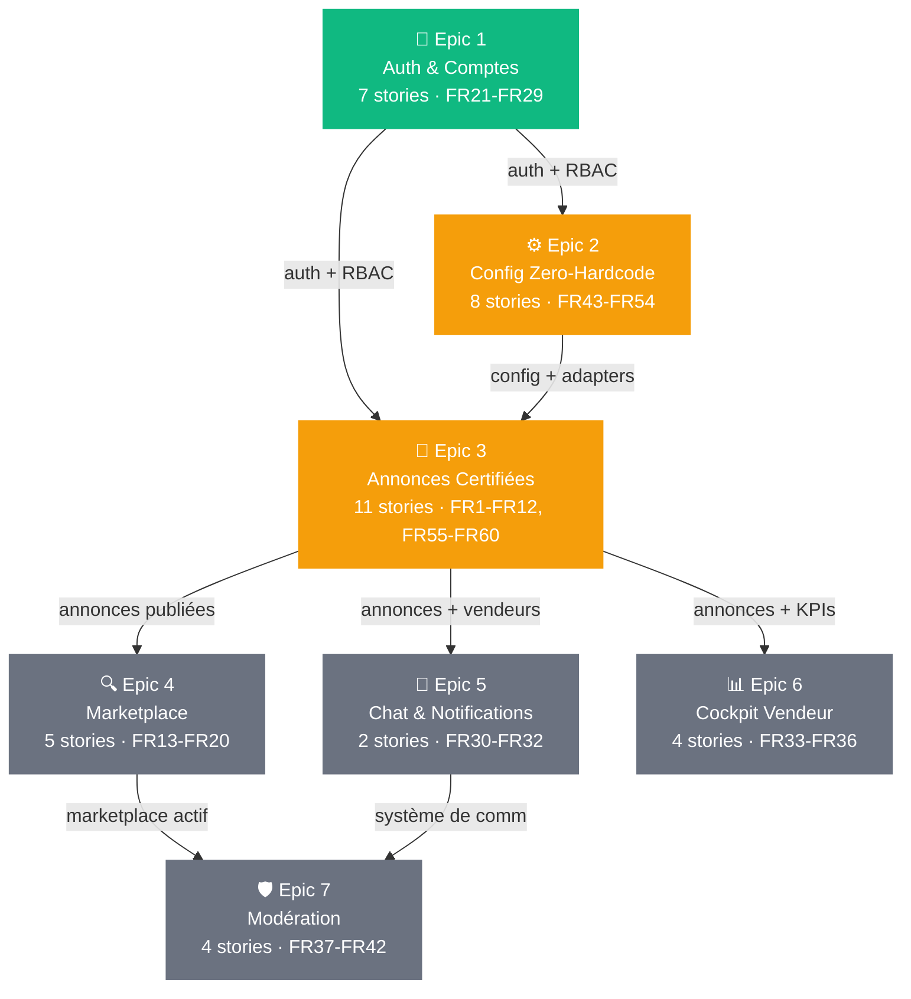
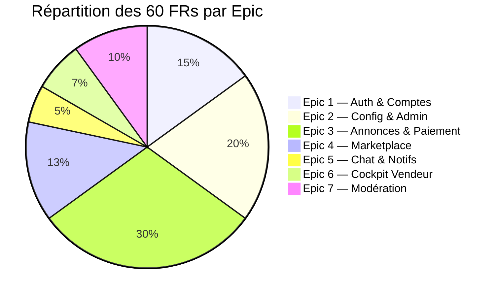

# auto - Epic Breakdown

## Overview

This document provides the complete epic and story breakdown for auto, decomposing the requirements from the PRD, UX Design, and Architecture into implementable stories.

## Diagrammes

### Dépendances entre Epics

_Légende : 🟢 en cours · 🟡 prochaine priorité · ⚪ à venir_

### Couverture des Functional Requirements par Epic

### Séquence d'implémentation (stories)

```mermaid
gantt
    title Séquence d'implémentation par Epic
    dateFormat X
    axisFormat %s

    section Epic 1 — Auth
    1.1 Project Bootstrap           :done, e1s1, 0, 1
    1.2 User Registration           :done, e1s2, 1, 2
    1.3 Consent RGPD                :done, e1s3, 2, 3
    1.4 Authentication              :active, e1s4, 3, 4
    1.5 RBAC                        :e1s5, 4, 5
    1.6 User Profile                :e1s6, 5, 6
    1.7 Anonymization & Export      :e1s7, 6, 7

    section Epic 2 — Config
    2.1 Config Engine               :e2s1, 7, 8
    2.2 Platform Config UI          :e2s2, 8, 9
    2.3 API Provider Management     :e2s3, 9, 10
    2.4 Admin Dashboard KPIs        :e2s4, 10, 11
    2.5 Configurable Alerts         :e2s5, 11, 12
    2.6 SEO Templates               :e2s6, 12, 13
    2.7 Legal Texts                 :e2s7, 13, 14
    2.8 Audit Trail                 :e2s8, 14, 15

    section Epic 3 — Annonces
    3.1 Adapter Pattern             :e3s1, 15, 16
    3.2 Vehicle Auto-Fill           :e3s2, 16, 17
    3.3 Listing Form                :e3s3, 17, 18
    3.4 Photo Management            :e3s4, 18, 19
    3.5 Visibility Score            :e3s5, 19, 20
    3.6 Draft Management            :e3s6, 20, 21
    3.7 Declaration of Honor        :e3s7, 21, 22
    3.8 Vehicle History Report      :e3s8, 22, 23
    3.9 Batch Publish & Payment     :e3s9, 23, 24
    3.10 Listing Lifecycle          :e3s10, 24, 25
    3.11 API Resilience             :e3s11, 25, 26

    section Epic 4 — Marketplace
    4.1 Public Listing Cards        :e4s1, 26, 27
    4.2 Search & Filters            :e4s2, 27, 28
    4.3 Certification Filters       :e4s3, 28, 29
    4.4 Favorites & Watchlist       :e4s4, 29, 30
    4.5 SEO & Structured Data       :e4s5, 30, 31

    section Epic 5 — Chat
    5.1 Real-Time Chat              :e5s1, 31, 32
    5.2 Notifications & Push        :e5s2, 32, 33

    section Epic 6 — Cockpit
    6.1 Seller Dashboard KPIs       :e6s1, 33, 34
    6.2 Market Price Positioning    :e6s2, 34, 35
    6.3 Market Watch                :e6s3, 35, 36
    6.4 Empty State Onboarding      :e6s4, 36, 37

    section Epic 7 — Modération
    7.1 Abuse Reporting             :e7s1, 37, 38
    7.2 Moderation Cockpit          :e7s2, 38, 39
    7.3 Moderation Actions          :e7s3, 39, 40
    7.4 Seller History              :e7s4, 40, 41
```

---

## Requirements Inventory

### Functional Requirements

- **FR1:** Le vendeur peut créer une annonce en saisissant une plaque d'immatriculation ou un VIN, déclenchant le remplissage automatique des champs à partir de sources de données officielles
- **FR2:** Le système marque chaque champ de données d'une annonce avec son origine : certifié (source API) ou déclaré (saisie vendeur)
- **FR3:** Le vendeur peut compléter, modifier ou corriger les champs déclarés d'une annonce
- **FR4:** Le vendeur peut ajouter des photos à une annonce
- **FR5:** Le vendeur peut sauvegarder une annonce en brouillon sans la publier
- **FR6:** Le vendeur peut gérer plusieurs brouillons simultanément
- **FR7:** Le vendeur peut sélectionner plusieurs brouillons pour publication groupée
- **FR8:** Le vendeur doit compléter une déclaration sur l'honneur numérique horodatée avant publication de chaque annonce
- **FR9:** Le système calcule et affiche un score de visibilité en temps réel pendant la création d'annonce, basé sur le taux de complétion et de certification des champs
- **FR10:** Le système inclut un rapport historique du véhicule dans chaque annonce publiée
- **FR11:** Le vendeur peut marquer une annonce comme vendue ou la retirer du marketplace
- **FR12:** Le système archive les déclarations sur l'honneur avec horodatage comme preuve
- **FR13:** Le visiteur peut parcourir les annonces publiées sur le marketplace
- **FR14:** Le visiteur peut filtrer les annonces par critères multiples (budget, marque, modèle, localisation, kilométrage, type de carburant, etc.)
- **FR15:** Le visiteur peut filtrer les annonces par niveau de certification, contrôle technique valide, et positionnement par rapport au prix du marché
- **FR16:** Le système affiche une comparaison visuelle du prix de chaque annonce par rapport au prix du marché (en dessous, aligné, au-dessus)
- **FR17:** L'utilisateur inscrit peut ajouter des annonces en favoris et suivre l'évolution de leurs informations
- **FR18:** Le système génère des pages indexables pour chaque annonce, chaque combinaison de critères de recherche, et des landing pages statiques
- **FR19:** Le système produit des données structurées (Schema.org) et un sitemap pour le référencement
- **FR20:** Le système affiche les annonces sous forme de cards avec des informations configurables (photos, prix, kilométrage, date, note vendeur, etc.)
- **FR21:** Le visiteur peut créer un compte avec des champs d'inscription dont le caractère obligatoire ou facultatif est configurable
- **FR22:** Le compte est actif immédiatement après inscription sans validation par un modérateur
- **FR23:** Le système attribue des rôles aux utilisateurs : acheteur inscrit, vendeur, modérateur, administrateur
- **FR24:** Le système contrôle l'accès aux fonctionnalités selon le rôle de l'utilisateur
- **FR25:** Le système restreint certaines fonctionnalités aux utilisateurs authentifiés, les fonctionnalités soumises à authentification étant configurables
- **FR26:** Le taux de remplissage des champs du profil vendeur contribue à la note du vendeur
- **FR27:** L'utilisateur peut demander l'anonymisation de son compte
- **FR28:** L'utilisateur peut demander l'export de toutes ses données personnelles
- **FR29:** Le système recueille le consentement explicite de l'utilisateur, granulaire par type de traitement
- **FR30:** L'acheteur et le vendeur peuvent communiquer en temps réel via un chat lié à un véhicule spécifique
- **FR31:** Le système envoie des notifications aux utilisateurs pour les événements pertinents (nouveau contact, nouvelle vue, signalement traité, etc.)
- **FR32:** Le système envoie des notifications push aux utilisateurs sur leurs appareils (mobile, tablette, ordinateur)
- **FR33:** Le vendeur accède à un tableau de bord affichant les KPIs de ses annonces (vues, contacts, jours en ligne)
- **FR34:** Le vendeur peut visualiser le positionnement prix de ses annonces par rapport au marché
- **FR35:** Le vendeur peut suivre des véhicules sur le marché et surveiller l'évolution de leurs informations
- **FR36:** Le cockpit invite le vendeur à publier sa première annonce ou explorer le marché lorsqu'il est vide
- **FR37:** L'utilisateur peut signaler une annonce ou un comportement abusif avec une catégorisation par type et gravité
- **FR38:** Le modérateur accède à un cockpit dédié affichant la file de signalements classés par gravité et type
- **FR39:** Le modérateur peut désactiver ou réactiver une annonce spécifique
- **FR40:** Le modérateur peut désactiver ou réactiver un compte utilisateur
- **FR41:** Le modérateur peut envoyer un avertissement à un utilisateur via le système de communication de la plateforme
- **FR42:** Le modérateur peut consulter l'historique d'un vendeur (signalements précédents, note, ancienneté)
- **FR43:** L'administrateur accède à un dashboard affichant les KPIs globaux en temps réel (visiteurs, inscriptions, annonces, ventes, revenus, sources de trafic)
- **FR44:** L'administrateur peut consulter le coût API par annonce et par fournisseur, et visualiser la marge nette par annonce
- **FR45:** L'administrateur peut configurer des alertes sur des seuils (marge minimum, etc.)
- **FR46:** L'administrateur peut activer ou désactiver des fournisseurs API sans intervention technique
- **FR47:** L'administrateur peut modifier les prix, textes, règles métier, et paramètres de la plateforme sans intervention technique
- **FR48:** L'administrateur peut configurer les informations affichées sur les cards d'annonces
- **FR49:** L'administrateur peut configurer quelles fonctionnalités nécessitent une authentification
- **FR50:** L'administrateur peut configurer les champs d'inscription (obligatoire/facultatif)
- **FR51:** L'administrateur peut gérer les templates SEO (meta title, meta description) par type de page
- **FR52:** L'administrateur peut gérer les textes juridiques (CGU, CGV, mentions légales) avec versionnage et re-acceptation automatique
- **FR53:** Le système enregistre un audit trail de toutes les opérations (horodatage, action, acteur)
- **FR54:** L'administrateur possède toutes les capacités des autres rôles (vendeur, acheteur, modérateur)
- **FR55:** Le vendeur peut payer pour la publication d'annonces sélectionnées
- **FR56:** Le système traite le paiement groupé de plusieurs annonces en une seule transaction
- **FR57:** Le système ne publie les annonces qu'après confirmation du paiement
- **FR58:** Le système propose au vendeur une saisie manuelle lorsqu'une source de données est indisponible
- **FR59:** Le système propose automatiquement au vendeur de récupérer et mettre à jour ses données certifiées lorsque la source redevient disponible
- **FR60:** Le système fonctionne en mode dégradé (données partielles) sans blocage du parcours utilisateur

### NonFunctional Requirements

- **NFR1:** Les pages publiques SSR (annonces, recherche, landing) atteignent un LCP < 2.5s, un INP < 200ms, un CLS < 0.1, et un TTFB < 800ms
- **NFR2:** Le remplissage automatique via plaque/VIN retourne les données le plus rapidement possible avec une aspiration cible de 3 secondes maximum
- **NFR3:** Le score de visibilité se met à jour en moins de 500ms après chaque modification de champ pendant la création d'annonce
- **NFR4:** Les messages chat sont délivrés en moins de 1 seconde entre les participants
- **NFR5:** Les cockpits SPA (vendeur, modérateur, admin) chargent en moins de 2 secondes après authentification
- **NFR6:** Les résultats de recherche avec filtres multiples s'affichent en moins de 2 secondes
- **NFR7:** Les images sont optimisées et servies via CDN avec lazy loading pour les cards d'annonces
- **NFR8:** Toutes les communications sont chiffrées en transit (HTTPS/TLS obligatoire)
- **NFR9:** Les données sensibles (informations personnelles, données de paiement) sont chiffrées au repos dans la base de données
- **NFR10:** L'authentification à deux facteurs (2FA) est disponible pour tous les comptes professionnels
- **NFR11:** Le traitement des paiements est conforme PCI-DSS (délégué au fournisseur de paiement certifié)
- **NFR12:** L'authentification forte SCA est appliquée conformément à la directive PSD2 pour les paiements européens
- **NFR13:** Les sessions utilisateur expirent après une période d'inactivité configurable
- **NFR14:** Toutes les opérations sensibles (paiement, modification de compte, actions modération, changements admin) sont enregistrées dans un audit trail horodaté
- **NFR15:** Les données personnelles sont traitées conformément au RGPD (anonymisation, portabilité, consentement, durées de conservation)
- **NFR16:** Les accès aux données sont journalisés et traçables par acteur et action
- **NFR17:** Le système supporte 3 000 annonces simultanées au lancement avec montée à 10 000+ dans les 3 mois sans dégradation de performance
- **NFR18:** Le système supporte des centaines de milliers de visiteurs mensuels avec des pics de trafic sans dégradation perceptible
- **NFR19:** L'architecture supporte l'ajout de nouveaux types de véhicules, champs de données, fournisseurs API, et règles métier sans modification de code
- **NFR20:** L'architecture est prête pour une expansion multi-pays (i18n, multi-devise, réglementation locale) sans refonte structurelle
- **NFR21:** Le système de chat temps réel supporte la montée en charge proportionnelle au nombre d'utilisateurs actifs simultanés
- **NFR22:** Le système est conforme WCAG 2.1 niveau AA et RGAA (Référentiel Général d'Amélioration de l'Accessibilité)
- **NFR23:** Toute navigation est possible au clavier sans nécessiter de souris
- **NFR24:** Les contrastes de couleurs respectent un ratio minimum de 4.5:1 pour le texte et 3:1 pour les éléments d'interface
- **NFR25:** Les badges de certification (🟢/🟡) possèdent un équivalent textuel accessible (pas uniquement la couleur comme vecteur d'information)
- **NFR26:** Les formulaires de création d'annonce sont accessibles (labels associés, messages d'erreur explicites, gestion du focus)
- **NFR27:** La structure sémantique des pages est correcte (hiérarchie des titres, landmarks ARIA, textes alternatifs sur les images)
- **NFR28:** Chaque intégration API externe est encapsulée derrière une interface d'adaptation (Adapter Pattern) permettant le remplacement du fournisseur sans modification du code métier
- **NFR29:** Chaque appel API externe est journalisé avec le fournisseur, le coût, le statut de réponse et le temps de réponse
- **NFR30:** Le système supporte le fonctionnement avec des fournisseurs API en mode mock (données simulées) pour le développement et les cas où un fournisseur n'est pas encore contractualisé
- **NFR31:** Le système d'authentification est délégué à un fournisseur d'identité externe avec gestion des rôles et groupes
- **NFR32:** Le système de paiement est intégré via un fournisseur certifié avec support SEPA et moyens de paiement européens
- **NFR33:** Le système tolère jusqu'à 48h d'indisponibilité d'un fournisseur API sans bloquer les parcours utilisateur
- **NFR34:** En cas d'indisponibilité API, le système bascule automatiquement en mode dégradé (saisie manuelle) et propose la re-synchronisation au retour de la source
- **NFR35:** Les données en cache local sont servies quand la source primaire est indisponible
- **NFR36:** Le système notifie l'administrateur en cas de défaillance d'un fournisseur API ou de dépassement de seuil configurable
- **NFR37:** Les transactions de paiement sont atomiques — une annonce n'est publiée que si le paiement est confirmé, sans état intermédiaire incohérent

### Additional Requirements

**Depuis l'Architecture :**

- Starter Template : `cds init auto-backend --add typescript,typer,postgres,sample` (backend) + `npx create-next-app@latest auto-frontend --typescript --tailwind --app --src-dir` (frontend) — L'Epic 1 Story 1 doit initialiser les 3 repos (auto-backend, auto-frontend, auto-shared)
- Architecture multi-repo : 3 repositories Git séparés (auto-backend, auto-frontend, auto-shared) avec Azure Artifacts pour le package npm privé @auto/shared
- Modèles CDS normalisés : une table CDS par type de config (10+ tables : ConfigParameter, ConfigText, ConfigFeature, ConfigBoostFactor, ConfigVehicleType, ConfigListingDuration, ConfigReportReason, ConfigChatAction, ConfigModerationRule, ConfigApiProvider)
- Auth : Azure AD B2C (Authorization Code Flow + PKCE) avec MSAL.js côté frontend et JWT validation middleware côté CAP
- RBAC hybride : Azure AD B2C pour l'identité + table user_roles en PostgreSQL pour les permissions (configurable admin)
- API hybride : OData v4 auto-généré par CDS pour CRUD + actions/fonctions custom pour logique métier + REST custom pour paiement
- Cache API persisté : table api_cached_data en PostgreSQL avec TTL configurable pour résilience 48h
- Cache config : InMemoryConfigCache (singleton) avec interface prête pour Redis si scaling horizontal
- SignalR : 4 hubs séparés (/chat, /notifications, /live-score, /admin)
- Error handling : RFC 7807 (Problem Details) pour endpoints custom
- Adapter Pattern : 8 interfaces adapter avec Factory résolvant l'implémentation active depuis ConfigApiProvider
- Infrastructure : Azure App Service (backend + frontend), Azure Database for PostgreSQL, Azure Blob Storage + CDN, Azure SignalR Service, Azure AD B2C
- CI/CD : Azure DevOps Pipelines (YAML) avec gates (lint → type-check → tests → build → coverage)
- Testing strict : 8 types de tests avec seuils de couverture (≥90% unit, ≥80% integration, ≥85% component, 100% contract, 4 E2E journeys, 0 violations accessibilité critiques, LCP <2.5s, 0 findings OWASP critiques)
- English technical naming obligatoire : tous les noms techniques en anglais, français uniquement dans les textes i18n en BDD
- Seed data CSV : données initiales pour les 10+ tables de configuration
- Dev workflow : 3 terminaux (cds watch port 4004 + next dev port 3000 + npm link @auto/shared)
- Naming conventions strictes : CDS PascalCase entités/camelCase éléments, frontend kebab-case fichiers/PascalCase composants, API REST kebab-case, SignalR domain:action

**Depuis l'UX :**

- Design System : shadcn/ui + Tailwind CSS + Radix UI — composants copiés dans le projet (pas de dépendance externe)
- Architecture CSS 3 couches : tokens (globals.css) → composants base (shadcn/ui) → composants métier
- Palette couleurs : certified (vert émeraude HSL 152 55% 42%), declared (ambre HSL 38 92% 50%), primary (bleu slate/indigo), jamais de rouge pour la certification
- Dark mode : cockpits uniquement (pas les pages publiques)
- Typographie : Inter (principale), Lora (display narratif), JetBrains Mono (données techniques VIN/plaques)
- Badge certification 3 canaux : couleur + icône (bouclier/crayon) + texte ("Vérifié"/"Déclaré vendeur") — accessible WCAG
- Auto-fill cascade progressive : micro-stagger 100ms/champ, pas de faux délais, reflet fidèle du tempo API
- Score de visibilité normalisé par catégorie véhicule avec labels qualitatifs configurables ("Très documenté"/"Bien documenté"/"Partiellement documenté")
- Champ unique intelligent : détection automatique plaque vs VIN dès le 3ème caractère, label dynamique de confirmation
- Layout fiche annonce : galerie 60% + infos 40% (desktop), galerie full-width + scroll (mobile), vendeur sticky sidebar (desktop) / fixed bottom bar (mobile)
- Responsive mobile-first public / desktop-first cockpits
- Animations : cascade auto-fill 100ms/champ, score visibilité spring 500ms, skeleton loading 1.5s, respect prefers-reduced-motion
- Z-index hiérarchie : base(0) → sticky(10) → dropdown(20) → modal-backdrop(30) → modal(40) → toast(50)
- Touch targets minimum 44x44px sur mobile
- Progressive disclosure : card → fiche résumée → fiche détaillée → rapport complet
- Mur d'inscription calibré : teasing avec squelette visible et détails floutés (pattern LinkedIn)
- Empty states engageants pour cockpit vendeur vide
- Indicateurs de statut des sources API visibles pendant l'auto-fill ("SIV ✓ | ADEME ⏳")
- Command palette (Cmd+K) dans les cockpits pour power users
- Infinite scroll pour les résultats de recherche
- Filtres en chips actifs (visibles, suppression en un tap)

### FR Coverage Map

- FR1: Epic 3 — Auto-fill via plaque/VIN
- FR2: Epic 3 — Marquage certifié/déclaré par champ
- FR3: Epic 3 — Modification des champs déclarés
- FR4: Epic 3 — Ajout de photos
- FR5: Epic 3 — Sauvegarde en brouillon
- FR6: Epic 3 — Gestion de plusieurs brouillons
- FR7: Epic 3 — Publication groupée
- FR8: Epic 3 — Déclaration sur l'honneur
- FR9: Epic 3 — Score de visibilité temps réel
- FR10: Epic 3 — Rapport historique véhicule inclus
- FR11: Epic 3 — Marquer vendu / retirer
- FR12: Epic 3 — Archivage déclarations sur l'honneur
- FR13: Epic 4 — Parcourir les annonces
- FR14: Epic 4 — Filtres multi-critères
- FR15: Epic 4 — Filtres certification, CT, prix marché
- FR16: Epic 4 — Comparaison prix marché visuelle
- FR17: Epic 4 — Favoris et suivi
- FR18: Epic 4 — Pages indexables SEO
- FR19: Epic 4 — Schema.org et sitemap
- FR20: Epic 4 — Cards configurables
- FR21: Epic 1 — Inscription configurable
- FR22: Epic 1 — Compte actif immédiatement
- FR23: Epic 1 — Attribution des rôles
- FR24: Epic 1 — Contrôle d'accès par rôle
- FR25: Epic 1 — Fonctionnalités auth configurables
- FR26: Epic 1 — Profil vendeur contribue à la note
- FR27: Epic 1 — Anonymisation compte
- FR28: Epic 1 — Export données personnelles
- FR29: Epic 1 — Consentement explicite granulaire
- FR30: Epic 5 — Chat temps réel lié au véhicule
- FR31: Epic 5 — Notifications événements
- FR32: Epic 5 — Notifications push multi-device
- FR33: Epic 6 — Dashboard KPIs vendeur
- FR34: Epic 6 — Positionnement prix marché
- FR35: Epic 6 — Suivi véhicules marché
- FR36: Epic 6 — Empty state cockpit vendeur
- FR37: Epic 7 — Signalement abus catégorisé
- FR38: Epic 7 — Cockpit modération avec file
- FR39: Epic 7 — Désactiver/réactiver annonce
- FR40: Epic 7 — Désactiver/réactiver compte
- FR41: Epic 7 — Avertissement via plateforme
- FR42: Epic 7 — Historique vendeur
- FR43: Epic 2 — Dashboard KPIs admin temps réel
- FR44: Epic 2 — Coûts API et marge par annonce
- FR45: Epic 2 — Alertes sur seuils configurables
- FR46: Epic 2 — Activation/désactivation fournisseurs API
- FR47: Epic 2 — Modification prix, textes, règles sans code
- FR48: Epic 2 — Configuration cards annonces
- FR49: Epic 2 — Configuration auth par fonctionnalité
- FR50: Epic 2 — Configuration champs inscription
- FR51: Epic 2 — Templates SEO configurables
- FR52: Epic 2 — Textes juridiques versionnés
- FR53: Epic 2 — Audit trail systématique
- FR54: Epic 2 — Admin = tous les rôles
- FR55: Epic 3 — Paiement par annonce
- FR56: Epic 3 — Paiement groupé
- FR57: Epic 3 — Publication conditionnée au paiement
- FR58: Epic 3 — Saisie manuelle si API indisponible
- FR59: Epic 3 — Re-sync automatique au retour API
- FR60: Epic 3 — Mode dégradé sans blocage

## Epic List

### Epic 1: Authentification & Gestion des Comptes
Les utilisateurs peuvent s'inscrire, se connecter, gérer leur profil. Le système attribue les rôles (RBAC), gère le consentement RGPD, et supporte la 2FA pour les pros. Inclut l'initialisation des 3 repos (auto-backend, auto-frontend, auto-shared), les modèles CDS domaine, Azure AD B2C, MSAL frontend, RBAC hybride, et les fondations du design system (shadcn/ui, tokens, layouts).
**FRs covered:** FR21, FR22, FR23, FR24, FR25, FR26, FR27, FR28, FR29

### Epic 2: Configuration Zero-Hardcode & Administration
L'administrateur pilote l'intégralité de la plateforme sans code : prix, textes, règles métier, fournisseurs API, features, templates SEO, textes juridiques versionnés, alertes configurables, audit trail. Le dashboard affiche les KPIs globaux en temps réel avec suivi des coûts API et marge par annonce.
**FRs covered:** FR43, FR44, FR45, FR46, FR47, FR48, FR49, FR50, FR51, FR52, FR53, FR54

### Epic 3: Création d'Annonces Certifiées, Publication & Paiement
Le vendeur crée des annonces via auto-fill (plaque/VIN) avec certification champ par champ, score de visibilité temps réel, gestion de photos, brouillons multiples, et déclaration sur l'honneur horodatée. Publication par lot avec paiement groupé via Stripe. Le système gère les pannes API en mode dégradé avec re-sync automatique. Inclut le rapport historique véhicule.
**FRs covered:** FR1, FR2, FR3, FR4, FR5, FR6, FR7, FR8, FR9, FR10, FR11, FR12, FR55, FR56, FR57, FR58, FR59, FR60

### Epic 4: Marketplace, Recherche & Découverte
L'acheteur parcourt les annonces, filtre par critères multiples (budget, marque, certification, prix marché, CT valide), voit les cards configurables avec comparaison prix marché, ajoute en favoris et suit l'évolution. Pages SSR pour le SEO avec Schema.org, sitemap XML, et URLs sémantiques.
**FRs covered:** FR13, FR14, FR15, FR16, FR17, FR18, FR19, FR20

### Epic 5: Communication Temps Réel & Notifications
L'acheteur et le vendeur communiquent en temps réel via un chat lié à un véhicule spécifique. Le système envoie des notifications push multi-device pour les événements pertinents (nouveau contact, nouvelle vue, signalement traité).
**FRs covered:** FR30, FR31, FR32

### Epic 6: Cockpit Vendeur & Intelligence Marché
Le vendeur accède à son tableau de bord avec les KPIs de ses annonces (vues, contacts, jours en ligne), le positionnement prix par rapport au marché, le suivi des véhicules concurrents. Le cockpit vide guide le vendeur vers sa première action.
**FRs covered:** FR33, FR34, FR35, FR36

### Epic 7: Modération & Qualité du Contenu
Les utilisateurs signalent les abus avec catégorisation par type et gravité. Le modérateur accède à un cockpit dédié avec file de signalements, peut désactiver/réactiver annonces et comptes, envoyer des avertissements, et consulter l'historique complet d'un vendeur.
**FRs covered:** FR37, FR38, FR39, FR40, FR41, FR42

---

## Stories

Toutes les stories sont organisées en fichiers individuels dans le dossier `stories/` :

### Epic 1: Authentification & Gestion des Comptes (7 stories)
- [Story 1.1: Project Bootstrap & Design System Foundation](stories/epic-1/story-1.1-project-bootstrap.md)
- [Story 1.2: User Registration with Configurable Fields](stories/epic-1/story-1.2-user-registration.md)
- [Story 1.3: Explicit Consent & RGPD Compliance](stories/epic-1/story-1.3-consent-rgpd.md)
- [Story 1.4: User Authentication (Login, Logout, Session, 2FA)](stories/epic-1/story-1.4-authentication.md)
- [Story 1.5: Role-Based Access Control (RBAC)](stories/epic-1/story-1.5-rbac.md)
- [Story 1.6: User Profile & Seller Rating Contribution](stories/epic-1/story-1.6-user-profile.md)
- [Story 1.7: Account Anonymization & Personal Data Export](stories/epic-1/story-1.7-anonymization-export.md)

### Epic 2: Configuration Zero-Hardcode & Administration (8 stories)
- [Story 2.1: Zero-Hardcode Configuration Engine](stories/epic-2/story-2.1-config-engine.md)
- [Story 2.2: Platform Configuration UI](stories/epic-2/story-2.2-platform-config-ui.md)
- [Story 2.3: API Provider Management & Cost Tracking](stories/epic-2/story-2.3-api-provider-management.md)
- [Story 2.4: Admin Dashboard & Real-Time KPIs](stories/epic-2/story-2.4-admin-dashboard-kpis.md)
- [Story 2.5: Configurable Alerts & Thresholds](stories/epic-2/story-2.5-configurable-alerts.md)
- [Story 2.6: SEO Templates Management](stories/epic-2/story-2.6-seo-templates.md)
- [Story 2.7: Legal Texts Versioning & Re-acceptance](stories/epic-2/story-2.7-legal-texts.md)
- [Story 2.8: Audit Trail System](stories/epic-2/story-2.8-audit-trail.md)

### Epic 3: Création d'Annonces Certifiées, Publication & Paiement (11 stories)
- [Story 3.1: Adapter Pattern & API Integration Framework](stories/epic-3/story-3.1-adapter-pattern.md)
- [Story 3.2: Vehicle Auto-Fill via License Plate or VIN](stories/epic-3/story-3.2-vehicle-autofill.md)
- [Story 3.3: Listing Form & Declared Fields](stories/epic-3/story-3.3-listing-form-declared-fields.md)
- [Story 3.4: Photo Management](stories/epic-3/story-3.4-photo-management.md)
- [Story 3.5: Real-Time Visibility Score](stories/epic-3/story-3.5-visibility-score.md)
- [Story 3.6: Draft Management](stories/epic-3/story-3.6-draft-management.md)
- [Story 3.7: Declaration of Honor & Archival](stories/epic-3/story-3.7-declaration-of-honor.md)
- [Story 3.8: Vehicle History Report](stories/epic-3/story-3.8-vehicle-history-report.md)
- [Story 3.9: Batch Publication & Payment via Stripe](stories/epic-3/story-3.9-batch-publication-payment.md)
- [Story 3.10: Listing Lifecycle Management](stories/epic-3/story-3.10-listing-lifecycle.md)
- [Story 3.11: API Resilience & Degraded Mode](stories/epic-3/story-3.11-api-resilience.md)

### Epic 4: Marketplace, Recherche & Découverte (5 stories)
- [Story 4.1: Public Listing Browsing & Configurable Cards](stories/epic-4/story-4.1-public-listing-cards.md)
- [Story 4.2: Multi-Criteria Search & Filters](stories/epic-4/story-4.2-multi-criteria-search.md)
- [Story 4.3: Certification & Market Price Filters](stories/epic-4/story-4.3-certification-market-price-filters.md)
- [Story 4.4: Favorites & Watchlist](stories/epic-4/story-4.4-favorites-watchlist.md)
- [Story 4.5: SEO Pages & Structured Data](stories/epic-4/story-4.5-seo-pages-structured-data.md)

### Epic 5: Communication Temps Réel & Notifications (2 stories)
- [Story 5.1: Real-Time Chat Linked to Vehicle](stories/epic-5/story-5.1-realtime-chat.md)
- [Story 5.2: Event Notifications & Push](stories/epic-5/story-5.2-notifications-push.md)

### Epic 6: Cockpit Vendeur & Intelligence Marché (4 stories)
- [Story 6.1: Seller Dashboard & Listing KPIs](stories/epic-6/story-6.1-seller-dashboard-kpis.md)
- [Story 6.2: Market Price Positioning](stories/epic-6/story-6.2-market-price-positioning.md)
- [Story 6.3: Market Watch & Competitor Tracking](stories/epic-6/story-6.3-market-watch.md)
- [Story 6.4: Empty State & Seller Onboarding](stories/epic-6/story-6.4-empty-state-onboarding.md)

### Epic 7: Modération & Qualité du Contenu (4 stories)
- [Story 7.1: Abuse Reporting System](stories/epic-7/story-7.1-abuse-reporting.md)
- [Story 7.2: Moderation Cockpit & Report Queue](stories/epic-7/story-7.2-moderation-cockpit.md)
- [Story 7.3: Moderation Actions (Deactivate, Warn, Reactivate)](stories/epic-7/story-7.3-moderation-actions.md)
- [Story 7.4: Seller History & Moderation Context](stories/epic-7/story-7.4-seller-history.md)
