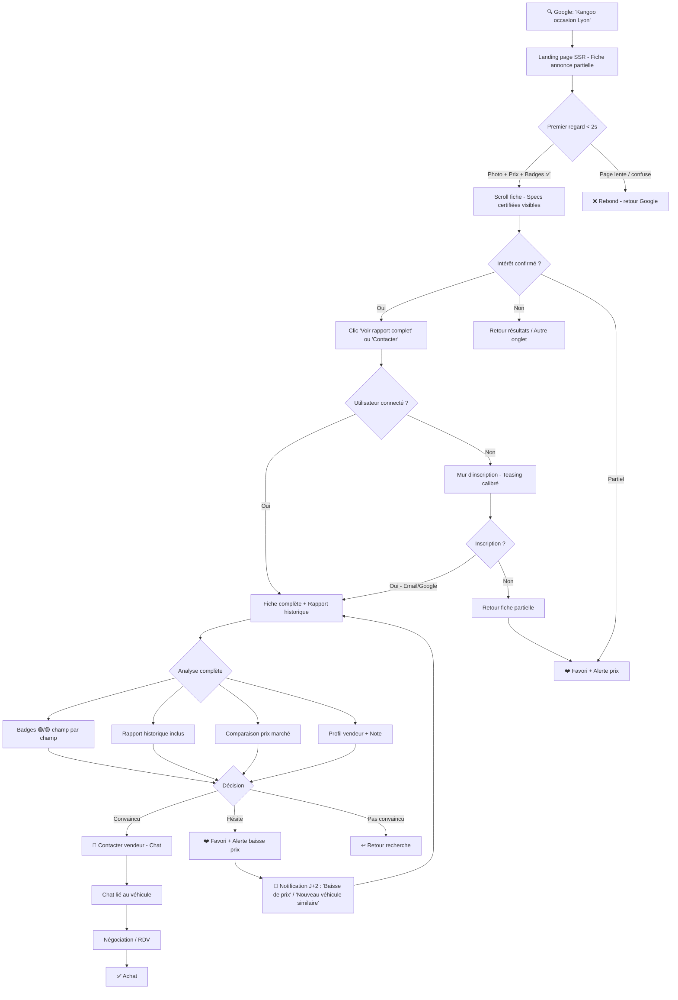
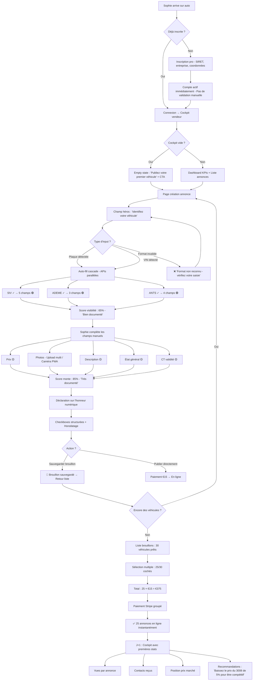
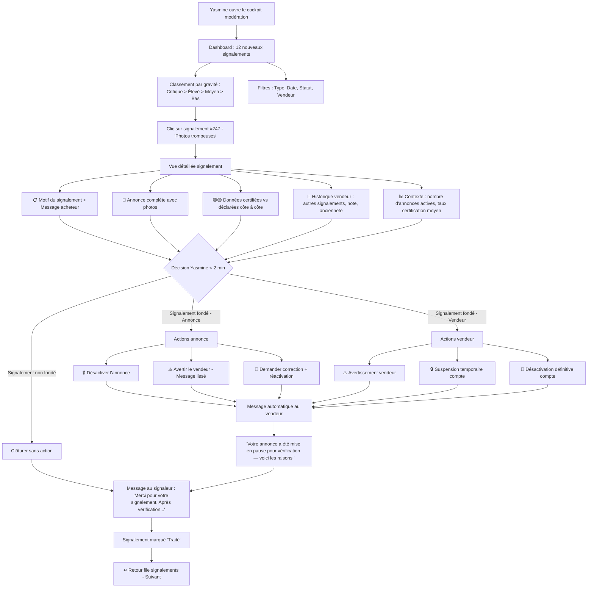
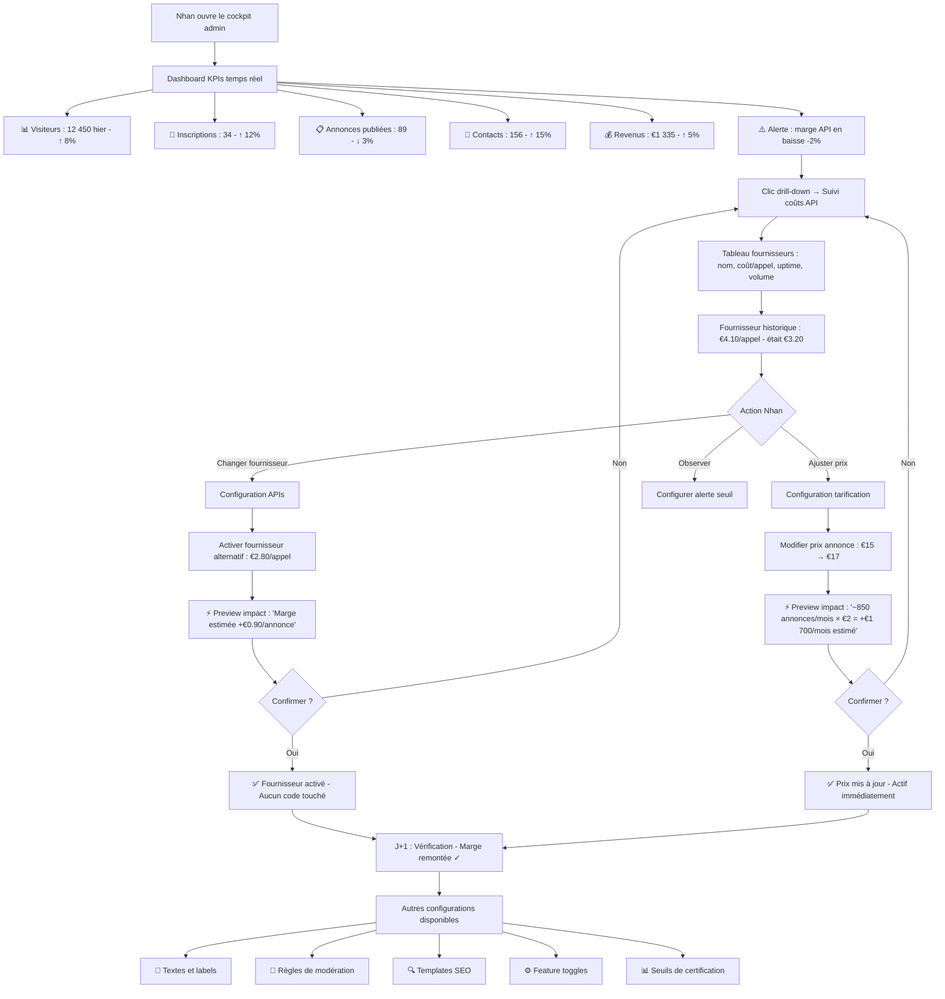

# UX Design Specification auto

**Author:** Nhan
**Date:** 2026-02-08

---

## Executive Summary

### Project Vision

auto est une plateforme française de petites annonces véhicules d'occasion dont l'expérience utilisateur repose sur un principe fondateur : la transparence certifiée au niveau du champ. Chaque donnée d'une annonce est visuellement identifiée comme Certifiée (source API officielle) ou Déclarée (saisie vendeur), créant un contrat de confiance visuel sans précédent dans le marché.

L'UX doit servir trois objectifs simultanés :
- **Confiance immédiate** pour l'acheteur — le design doit rendre la certification lisible, évidente et rassurante en moins de 2 secondes
- **Efficacité spectaculaire** pour le vendeur — le moment auto-fill (plaque → 15+ champs en 3s) doit être visuellement mémorable et le cockpit doit devenir l'outil de travail quotidien
- **Pilotage autonome** pour l'admin — un dashboard dense mais clair, permettant de piloter le business sans intervention technique

### UX Priority Hierarchy

1. **Expérience acheteur (pages publiques SSR)** — Priorité #1 en polish visuel. C'est elle qui génère le trafic et les conversions. Design magazine : aéré, visuel, premium.
2. **Expérience vendeur (cockpit SPA)** — Priorité #1 en fonctionnalité. Outil de travail quotidien. Design outil : dense, fonctionnel, réactif.
3. **Expérience modération & admin (cockpits SPA)** — Fonctionnel-first. Efficacité et clarté d'action.

### Target Users

**Persona 1 — Karim (Acheteur)**
- Profil : gérant PME, tech-savvy moyen, mobile-first, échaudé par un achat antérieur
- Besoin : confiance vérifiable, filtres pertinents (budget, CT valide, prix marché), rapport historique inclus
- Contexte : arrive souvent via SEO (Google), navigue sur mobile, compare plusieurs annonces
- Moment clé : la fiche annonce avec badges certifiés — c'est là que la confiance se crée ou se perd
- Insight empathie : Karim ne cherche pas un site d'annonces — il cherche un endroit sûr. La confiance est une émotion, pas une fonctionnalité.

**Persona 2 — Sophie (Vendeuse professionnelle)**
- Profil : responsable stock concessionnaire, gère 80+ véhicules, utilisatrice quotidienne
- Besoin : publier vite (< 5 min/annonce), gérer par lot, suivre les performances, se différencier
- Contexte : utilise la plateforme sur desktop comme outil de travail, parfois mobile en déplacement
- Moment clé : l'auto-fill par plaque — un moment de soulagement ("enfin, quelqu'un qui respecte mon temps"), pas juste un effet spectaculaire

**Persona 3 — Yasmine (Modératrice)**
- Profil : opérationnelle plateforme, traite des signalements, protège la qualité
- Besoin : file de travail claire, actions rapides, contexte complet sur chaque signalement
- Contexte : desktop exclusif, workflow quotidien structuré
- Moment clé : pouvoir prendre une décision de modération en moins de 2 minutes avec toutes les infos sous les yeux

**Persona 4 — Nhan (Administrateur)**
- Profil : fondateur, pilote le business, expertise technique mais veut autonomie sans code
- Besoin : KPIs temps réel, contrôle total sur la configuration, visibilité sur les marges
- Contexte : desktop, consultation quotidienne matinale, interventions ponctuelles de configuration
- Moment clé : pouvoir changer un fournisseur API ou un prix sans toucher au code

### Key Design Challenges

1. **Lisibilité instantanée du système de certification** — Système à trois canaux : couleur + icône + texte. Bouclier vert + "Vérifié" / Crayon jaune + "Déclaré vendeur". Le design doit être auto-explicatif sans tutoriel, comme un feu tricolore. WCAG 2.1 AA natif (pas uniquement la couleur comme vecteur d'information).

2. **Deux philosophies UX sur un même site** — Pages publiques = vitrine magazine (aéré, visuel, premium). Cockpits = outils de travail (dense, fonctionnel, réactif). Le design system de base (shadcn/ui) unifie les deux, mais les layouts sont radicalement différents. Supporté par les route groups Next.js `(public)/` vs `(dashboard)/`.

3. **Le moment auto-fill en cascade progressive** — Les appels API sont parallélisés techniquement, les données arrivent progressivement. Le design montre les champs qui se remplissent un par un au rythme des réponses API. Effet cascade naturel et satisfaisant, fidèle à la réalité technique.

4. **Hiérarchie visuelle de la fiche annonce** — Système à deux niveaux : vue résumée (champs critiques + indicateur global de certification) et vue détaillée (tous les champs avec badge, source et date). Configurable par l'admin via `config_listing_cards`.

5. **Indicateur de certification informatif, pas punitif** — Labels qualitatifs ("Très documenté" / "Bien documenté" / "Partiellement documenté") plutôt qu'un pourcentage brut. Ne stigmatise pas les véhicules anciens avec peu de données API. Seuils et labels configurables admin (zero-hardcode).

6. **Deux langages visuels pour la même donnée** — Score de visibilité côté vendeur = gamification, progression, motivation (jauge animée). Niveau de certification côté acheteur = information neutre, confiance, sérénité. Même donnée, design radicalement différent.

7. **Conversion au mur d'inscription** — L'acheteur anonyme voit les données publiques. Rapport historique et contact vendeur requièrent inscription. Composant flexible (pas un écran figé) car les seuils sont configurables admin. Montrer assez de valeur pour créer le désir, formulaire d'inscription minimal.

8. **Densité d'information sur mobile (PWA)** — Photos, badges, specs, historique, prix marché, chat, KPIs — tout doit rester lisible sur 375px. Progressive disclosure : montrer l'essentiel, révéler le détail à la demande.

### Design Opportunities

1. **L'atmosphère de confiance comme identité de marque** — La confiance ne se déclare pas, elle se ressent. Typographie posée, espace blanc généreux, photos de qualité, wording sobre ("vérifié à la source" plutôt que "garanti"). Le vert certifié peut devenir l'ADN visuel de la marque auto.

2. **Fiches annonces premium comme vitrine de marque** — Avec données certifiées, rapport historique, comparaison prix marché et photos optimisées, les fiches annonces auto peuvent devenir une référence visuelle dans le secteur.

3. **Le cockpit vendeur comme outil de fidélisation** — KPIs actionnables, positionnement marché, insights stock : si le cockpit est assez bien conçu, le vendeur pro l'ouvre chaque matin. Lock-in par la valeur.

4. **Le micro-onboarding intégré** — Le design des badges est auto-explicatif grâce au texte. Un bandeau léger dismissable sur la première visite comme filet de sécurité. Pattern Airbnb : première visite tu lis, troisième visite c'est un réflexe.

5. **Le cercle vertueux certification → visibilité** — Les vendeurs veulent un niveau de certification élevé (plus de visibilité), les acheteurs filtrent par certification, la qualité globale monte. Product-market fit designé dans l'UI.

## Core User Experience

### Defining Experience

auto possède deux expériences fondatrices qui s'articulent en un arc narratif :

**L'arc narratif en 3 actes :**

- **Acte 1 — La Promesse** (card d'annonce, résultats de recherche, SEO) : "Il existe un endroit où les données sont transparentes." La card intrigue, elle ne raconte pas tout. Son job est de donner envie de cliquer, pas de convaincre.
- **Acte 2 — La Preuve** (fiche annonce détaillée) : "Voici exactement ce qui est vérifié et ce qui ne l'est pas." C'est le produit phare d'auto. Toute la narration converge vers ce moment. La fiche annonce est traitée comme un produit à part entière, pas comme une page parmi d'autres.
- **Acte 3 — La Résolution** (contact vendeur, chat, transaction) : "Je fais confiance, j'agis." L'utilisateur passe à l'action concrète.

**Côté acheteur — La fiche annonce comme produit phare :**
La fiche annonce détaillée est la landing page la plus importante du site. C'est là que Karim passe de "intéressé" à "convaincu". C'est là que le Product-Market Fit se joue. Chaque pixel compte. Le budget design doit refléter cette hiérarchie : la fiche annonce reçoit le plus grand investissement en design.

**Côté acheteur — Le parcours en éventail :**
Karim ne regarde jamais une seule annonce. Il en ouvre 5 dans des onglets et compare. L'expérience doit supporter ce pattern de multi-consultation : chaque fiche doit fonctionner indépendamment, avec une structure visuelle cohérente qui facilite la comparaison mentale entre onglets.

**Côté vendeur — L'auto-fill comme moment de soulagement :**
Sophie entre sa plaque, 15+ champs se remplissent en cascade progressive en 3 secondes. Ce n'est pas un effet spectaculaire — c'est un moment de soulagement : "enfin, quelqu'un qui respecte mon temps". Le score de visibilité monte en temps réel, transformant la saisie en jeu de progression.

### Platform Strategy

| Dimension | Choix | Justification |
|-----------|-------|---------------|
| **Plateforme primaire** | Web responsive PWA, mobile-first | Les acheteurs cherchent sur mobile (SEO → Google → fiche). Les vendeurs pro travaillent sur desktop |
| **Mode d'interaction principal** | Touch (mobile acheteur) + Mouse/keyboard (desktop vendeur) | Deux contextes d'usage distincts, deux optimisations parallèles |
| **Fonctionnalité offline** | Limitée — consultation du cache annonces sauvegardées | PWA service worker pour installabilité et push, pas pour usage offline complet |
| **Capacités device exploitées** | Caméra (photos véhicules), géolocalisation (recherche proximité), push notifications | Trois fonctionnalités natives qui ajoutent de la valeur concrète |
| **Philosophie responsive** | Mobile-first pour le public, desktop-first pour les cockpits | Reflète le contexte d'usage réel de chaque persona |

### Effortless Interactions

**1. Scanner les résultats de recherche**
Chaque card communique en un regard : photo principale, prix, kilométrage certifié, localisation, niveau de certification. L'oeil compare 5 annonces en 10 secondes sans cliquer. La card promet, elle ne raconte pas tout.

**2. L'auto-fill magique**
Sophie tape sa plaque. Les champs se remplissent un par un en cascade au rythme des réponses API. Chaque badge vert apparaît progressivement. Le score de visibilité monte en temps réel. Zéro friction, zéro question.

**3. Filtrer avec précision**
Budget, marque, modèle, localisation, CT valide, niveau de certification, position prix marché. Filtres rapides à appliquer, état actif visible, résultats mis à jour instantanément (< 2s).

**4. Contacter un vendeur**
Un clic sur "Contacter", le chat s'ouvre lié au véhicule. Pas de formulaire email, pas de numéro à copier. Un message, un clic.

**5. Publier par lot**
30 brouillons, 25 sélectionnés, un seul paiement groupé, 25 annonces en ligne instantanément.

**6. Upload photo fluide**
Prise de vue directe depuis mobile (PWA caméra), multi-sélection galerie, réorganisation par glisser-déposer, compression automatique. Le flow photos doit être aussi fluide que l'auto-fill pour tenir le "< 5 min par annonce".

**7. Rétention acheteur**
Alertes configurables ("nouveau Kangoo Lyon < €13 000"), recherches sauvegardées, suivi de prix des favoris. L'acheteur a une raison de revenir chaque jour.

### Critical Success Moments

| Moment | Persona | Rôle narratif | Si on réussit | Si on échoue | Métrique UX |
|--------|---------|---------------|---------------|--------------|-------------|
| **La card d'annonce** | Karim | Acte 1 — Promesse | Karim clique, explore, s'inscrit | Rebond, retour sur LeBonCoin | CTR > 8% |
| **La fiche annonce** | Karim | Acte 2 — Preuve | Confiance, inscription, contact vendeur | Doute, onglet fermé | Conversion fiche → inscription > 15% |
| **Le mur d'inscription** | Karim | Teasing calibré | Karim s'inscrit pour débloquer la valeur | Rebond, valeur perçue insuffisante | Taux conversion mur > 15% |
| **L'auto-fill** | Sophie | Moment de soulagement | 30 annonces créées en une session | "Comme les autres", abandon | Complétion > 90% des auto-fills |
| **L'upload photos** | Sophie | Fluidité du flow complet | < 5 min par annonce tenu | Goulet d'étranglement, frustration | Temps moyen upload < 2 min pour 10 photos |
| **Le premier paiement** | Sophie | Moment de vérité prix | Valeur perçue, fidélité | Friction, abandon panier | Conversion brouillon → publié > 70% |
| **Le cockpit J+1** | Sophie | Fidélisation | auto = outil de travail quotidien | Oubli, retour aux habitudes | Rétention J+7 > 60% |
| **Le retour J+2 acheteur** | Karim | Rétention | Karim revient grâce aux alertes | Visite unique, pas de rétention | Rétention acheteur J+7 > 25% |
| **La première modération** | Yasmine | Efficacité opérationnelle | Signalement traité, qualité protégée | File qui s'accumule | Traitement < 2 min |
| **Le changement de config** | Nhan | Zero-hardcode prouvé | Business agile | Ticket développeur = promesse non tenue | Changement sans code en < 5 min |

### Experience Principles

**1. La confiance se respire, elle ne se crie pas**
Pas de déclarations tapageuses. Un design calme, aéré, avec des données sourcées. L'utilisateur ressent la fiabilité par l'atmosphère, pas par le marketing.

**2. Montrer d'abord, expliquer ensuite**
Le design est auto-explicatif. Les badges parlent par leur icône + texte. Les scores parlent par leur couleur et leur label. L'explication détaillée est là pour qui la cherche, jamais imposée. Les sources officielles sont nommées explicitement ("Source : ADEME", "Source : Ministère de l'Intérieur") — le nom de la source est un vecteur de confiance transitive.

**3. Chaque seconde compte**
Auto-fill en 3s, recherche en < 2s, LCP < 2.5s. La vitesse est une sensation de respect du temps de l'utilisateur.

**4. Une donnée, deux récits**
La même certification est présentée comme motivation côté vendeur (gamification) et comme assurance côté acheteur (information neutre). Le contexte détermine le design.

**5. Le minimum nécessaire, révélé progressivement**
Pas de surcharge. Card résumée → fiche détaillée → rapport complet. Chaque niveau de profondeur est un choix de l'utilisateur.

**6. Configurable par design, pas par accident**
Chaque élément d'UI qui affiche une valeur business est piloté par la configuration admin. Le design absorbe la variabilité sans casser.

**7. La transparence radicale est notre courage**
Ce que les autres cachent, nous le montrons. Quand un champ n'est pas certifié, nous le disons clairement. "Dans un monde où tout le monde déclare, nous vérifions. Et quand nous ne pouvons pas vérifier, nous le disons."

**8. Contexte complet sans navigation**
Dans les cockpits (vendeur, modérateur, admin), toute l'information nécessaire à une décision est visible sur un seul écran. Pas de navigation multi-pages pour comprendre une situation.

**9. Chaque chiffre mène à une action**
Les KPIs ne sont pas décoratifs. Chaque métrique affichée dans un cockpit est cliquable et mène à une action concrète ou une recommandation. Le cockpit est un outil de décision, pas un tableau d'affichage.

**10. Teasing calibré au mur d'inscription**
Montrer le squelette de la valeur cachée (nombre de propriétaires, nombre de sinistres) mais flouter les détails. L'acheteur voit qu'il y a de la valeur derrière l'inscription. Pattern LinkedIn : "3 informations disponibles — créez un compte."

**11. Preview before commit**
Tout changement de configuration admin affiche un aperçu de son impact avant validation (nombre d'éléments impactés, estimation financière). Changer sans code est nécessaire, changer en comprenant l'impact est suffisant.

## Desired Emotional Response

### Primary Emotional Goals

L'émotion fondatrice d'auto est **la sérénité dans la décision**. Pas l'excitation, pas le "wow". La sérénité. Acheter une voiture d'occasion est stressant, vendre est fastidieux, modérer est ingrat, administrer est anxiogène. auto transforme chacune de ces expériences tendues en moments de calme maîtrisé.

| Persona | Émotion primaire | Ce qu'il/elle se dit | Ce qui différencie des concurrents |
|---------|-----------------|---------------------|-----------------------------------|
| **Karim** (acheteur) | **Sérénité** — "Je sais exactement ce que j'achète" | "Pour la première fois, je ne doute pas" | Sur LeBonCoin, il ressent de la méfiance. Sur auto, de la clarté. |
| **Sophie** (vendeuse pro) | **Soulagement** — "Enfin un outil qui travaille pour moi" | "Je ne perds plus mon temps" | Sur La Centrale, elle ressent de la frustration. Sur auto, de l'efficacité. |
| **Yasmine** (modératrice) | **Maîtrise** — "J'ai tout sous contrôle" | "Je vois tout, je décide vite" | Ailleurs, elle ressent du chaos. Sur auto, de l'ordre. |
| **Nhan** (admin) | **Puissance tranquille** — "Je pilote sans dépendre de personne" | "Le business tourne, je contrôle" | Ailleurs, il ressent de la dépendance. Sur auto, de l'autonomie. |

### Emotional Journey Mapping

**Karim — De la méfiance à la sérénité**

| Étape | Émotion | Design qui la crée |
|-------|---------|-------------------|
| Arrive via Google | **Curiosité prudente** — "Encore un site d'annonces ?" | Card propre, prix clair, badge certification visible = signal de différence |
| Voit la fiche partielle | **Intrigue** — "C'est quoi ces badges verts ?" | Badges auto-explicatifs, légende subtile, données partielles qui donnent envie d'en voir plus |
| Mur d'inscription | **Hésitation puis motivation** — "Ok, ça vaut le coup" | Teasing calibré : le squelette du rapport est visible, les détails sont floutés |
| Fiche complète | **Sérénité** — "Je vois tout, je comprends tout" | Chaque champ sourcé, rapport historique inclus, comparaison prix marché claire |
| Contact vendeur | **Confiance en action** — "J'y vais" | Chat simple, lié au véhicule, pas de friction |
| Retour J+2 | **Satisfaction du suivi** — "On me prévient" | Alerte "nouveau véhicule correspondant à vos critères" |
| Quelque chose ne va pas | **Frustration contenue** — "Ce n'est pas grave, je comprends" | Messages d'erreur humains, pas techniques. "Le service est temporairement indisponible" plutôt qu'un code 503 |

**Sophie — De la frustration à l'efficacité joyeuse**

| Étape | Émotion | Design qui la crée |
|-------|---------|-------------------|
| Première visite | **Espoir sceptique** — "Encore une promesse ?" | Cockpit vide avec invitation claire, pas de tutoriel interminable |
| Auto-fill | **Émerveillement puis soulagement** — "C'est... magique" | Cascade progressive des champs, badges verts qui apparaissent un par un, score qui monte |
| Upload photos | **Fluidité** — "C'est rapide aussi pour les photos" | Multi-sélection, glisser-déposer, compression invisible |
| Publication par lot | **Satisfaction d'efficacité** — "30 véhicules, 10 minutes" | Sélection visuelle, total clair, paiement groupé sans friction |
| Cockpit le lendemain | **Curiosité engagée** — "Voyons les résultats" | KPIs clairs avec tendances, insights actionnables, recommandations |
| Quelque chose ne va pas | **Patience informée** — "Je sais ce qui se passe" | API down → "Saisie manuelle disponible, les données certifiées seront récupérées automatiquement" |

### Micro-Emotions

| Paire émotionnelle | Objectif auto | Comment le design y parvient |
|-------------------|---------------|------------------------------|
| **Confiance vs Scepticisme** | Confiance dès le premier regard | Sources nommées ("ADEME", "Ministère"), 3 canaux (couleur + icône + texte), pas de marketing agressif |
| **Efficacité vs Frustration** | Efficacité à chaque interaction | Auto-fill < 3s, recherche < 2s, publication par lot, zéro étape inutile |
| **Maîtrise vs Confusion** | Maîtrise par la clarté | Hiérarchie visuelle forte, progressive disclosure, cockpits "tout en un écran" |
| **Fierté vs Indifférence** | Fierté du vendeur transparent | Score de visibilité comme récompense, badge "Très documenté" comme reconnaissance |
| **Sérénité vs Anxiété** | Sérénité dans la décision | Comparaison prix marché, rapport historique inclus, données sourcées |
| **Plaisir vs Ennui** | Plaisir subtil, pas spectaculaire | Micro-animations (cascade auto-fill, jauge score), transitions fluides, feedback immédiat |

**Émotions à éviter absolument :**

| Émotion toxique | Déclencheur potentiel | Garde-fou UX |
|----------------|----------------------|--------------|
| **Méfiance envers la plateforme** | Marketing agressif, promesses excessives | Wording sobre, transparence radicale, "vérifié à la source" pas "garanti" |
| **Sentiment d'être piégé** | Mur d'inscription trop agressif, dark patterns | Teasing calibré, valeur visible avant inscription, pas de popup intrusif |
| **Panique lors d'une erreur** | Messages d'erreur techniques, états bloquants | Mode dégradé gracieux, messages humains, toujours une porte de sortie |
| **Sentiment de punition** | Annonces à faible certification stigmatisées | Labels neutres ("Partiellement documenté"), pas de rouge, pas de score négatif |
| **Surcharge cognitive** | Trop d'information d'un coup | Progressive disclosure systématique, hiérarchie visuelle claire |
| **Sentiment d'abandon** | Cockpit vide sans guide, pas de feedback | Empty states engageants ("Publiez votre premier véhicule"), feedback sur chaque action |

### Design Implications

| Émotion cible | Approche UX concrète |
|---------------|---------------------|
| **Sérénité** | Palette de couleurs apaisante (pas de rouge vif), espace blanc généreux, typographie posée (sans-serif ronde, taille confortable), animations lentes et fluides |
| **Soulagement** | Temps de réponse rapides, auto-complétion maximale, feedback immédiat sur chaque action, zéro champ inutile |
| **Maîtrise** | Cockpits structurés en zones logiques, tout le contexte visible sans navigation, actions clairement identifiées, raccourcis clavier pour power users |
| **Fierté** | Score de visibilité visible et gratifiant, badge vendeur "Très documenté", compteur de vues en temps réel, positionnement marché positif |
| **Confiance** | Noms de sources officielles affichés, badge à 3 canaux, rapport historique inclus gratuitement, déclaration sur l'honneur visible |
| **Plaisir subtil** | Micro-animations de cascade auto-fill, transitions fluides entre les vues, confettis discrets à la première publication, feedback haptique sur mobile |

### Emotional Design Principles

**1. La sérénité est le silence du design**
Quand l'utilisateur ne remarque pas le design, c'est qu'il fonctionne. Pas de couleurs criardes, pas de pop-ups, pas de notifications intrusives. L'interface est un espace de calme dans un marché anxiogène.

**2. Le soulagement vaut plus que l'émerveillement**
Sophie ne veut pas être impressionnée — elle veut être soulagée. Le "moment wahou" de l'auto-fill est puissant parce qu'il résout une frustration, pas parce qu'il est spectaculaire. Designer pour le soulagement, pas pour le spectacle.

**3. La fierté motive mieux que la culpabilité**
Le score de visibilité récompense la transparence — il ne punit jamais le manque. Pas de messages "votre annonce est incomplète". Plutôt : "ajoutez le CT pour gagner en visibilité". Toujours positif, toujours incitatif.

**4. L'erreur est humaine, le design aussi**
Quand quelque chose ne va pas, le ton est empathique et la solution est claire. "Nous n'avons pas pu récupérer les données — vous pouvez les saisir manuellement et nous les mettrons à jour automatiquement." Pas de code d'erreur, pas de jargon.

**5. Le retour est un compliment**
Chaque visite de retour de l'utilisateur est une validation de notre design. On la récompense avec de la nouveauté pertinente : nouvelles alertes, nouvelles vues sur le cockpit, suivi de prix mis à jour.

## UX Pattern Analysis & Inspiration

### Inspiring Products Analysis

**1. Airbnb — La référence en confiance peer-to-peer**

| Ce qu'ils font bien | Application pour auto |
|---------------------|----------------------|
| Badges de confiance progressifs (Superhost, Identité vérifiée) | Modèle pour notre système 🟢/🟡 — crédibilité en couches, compréhension sans explication |
| Photos immersives plein écran | Photos véhicules comme premier contact émotionnel — galerie fluide, zoom, qualité |
| Mur d'inscription calibré (naviguer et rêver gratuit, agir après inscription) | Teasing calibré : voir les données partielles, s'inscrire pour le rapport complet et le contact |
| Empty states engageants | Cockpit vendeur vide = invitation à publier, pas écran mort |

**2. Vinted — L'efficacité de listing en marketplace C2C**

| Ce qu'ils font bien | Application pour auto |
|---------------------|----------------------|
| Listing en < 2 minutes (photo → catégorie → prix → publier) | Philosophie "chaque champ justifié" pour le formulaire création annonce |
| Mobile-first radical (actions en bas, scroll naturel, photo directe) | Expérience acheteur mobile : zones de pouce, tab bar, actions accessibles |
| Feed personnalisé et alertes | Rétention acheteur : alertes configurables, recherches sauvegardées |
| Badges vendeur (note, ventes, réactivité) | Indicateurs vendeur en complément de la certification |

**3. Stripe Dashboard — Le cockpit data-dense élégant**

| Ce qu'ils font bien | Application pour auto |
|---------------------|----------------------|
| Densité sans surcharge (hiérarchie visuelle impeccable) | Cockpits vendeur et admin — les gros chiffres parlent, les détails à un clic |
| Graphiques actionnables (contexte + lien action) | Chaque KPI cliquable et menant à une action concrète |
| Navigation sidebar structurée | Navigation cockpits `(dashboard)/` |
| Trend indicators (chiffre + flèche + % variation) | KPIs avec contexte : "234 vues (+12% vs semaine dernière)" |

**4. Linear — L'outil de travail quotidien qu'on aime ouvrir**

| Ce qu'ils font bien | Application pour auto |
|---------------------|----------------------|
| Vitesse comme feature (tout instantané, transitions fluides) | Cockpits sans spinner — la vitesse crée le sentiment de maîtrise |
| Raccourcis clavier partout (`Cmd+K`) | Command palette pour vendeur pro gérant 80 véhicules |
| Design minimaliste fonctionnel (couleur = sens, jamais décoration) | Vert = certifié, jaune = déclaré — chaque couleur a un rôle |
| Vues configurables (liste, tableau, board) | Liste annonces vendeur : grille, liste, tableau |

**5. Google Maps — La recherche géolocalisée de référence**

| Ce qu'ils font bien | Application pour auto |
|---------------------|----------------------|
| Carte + liste simultanées | Recherche véhicules par proximité géographique |
| Filtres en chips actifs (visibles, suppression en un tap) | Filtres recherche : budget, marque, CT, certification — toujours visibles |
| Fiche détaillée en panneau latéral sans quitter la liste | Prévisualisation annonce depuis les résultats (mobile : bottom sheet) |

### Transferable UX Patterns

**Patterns de navigation :**

| Pattern | Source | Application auto |
|---------|--------|-----------------|
| Sidebar navigation | Stripe, Linear | Cockpits vendeur, modérateur, admin |
| Tab bar mobile | Vinted, Airbnb | Navigation acheteur mobile : Accueil, Recherche, Favoris, Messages, Profil |
| Panneau latéral / Bottom sheet | Google Maps | Prévisualisation annonce depuis résultats |
| Breadcrumbs | E-commerce standard | Fiche annonce : Accueil > Peugeot > 3008 > Marseille |

**Patterns d'interaction :**

| Pattern | Source | Application auto |
|---------|--------|-----------------|
| Progressive disclosure | Airbnb, Apple | Card → fiche résumée → fiche détaillée → rapport complet |
| Skeleton loading | Facebook, LinkedIn | Forme grisée pendant chargement SSR, pas de spinner blanc |
| Pull-to-refresh | Standard mobile | Résultats recherche et cockpit vendeur sur mobile |
| Swipe actions | Mail, Vinted | Gestion brouillons : swipe gauche = supprimer, swipe droit = publier |
| Command palette | Linear, VS Code | `Cmd+K` dans cockpits pour recherche rapide et actions |
| Infinite scroll | Standard marketplace | Résultats recherche acheteur — pas de pagination classique |
| Drag & drop | Trello, Notion | Réorganisation photos annonce, gestion priorité stock |

**Patterns visuels :**

| Pattern | Source | Application auto |
|---------|--------|-----------------|
| Badge à 3 canaux | Airbnb | Icône + couleur + texte pour certification |
| Indicateur de progression | LinkedIn | Score de visibilité vendeur — jauge circulaire ou barre |
| Chips filtres actifs | Google Maps | Filtres recherche affichés comme badges cliquables |
| Comparaison visuelle | Amazon | Prix marché : flèche verte "8% en dessous du marché" |
| Cards avec image hero | Airbnb, Vinted | Card annonce : photo principale en haut, infos clés en dessous |
| Data-dense tables | Stripe | Cockpit admin : tableaux avec tri, filtre, export |
| Trend indicators | Stripe | KPIs : chiffre + flèche ↑↓ + % variation + couleur |

### Anti-Patterns to Avoid

| Anti-pattern | Alternative auto |
|-------------|-----------------|
| Popup d'inscription immédiat | Teasing calibré — montrer la valeur d'abord |
| Carrousel auto-rotatif | Galerie photo contrôlée par l'utilisateur |
| Filtres cachés dans un menu | Filtres toujours visibles et accessibles |
| Formulaire multi-pages | Page unique scrollable avec sections et ancres |
| Dark patterns de contact (tel obligatoire, newsletter pré-cochée) | Inscription minimale, consentement explicite |
| Notification spam | Notifications pertinentes, fréquence configurable par l'utilisateur |
| Pagination classique ("Page 1 de 47") | Infinite scroll pour la recherche |
| Dashboard vide sans guide | Empty state = invitation + premier pas clair |
| Stats sans contexte ("234 vues") | Toujours avec tendance et comparaison ("234 vues, +12% vs sem. dern.") |

### Design Inspiration Strategy

**Ce qu'on adopte directement :**

| Pattern | Source | Raison |
|---------|--------|--------|
| Badges de confiance progressifs | Airbnb | Coeur de la proposition de valeur — même logique, contexte véhicule |
| Photos immersives | Airbnb | Premier contact émotionnel avec le véhicule |
| Skeleton loading | Facebook/LinkedIn | Perception de vitesse — pas de page blanche |
| Sidebar cockpit | Stripe | Navigation structurée pour les pros quotidiens |
| KPIs avec tendances | Stripe | Chaque chiffre a du contexte et mène à une action |
| Tab bar mobile | Vinted | Navigation acheteur mobile — standard attendu |
| Filtres en chips | Google Maps | Visibilité des filtres actifs, suppression en un tap |

**Ce qu'on adapte :**

| Pattern | Source | Adaptation pour auto |
|---------|--------|---------------------|
| Listing rapide | Vinted | Plus riche (auto-fill + certification), mais "chaque champ justifié" |
| Command palette | Linear | Contexte vendeur pro — recherche véhicules, actions rapides |
| Carte + liste | Google Maps | Recherche par proximité — carte optionnelle, pas mode par défaut |
| Profil vendeur | Airbnb | Adapté avec données certifiées : note + taux certification + ancienneté + réactivité |

**Ce qu'on évite :**

| Anti-pattern | Alternative auto |
|-------------|-----------------|
| Popup d'inscription immédiat | Teasing calibré — montrer la valeur d'abord |
| Carrousel auto-rotatif | Galerie photo contrôlée par l'utilisateur |
| Formulaire multi-pages | Page unique scrollable avec sections |
| Notification spam | Notifications pertinentes, fréquence configurable |
| Stats sans contexte | Chaque KPI avec tendance et action |

## Design System Foundation

### Design System Choice

**shadcn/ui + Tailwind CSS** — Système thématisable avec personnalisation totale.

shadcn/ui est une collection de composants Radix UI (accessibles nativement) copiés dans le projet. Pas de dépendance externe, personnalisation totale, compatible Next.js App Router.

| Critère | Besoin auto | shadcn/ui + Tailwind |
|---------|-------------|---------------------|
| Accessibilité native | WCAG 2.1 AA, RGAA (NFR22-27) | Radix UI = ARIA natif, focus management, navigation clavier |
| Personnalisation totale | Identité de marque unique (badges 🟢/🟡) | Composants copiés dans le projet, pas de contrainte framework |
| Deux philosophies UX | Vitrine magazine + Cockpit outil | Même design tokens, composants adaptés par contexte |
| Performance | LCP < 2.5s, SSR (NFR1) | Tailwind = CSS utilitaire, tree-shaking natif, pas de runtime CSS |
| Compatible App Router | Next.js 16, Server Components | shadcn/ui conçu pour App Router, composants RSC-friendly |
| Zero-hardcode visuel | Tokens configurables | CSS variables Tailwind = thème modifiable sans recompiler |
| Vitesse de développement | MVP ambitieux | ~50 composants prêts à l'emploi |

### Rationale for Selection

1. **Accessibilité par défaut** — Radix UI fournit ARIA, focus trapping, navigation clavier nativement. Les badges de certification (différenciateur principal) sont accessibles sans effort supplémentaire.
2. **Pas de vendor lock-in** — Les composants sont copiés dans le projet (`components/ui/`), pas importés d'un package. Personnalisation chirurgicale sans contrainte.
3. **Performance SSR** — Tailwind génère du CSS utilitaire statique, pas de runtime JavaScript. Compatible Server Components. LCP optimal.
4. **Écosystème cohérent** — shadcn/ui + Tailwind + Radix + `cva` = une chaîne d'outils intégrée, utilisée par la communauté Next.js.

### Implementation Approach

**Architecture du design system en 3 couches :**

**Couche 1 — Design Tokens (CSS variables dans `globals.css`)**
Couleurs, typographie, espacement, ombres, rayons, transitions, breakpoints. Source unique de vérité pour toute l'identité visuelle.

**Couche 2 — Composants de base (shadcn/ui personnalisés dans `components/ui/`)**
Button, Input, Select, Card, Badge, Dialog, Table, Tabs, Toast, etc. Personnalisés avec les tokens auto, variants gérées via `cva` (Class Variance Authority).

**Couche 3 — Composants métier auto (dans `components/listing/`, `components/dashboard/`, etc.)**
`certified-field.tsx`, `listing-card.tsx`, `visibility-score.tsx`, `price-comparison.tsx`, `declaration-form.tsx`, `auto-fill-trigger.tsx`, `kpi-card.tsx`, etc. Composent des composants shadcn/ui, ajoutent la logique métier.

### Customization Strategy

#### Palette de couleurs

| Token | Usage | Justification émotionnelle |
|-------|-------|---------------------------|
| `--certified` | Vert émeraude doux | Confiance, vérification, sérénité. Pas un vert vif — un vert posé, crédible. Contraste > 4.5:1 |
| `--declared` | Ambre/jaune chaud | Neutre, informatif, pas alarmant. "Déclaré" pas "attention". Contraste > 4.5:1 |
| `--primary` | Bleu profond (slate/indigo) | Professionnalisme, fiabilité. Actions principales, navigation, liens |
| `--background` | Blanc cassé / Gris très clair | Espace, calme, lisibilité. L'espace blanc = sérénité |
| `--foreground` | Gris très foncé (pas noir pur) | Lisibilité sans dureté. Le gris foncé est posé |
| `--muted` | Gris moyen | Informations secondaires, bordures subtiles |
| `--accent` | Bleu clair | Hover states, sélections, focus indicators |
| `--destructive` | Rouge doux | Erreurs et suppressions uniquement — JAMAIS pour la certification |
| `--success` | Vert distinct du certified | Confirmations, succès d'actions — distinct du vert certifié |

**Règle critique :** Le rouge n'est JAMAIS utilisé dans le contexte de certification. "Partiellement documenté" utilise un gris neutre. Le rouge = erreur système uniquement.

**Règle tokens :** Les couleurs de certification (vert/jaune) sont identitaires, fixées dans le code. Les labels et seuils textuels sont configurables admin en BDD (zero-hardcode).

**Format tokens :** Convention HSL sans parenthèses, compatible shadcn/ui :
```css
--certified: 152 55% 42%;
--declared: 38 92% 55%;
```

#### Dark Mode — Cockpit-only

- **Pages publiques `(public)/`** : Light mode uniquement. L'atmosphère de confiance repose sur la lumière, le calme, l'espace blanc.
- **Cockpits `(dashboard)/`** : Light + Dark mode au choix. Les pros qui passent 8h/jour sur le cockpit méritent le choix. Toggle dans le layout dashboard.
- **Implémentation :** Bloc `.dark {}` dans `globals.css` redéfinit les mêmes tokens. Les composants ne changent pas, seules les valeurs changent.

#### Typographie

| Élément | Choix | Usage |
|---------|-------|-------|
| **Sans-serif principale** | Inter (variable font) | Partout — corps, titres, cockpits. Lisible, moderne, performante |
| **Serif display** | Lora | Titres de pages narratives uniquement (homepage hero, about). Crédibilité, tradition. Chargée via `next/font` avec subset, uniquement sur les pages concernées |
| **Monospace** | JetBrains Mono | Données techniques (VIN, plaque, codes). Lisibilité maximale des caractères alphanumériques |

Échelle typographique : 12 / 14 / 16 / 18 / 20 / 24 / 30 / 36 / 48 (ratio ~1.25 Major Third)
Poids : 400 (normal), 500 (medium), 600 (semibold), 700 (bold)
Line height : 1.5 corps, 1.2 titres

#### Espacement

Échelle basée sur 4px : `4 / 8 / 12 / 16 / 20 / 24 / 32 / 40 / 48 / 64 / 80 / 96`

Pages publiques : espace blanc généreux (sérénité). Cockpits : espacement resserré (densité fonctionnelle).

#### Ombres et profondeur

| Niveau | Usage |
|--------|-------|
| `shadow-sm` | Cards, inputs — subtile, presque plate |
| `shadow-md` | Dropdowns, tooltips — signale la superposition |
| `shadow-lg` | Modals, dialogs — focus visuel prioritaire |

Design quasi-flat avec ombres minimales. La profondeur sert la hiérarchie fonctionnelle, pas la décoration.

#### Rayons de bordure

| Token | Valeur | Usage |
|-------|--------|-------|
| `rounded-sm` | 4px | Inputs, badges |
| `rounded-md` | 8px | Cards, boutons |
| `rounded-lg` | 12px | Modals, containers |
| `rounded-full` | 9999px | Avatars, chips filtres |

Coins arrondis doux — chaleur et modernité sans côté "jouet".

#### Animations et transitions

| Type | Durée | Usage |
|------|-------|-------|
| Micro-interactions | 150ms ease-out | Hover, focus, toggle |
| Transitions de vue | 200-300ms ease-in-out | Ouverture panneau, slide |
| Cascade auto-fill | 100ms/champ staggered | Apparition progressive des champs certifiés |
| Score de visibilité | 500ms spring | Montée de la jauge — satisfaction visuelle |
| Skeleton loading | 1.5s loop | Pulsation grise pendant chargement |

Animations fonctionnelles, pas décoratives. Respect de `prefers-reduced-motion`.

#### Responsive breakpoints

| Breakpoint | Valeur | Contexte |
|------------|--------|----------|
| `sm` | 640px | Mobile paysage |
| `md` | 768px | Tablette portrait |
| `lg` | 1024px | Tablette paysage / petit desktop |
| `xl` | 1280px | Desktop |
| `2xl` | 1536px | Grand écran |

Mobile-first : CSS de base = mobile, breakpoints ajoutent la complexité.

### Clean Code CSS — Règles d'architecture

**Principe fondateur : 6 points de modification, 6 responsabilités, zéro ambiguïté.**

| Tu veux changer... | Tu modifies... | Fichier |
|---------------------|----------------|---------|
| Le vert certifié partout | `--certified` | `globals.css` |
| La taille des boutons | `size` variant | `components/ui/button.tsx` |
| Les champs visibles sur la card | Config admin | BDD via admin dashboard |
| Le style spécifique d'un composant | `cva()` de ce composant | Le fichier `.tsx` du composant |
| La police de tout le site | `fontFamily` | `tailwind.config.ts` |
| L'espacement global | échelle spacing | `tailwind.config.ts` |

**Règle 1 : Jamais de couleur raw dans les composants**
```
❌ INTERDIT : className="bg-emerald-500 text-white"
✅ CLEAN   : className="bg-certified text-certified-foreground"
```
Le composant ne connaît pas la couleur, il connaît le *sens*. Modifier la couleur = changer un token, pas 200 fichiers.

**Règle 2 : Variants via `cva()` (Class Variance Authority)**
Chaque composant shadcn/ui définit ses variants dans son propre fichier. Une source de vérité par composant. Pas de classes Tailwind dupliquées.

**Règle 3 : Naming auto-documenté**
Les noms de tokens sont des mots, pas des codes. `--certified-foreground` pas `--cf`. Le code se lit comme une phrase.

**Règle 4 : `globals.css` organisé par domaine**
Sections clairement séparées : Certification, Brand, Feedback, Layout. Un développeur trouve immédiatement ce qu'il cherche.

**Règle 5 : Composants métier composent, ne dupliquent pas**
Les composants métier (`listing-card`, `certified-field`) composent des composants shadcn/ui. Ils ajoutent du layout via Tailwind utilitaire (flex, grid, gap) mais JAMAIS de couleur raw.

**Règle 6 : Design élastique pour les composants configurables**
`listing-card.tsx` reçoit une configuration dynamique (quels champs afficher). Le design absorbe entre 4 et 7 champs sans casser la mise en page.

## Defining Core Experience

### L'Expérience Définitoire

**En une phrase que Karim dit à un ami :**
> "C'est un site d'annonces où tu sais exactement ce que t'achètes — en un regard."

**En une phrase que Sophie dit à un collègue :**
> "Tu tapes ta plaque ou ton numéro de série, tout se remplit tout seul, et tes annonces ont des badges officiels que les autres n'ont pas."

**L'expérience définitoire d'auto est un résultat, pas un mécanisme.** Ce n'est pas "voir des badges verts et jaunes". C'est **savoir exactement ce qu'on achète — en un regard.** Les badges sont le *comment*. La certitude est le *quoi*. Si nous réussissons cette seule chose, tout le reste en découle : la confiance acheteur, la différenciation vendeur, le pricing justifié, la rétention.

**Analogie avec les grands produits :**

| Produit | Mécanisme | Expérience définitoire |
|---------|-----------|------------------------|
| Tinder | Swipe | Matcher avec quelqu'un en 2 secondes |
| Spotify | Bibliothèque universelle | Jouer n'importe quelle chanson instantanément |
| Airbnb | Annonces vérifiées | Réserver chez un inconnu en confiance |
| **auto** | **Badges certifié/déclaré** | **Savoir exactement ce qu'on achète — en un regard** |

**Deux manifestations, un même langage :**

- **Manifestation acheteur** — La fiche annonce avec badges 🟢/🟡 sur chaque champ. Karim *voit* la certitude.
- **Manifestation vendeur** — L'auto-fill cascade avec badges qui apparaissent. Sophie *crée* la certitude.
- **Le lien** — Ce que Sophie crée en 3 secondes (plaque ou VIN), Karim le lit en 2 secondes. C'est le même système des deux côtés.

### Modèle Mental Utilisateur

**Comment les utilisateurs résolvent le problème aujourd'hui :**

| Utilisateur | Stratégie actuelle | Frustration principale | Modèle mental qu'il apporte |
|-------------|--------------------|-----------------------|-----------------------------|
| **Karim** (acheteur) | Croise les données manuellement : annonce + Histovec + CT + Argus + Google Street View | Aucune source unique de vérité, chaque info demande un effort séparé | "Un site d'annonces = les infos du vendeur. Je dois vérifier moi-même." |
| **Sophie** (vendeuse) | Saisit manuellement 20+ champs par véhicule sur chaque plateforme | Ressaisie répétitive, aucune valorisation de sa rigueur | "Publier une annonce = corvée administrative." |

**Le changement de modèle mental qu'auto doit provoquer :**

| De... | Vers... | Déclencheur du changement |
|-------|---------|---------------------------|
| "Les infos sont celles du vendeur" | "Les infos sont vérifiées à la source" | Le premier badge 🟢 vu sur une fiche, avec "Source : ADEME" |
| "Je dois tout vérifier moi-même" | "Le site a déjà vérifié pour moi" | La fiche avec 12 champs certifiés sur 18 — le travail est déjà fait |
| "Publier = corvée de saisie" | "Publier = identifier mon véhicule et compléter" | L'auto-fill cascade — plaque ou VIN, 15 champs remplis en 3s |
| "Toutes les plateformes se valent" | "Mes annonces ici ont un avantage compétitif" | Le badge "Très documenté" + la visibilité accrue |

**Points de confusion potentiels :**

| Risque | Prévention UX |
|--------|---------------|
| "Certifié = le site garantit le véhicule ?" | Wording : "Vérifié à la source" / "Source : [nom officiel]" — jamais "garanti" |
| "Déclaré = suspect ?" | Label neutre "Déclaré vendeur" avec icône crayon. Wording : "Complété par le vendeur" |
| "Comment ils ont mes données ?" | Infobulle : "Données récupérées depuis [source officielle] à partir de votre plaque ou VIN" |
| "Pourquoi certains champs verts, d'autres jaunes ?" | Légende auto-explicative 1ère visite (bandeau dismissable) + tooltip sur chaque badge |
| "Mon véhicule ancien a un score bas, c'est normal ?" | Score normalisé par catégorie + message contextuel : "Bon score pour un véhicule de 2005" |

### Critères de Succès

**Le test "ça marche" :** L'expérience de certification est réussie quand l'utilisateur comprend le système en moins de 5 secondes, sans aucune explication.

| Critère | Mesure | Seuil cible |
|---------|--------|-------------|
| **Compréhension instantanée** | Distinguer certifié/déclaré sans aide | < 5s au premier contact |
| **Confiance accrue** | Taux de contact annonces "Très documenté" vs standard | > 2x |
| **Auto-fill mémorable** | % vendeurs qui mentionnent l'auto-fill en premier | > 70% |
| **Effet "jamais en arrière"** | NPS vendeur / taux retour plateforme | NPS > 50, retour > 60% |
| **Viralité par la transparence** | Fiches partagées mentionnant la certification | > 5% |
| **Perception de rapidité** | Temps perçu de l'auto-fill | < 2s perçu (3s réel) |
| **Neutralité du "déclaré"** | Utilisateurs associant "déclaré" à "suspect" | < 10% |
| **Détection input intelligente** | Taux de succès identification plaque/VIN automatique | > 99% |

**Le "moment de vérité" par persona :**

| Persona | Moment de vérité | Signal de succès |
|---------|-----------------|------------------|
| **Karim** | Fiche avec 14/18 certifiés — compare mentalement avec LeBonCoin | Il s'inscrit pour le rapport complet |
| **Karim** | Il revient d'un onglet LeBonCoin vers auto — **moment de contraste** | Sentiment de "retour à la maison", préférence cristallisée |
| **Sophie** | Première plaque ou VIN tapé, cascade auto-fill | Elle crée 5+ annonces dans la même session |
| **Yasmine** | Signalement ouvert : données certifiées vs déclarations côte à côte | Décision en < 2 minutes |
| **Nhan** | Taux de certification global monte semaine après semaine | La qualité moyenne des annonces augmente |

### Patterns UX — Novel vs Established

L'expérience définitoire d'auto **combine des patterns établis de manière innovante**. Le badge existe (Airbnb). L'auto-fill existe (Google Forms). L'innovation est l'application au niveau du champ individuel dans un contexte de confiance transactionnelle.

| Composant | Type | Éducation nécessaire |
|-----------|------|---------------------|
| Badge visuel sur un champ | **Établi** (Airbnb, LinkedIn) | Aucune |
| Trois canaux (couleur + icône + texte) | **Établi** (accessibilité standard) | Aucune |
| Badge *sur chaque champ* individuellement | **Novel** | Minimale — la première fiche suffit |
| Champ unique intelligent plaque/VIN avec détection auto | **Semi-novel** — détection de format connue (cartes bancaires) mais appliquée à l'identifiant véhicule | Aucune — le label dynamique guide |
| Cascade progressive d'auto-fill | **Novel** — les champs apparaissent progressivement | Aucune — l'animation est auto-explicative |
| Score de visibilité normalisé par catégorie | **Semi-novel** — combine LinkedIn profile strength + contextualisation | Minimale — le message contextuel explique |
| Statut des sources API visible pendant l'auto-fill | **Novel** — transparence sur nos propres processus | Aucune — les indicateurs sont auto-explicatifs |

**Stratégie d'éducation progressive :**

| Visite | Stratégie | Mécanisme |
|--------|-----------|-----------|
| **1ère** | Bandeau explicatif léger | "Sur auto, les données vérifiées sont marquées 🟢 et les données du vendeur 🟡" — dismissable |
| **2ème** | Tooltips contextuels | Hover/tap sur badge : "Vérifié auprès de [source] le [date]" |
| **3ème+** | Zéro aide | Le pattern est acquis — réflexe de lecture |

**Métaphores familières :**

| Concept auto | Métaphore | Pourquoi ça marche |
|-------------|-----------|-------------------|
| Certifié 🟢 | Coche bleue Twitter/Instagram | "Vérifié par un tiers" — universel |
| Déclaré 🟡 | Avis utilisateur vs avis expert | "C'est lui qui le dit" — distinction naturelle |
| Score de visibilité | Barre de complétion LinkedIn | Gamification connue |
| Détection plaque/VIN | Détection carte bancaire (Visa/Mastercard) | Le système reconnaît le format — familier |
| Cascade auto-fill | Formulaire pré-rempli des impôts | "Les infos sont déjà connues" |

### Mécanique de l'Expérience — Détail

#### Expérience A : La Fiche Annonce Certifiée (Karim)

**1. Initiation**

| Étape | Ce qui se passe | Ce que Karim voit |
|-------|----------------|-------------------|
| Arrive via Google | SSR — fiche déjà rendue serveur | Page complète instantanée, pas de spinner |
| Premier regard | Scan hiérarchie visuelle | Photo → Prix + comparaison marché → Badges certification → Specs clés |
| Contact badges | Premier badge 🟢 | Bouclier vert + "Vérifié" + texte — les 3 canaux ensemble |

**2. Interaction**

| Action | Système | Feedback |
|--------|---------|----------|
| Scroll la fiche | Sections : Photos → Specs → Historique → Équipements → Vendeur | Badges omniprésents mais pas envahissants |
| Hover badge 🟢 | Tooltip | "Source : ADEME — vérifié le 08/02/2026" |
| Hover badge 🟡 | Tooltip | "Déclaré par le vendeur" |
| "Voir le rapport complet" | Non inscrit : mur d'inscription. Inscrit : rapport | Rapport teasé (squelette visible, détails floutés) |
| Compare entre onglets | Structure visuelle cohérente sur chaque fiche | Comparaison mentale facilitée (pattern éventail) |

**3. Feedback**

| Signal | Design |
|--------|--------|
| Indicateur global "Très documenté" | Label qualitatif + badge en haut de fiche |
| Comparaison prix marché | Flèche verte "8% en dessous" ou indicateur neutre "Prix aligné" |
| Nombre de champs certifiés | "14 données vérifiées sur 18" — informatif, pas un score |
| Profil vendeur | Note + taux certification moyen + ancienneté + réactivité |

**4. Complétion**

| Issue | Ce qui se passe | Émotion |
|-------|----------------|---------|
| Convaincu | "Contacter le vendeur" → chat | Confiance en action |
| Hésite | Ajoute aux favoris, configure alerte prix | Le suivi continue |
| Pas convaincu | Retourne aux résultats | Navigation fluide |
| **Revient d'un onglet concurrent** | **Retrouve la structure certifiée d'auto — "moment de contraste"** | **Sentiment de "retour à la maison" — préférence cristallisée** |

#### Expérience B : L'Auto-Fill Cascade (Sophie)

**1. Initiation — Le champ intelligent**

| Étape | Ce qui se passe | Ce que Sophie voit |
|-------|----------------|-------------------|
| Page "Créer une annonce" | Un champ unique héros, centré | **Label : "Identifiez votre véhicule"** — Placeholder : `AA-123-BB ou numéro VIN` — Sous-texte : "Saisissez la plaque ou le numéro de série — les données officielles se remplissent automatiquement" |
| Sophie tape une plaque | Détection format en temps réel dès le 3ème caractère | Le label dynamique confirme : **"Plaque détectée ✓"** — tirets auto-formatés |
| Sophie tape un VIN | Détection format (17 chars alphanumériques, pas I/O/Q) | Le label dynamique confirme : **"VIN détecté ✓"** — formatage en groupes de 3 pour lisibilité |
| **Phase 2 (post-MVP)** | Icône caméra à droite du champ — scan OCR du VIN depuis carte grise via PWA | Le VIN se remplit automatiquement depuis la caméra — "moment wahou" mobile |

**2. Interaction — La Cascade**

| Temps | Ce qui se passe | Ce que Sophie voit | Émotion |
|-------|----------------|-------------------|---------|
| 0s | Sophie appuie sur "Rechercher" | Bouton : spinner + "Recherche en cours..." + **indicateurs sources : SIV ⏳ ADEME ⏳ ANTS ⏳** | Attente informée |
| 0.3s | API SIV répond (marque, modèle, date) | 5 champs arrivent avec micro-stagger 50ms/champ + badges 🟢. **SIV ✓** | Surprise — "c'est ma voiture !" |
| 0.8s | API ADEME répond (CO2, énergie) | 3 champs en cascade 50ms/champ + badges 🟢. **ADEME ✓** | Satisfaction croissante |
| 1.2s | API ANTS répond (historique) | 4 champs en cascade + badges 🟢. **ANTS ✓** | Plaisir du rythme de cascade |
| 2.0s | Toutes APIs répondues | Score de visibilité s'anime : "72% — Bien documenté" | Soulagement |
| 2.5s | Focus sur champs manuels | Champs restants (prix, description, photos) mis en avant | Clarté — "voilà ce qu'il me reste" |

**Timing critique :** Micro-stagger de 50ms entre champs d'un même bloc API — lissage honnête de l'arrivée par blocs, pas de faux délai ajouté. La cascade reflète le tempo réel des APIs. Transparence radicale appliquée à nos propres processus.

**3. Feedback en continu**

| Signal | Design |
|--------|--------|
| Score de visibilité | Jauge animée (spring 500ms). **Normalisé par catégorie véhicule** : "Bon score pour un véhicule de 2005" si > 15 ans. Seuils configurables admin |
| Badges 🟢 vs 🟡 | Auto-fill = 🟢 automatique. Saisie manuelle = 🟡 |
| Compteur de champs | "15/18 complétés" — discret, informatif |
| Conseils positifs | "Ajoutez le CT pour gagner en visibilité" — jamais culpabilisant |
| **Statut des sources API** | **Micro-indicateurs : "SIV ✓ | ADEME ✓ | ANTS ✓"** — transparence sur nos propres processus |

**4. Complétion & Mode dégradé**

| Issue | Ce qui se passe | Émotion |
|-------|----------------|---------|
| Tout fonctionne | Score monte, Sophie complète les champs manuels + photos | Fierté — "Très documenté" |
| **API partiellement down** | **"ADEME — données indisponibles temporairement. Saisie manuelle disponible. Données certifiées ajoutées automatiquement quand disponibles."** | **Patience informée — pas de panique** |
| Brouillon sauvegardé | Retour à la liste | Efficacité — "véhicule suivant" |
| Publication par lot | Sélection multiple + paiement groupé | Satisfaction — "30 annonces en 20 minutes" |

## Visual Design Foundation

### Color System

**Philosophie de couleur :** La palette d'auto repose sur le calme et la lisibilité. Les couleurs servent la **sérénité** (Karim), le **soulagement** (Sophie), la **maîtrise** (Yasmine) et la **puissance tranquille** (Nhan). Aucune couleur n'est décorative — chaque teinte a un rôle sémantique.

#### Palette complète — Light Mode

| Token | HSL | Hex approx. | Usage | Ratio contraste sur blanc |
|-------|-----|-------------|-------|--------------------------|
| `--background` | 0 0% 99% | `#FCFCFC` | Fond principal pages publiques | — |
| `--foreground` | 222 47% 11% | `#0F172A` | Texte principal (slate-900) | 15.4:1 ✓ AAA |
| `--card` | 0 0% 100% | `#FFFFFF` | Fond cards et containers | — |
| `--card-foreground` | 222 47% 11% | `#0F172A` | Texte dans les cards | 15.4:1 ✓ AAA |
| `--primary` | 221 83% 53% | `#3B82F6` | Actions principales, liens, navigation | 3.1:1 (large text ✓) |
| `--primary-foreground` | 0 0% 100% | `#FFFFFF` | Texte sur primary | — |
| `--secondary` | 210 40% 96% | `#F1F5F9` | Fonds secondaires, zones subtiles | — |
| `--secondary-foreground` | 222 47% 11% | `#0F172A` | Texte sur secondary | 15.4:1 ✓ AAA |
| `--muted` | 210 40% 96% | `#F1F5F9` | Texte désactivé, bordures subtiles | — |
| `--muted-foreground` | 215 16% 47% | `#64748B` | Texte secondaire (slate-500) | 4.6:1 ✓ AA |
| `--accent` | 210 40% 96% | `#F1F5F9` | Hover states, sélections | — |
| `--accent-foreground` | 222 47% 11% | `#0F172A` | Texte sur accent | 15.4:1 ✓ AAA |
| `--certified` | 152 55% 42% | `#30A46C` | Vert certifié — identité de marque | 3.5:1 (large ✓, + icône + texte) |
| `--certified-foreground` | 0 0% 100% | `#FFFFFF` | Texte sur certified | — |
| `--certified-subtle` | 152 55% 95% | `#ECFDF5` | Fond léger certifié (backgrounds) | — |
| `--declared` | 38 92% 50% | `#F59E0B` | Ambre déclaré — neutre, pas alarmant | 2.1:1 (+ icône + texte obligatoires) |
| `--declared-foreground` | 0 0% 100% | `#FFFFFF` | Texte sur declared | — |
| `--declared-subtle` | 38 92% 95% | `#FFFBEB` | Fond léger déclaré (backgrounds) | — |
| `--destructive` | 0 84% 60% | `#EF4444` | Erreurs, suppressions — JAMAIS pour certification | 3.9:1 |
| `--destructive-foreground` | 0 0% 100% | `#FFFFFF` | Texte sur destructive | — |
| `--success` | 142 71% 45% | `#22C55E` | Confirmations d'actions (distinct du certified) | 3.0:1 (large ✓) |
| `--border` | 214 32% 91% | `#E2E8F0` | Bordures standards | — |
| `--input` | 214 32% 91% | `#E2E8F0` | Bordures inputs | — |
| `--ring` | 221 83% 53% | `#3B82F6` | Focus ring (outline) | — |
| `--market-below` | 152 55% 42% | `#30A46C` | Prix en dessous du marché | identique à certified |
| `--market-aligned` | 215 16% 47% | `#64748B` | Prix aligné au marché | neutre |
| `--market-above` | 25 95% 53% | `#F97316` | Prix au-dessus du marché | orange distinct |

#### Palette complète — Dark Mode (cockpits uniquement)

| Token | HSL | Hex approx. | Usage |
|-------|-----|-------------|-------|
| `--background` | 222 47% 11% | `#0F172A` | Fond principal cockpit dark |
| `--foreground` | 210 40% 98% | `#F8FAFC` | Texte principal |
| `--card` | 217 33% 17% | `#1E293B` | Fond cards |
| `--card-foreground` | 210 40% 98% | `#F8FAFC` | Texte cards |
| `--primary` | 217 91% 60% | `#60A5FA` | Actions principales (bleu plus clair) |
| `--certified` | 152 55% 52% | `#34D399` | Vert certifié (plus lumineux en dark) |
| `--declared` | 38 92% 60% | `#FBBF24` | Ambre déclaré (plus lumineux en dark) |
| `--muted-foreground` | 215 20% 65% | `#94A3B8` | Texte secondaire |
| `--border` | 217 33% 25% | `#334155` | Bordures |

**Règles critiques couleur :**
- Le rouge n'est JAMAIS utilisé dans le contexte de certification
- `--certified` et `--declared` sont identitaires — fixés dans le code CSS
- Les labels et seuils textuels associés sont configurables admin en BDD (zero-hardcode)
- Le vert `certified` ≠ le vert `success` — deux teintes distinctes pour éviter l'ambiguïté
- En dark mode, les couleurs de certification augmentent en luminosité pour maintenir la lisibilité

#### Sémantique des couleurs par contexte

| Contexte | Couleur dominante | Couleur d'accentuation | Fond |
|----------|-------------------|----------------------|------|
| Pages publiques (acheteur) | `--foreground` (texte) + `--certified` (badges) | `--primary` (actions) | `--background` (blanc cassé) |
| Cockpit vendeur | `--foreground` + `--certified`/`--declared` | `--primary` + gamification colors | `--card` (white cards sur fond gris) |
| Cockpit modération | `--foreground` + `--destructive` (alertes) | `--primary` (actions) | `--card` |
| Cockpit admin | `--foreground` + KPI colors | `--primary` (actions) | `--card` |

### Typography System

**Philosophie typographique :** La typographie d'auto doit respirer le professionnalisme calme. Inter comme police universelle donne une lisibilité optimale. Lora en serif pour les moments narratifs (homepage, about) crée de la crédibilité. JetBrains Mono pour les données techniques (VIN, plaques) assure la lisibilité des caractères alphanumériques.

#### Échelle typographique complète

| Niveau | Taille | Poids | Line height | Letter spacing | Usage |
|--------|--------|-------|-------------|----------------|-------|
| `display-xl` | 48px / 3rem | 700 bold | 1.1 | -0.02em | Hero homepage uniquement (Lora) |
| `display-lg` | 36px / 2.25rem | 700 bold | 1.15 | -0.02em | Titres de section homepage (Lora) |
| `h1` | 30px / 1.875rem | 700 bold | 1.2 | -0.01em | Titres de page (Inter) |
| `h2` | 24px / 1.5rem | 600 semibold | 1.25 | -0.01em | Titres de section (Inter) |
| `h3` | 20px / 1.25rem | 600 semibold | 1.3 | 0 | Sous-titres (Inter) |
| `h4` | 18px / 1.125rem | 500 medium | 1.35 | 0 | Labels de sections (Inter) |
| `body-lg` | 18px / 1.125rem | 400 normal | 1.6 | 0 | Paragraphes importants (Inter) |
| `body` | 16px / 1rem | 400 normal | 1.5 | 0 | Corps de texte standard (Inter) |
| `body-sm` | 14px / 0.875rem | 400 normal | 1.5 | 0 | Texte secondaire, metadata (Inter) |
| `caption` | 12px / 0.75rem | 500 medium | 1.4 | 0.01em | Labels, badges, micro-texte (Inter) |
| `mono` | 14px / 0.875rem | 400 normal | 1.5 | 0.05em | VIN, plaques, codes techniques (JetBrains Mono) |
| `mono-sm` | 12px / 0.75rem | 400 normal | 1.4 | 0.05em | Dates de vérification, IDs (JetBrains Mono) |

#### Règles typographiques par contexte

| Contexte | Police titre | Police corps | Taille base | Densité |
|----------|-------------|-------------|-------------|---------|
| Homepage / pages narratives | Lora (display) | Inter (body-lg) | 18px | Aéré — line-height 1.6 |
| Pages publiques (recherche, fiche) | Inter (h1-h4) | Inter (body) | 16px | Standard — line-height 1.5 |
| Cockpits (dashboard) | Inter (h2-h4) | Inter (body-sm) | 14px | Dense — line-height 1.4 |
| Badges de certification | Inter (caption) | — | 12px | Compact — medium weight |
| Données techniques | JetBrains Mono | — | 14px | Monospace — spacing 0.05em |

#### Chargement des polices (performance)

| Police | Chargement | Subset | Stratégie |
|--------|------------|--------|-----------|
| Inter | `next/font/google` — variable font | Latin | Chargée globalement — `font-display: swap` |
| Lora | `next/font/google` — variable font | Latin | Chargée uniquement sur pages narratives — lazy load via route group |
| JetBrains Mono | `next/font/google` — variable font | Latin | Chargée globalement (VIN/plaques sont partout) — `font-display: swap` |

### Spacing & Layout Foundation

**Philosophie de l'espace :** L'espace blanc est un vecteur de sérénité. Les pages publiques respirent. Les cockpits sont denses mais structurés. L'espacement n'est jamais identique entre ces deux mondes — même base 4px, application radicalement différente.

#### Système d'espacement

| Token | Valeur | Usage type |
|-------|--------|-----------|
| `space-0.5` | 2px | Micro-ajustements internes (gap entre icône et texte dans badge) |
| `space-1` | 4px | Padding interne minimal (badges, chips) |
| `space-1.5` | 6px | Gap entre éléments inline compacts |
| `space-2` | 8px | Padding boutons small, gap entre champs de formulaire |
| `space-3` | 12px | Padding standard inputs, gap entre items de liste |
| `space-4` | 16px | Padding cards cockpit, gap entre sections internes |
| `space-5` | 20px | Padding cards publiques |
| `space-6` | 24px | Gap entre groupes de champs, margin entre composants |
| `space-8` | 32px | Séparation entre sections de page cockpit |
| `space-10` | 40px | Séparation entre sections de page publique |
| `space-12` | 48px | Margin top/bottom de sections majeures |
| `space-16` | 64px | Espacement entre sections full-width (homepage) |
| `space-20` | 80px | Padding hero sections |
| `space-24` | 96px | Séparation majeure entre zones de page |

#### Grilles de layout

**Pages publiques — Conteneur centré :**

| Breakpoint | Max-width conteneur | Colonnes | Gutter | Margins |
|------------|---------------------|----------|--------|---------|
| Mobile (< 640px) | 100% | 4 colonnes | 16px | 16px |
| Tablet (640-1024px) | 100% | 8 colonnes | 24px | 24px |
| Desktop (1024-1280px) | 1024px | 12 colonnes | 24px | auto |
| Wide (> 1280px) | 1200px | 12 colonnes | 32px | auto |

**Cockpits — Layout sidebar + content :**

| Zone | Largeur | Comportement responsive |
|------|---------|------------------------|
| Sidebar navigation | 240px (desktop) / collapsible 64px | Mobile : bottom nav ou drawer |
| Content area | Fluid (reste) | Scroll vertical, pas horizontal |
| Panels latéraux (preview, détails) | 360-480px | Mobile : bottom sheet ou page entière |

**Fiche annonce — Layout spécifique :**

| Zone | Desktop (> 1024px) | Mobile (< 1024px) |
|------|--------------------|--------------------|
| Galerie photos | 60% largeur, aspect 4:3 | Full width, swipeable |
| Infos clés + badges | 40% largeur, sticky on scroll | Sous la galerie, scroll naturel |
| Sections détaillées | Full width sous le pli | Accordéons ou tabs |
| Vendeur + contact | Sidebar sticky (desktop) | Fixed bottom bar (mobile) |

#### Principes de layout

**1. Le contenu dicte la densité, pas le template**
Les pages publiques utilisent `space-10` à `space-16` entre sections. Les cockpits utilisent `space-4` à `space-8`. La même grille 12 colonnes sert les deux, mais l'air entre les éléments change radicalement.

**2. Le scroll vertical est naturel, le scroll horizontal est interdit**
Aucun élément ne provoque de scroll horizontal, même sur 320px. Les tables larges (cockpit admin) deviennent scrollables en isolation (overflow-x sur le container de table uniquement).

**3. Le sticky est stratégique**
Desktop : sidebar cockpit sticky, barre contact vendeur sticky, header compact sticky après scroll. Mobile : bottom bar contact sticky, header compact sticky. Jamais plus de 2 éléments sticky simultanés.

**4. Le z-index est une hiérarchie claire**

| Couche | z-index | Éléments |
|--------|---------|----------|
| Base | 0 | Contenu normal |
| Sticky | 10 | Header, sidebar, barre contact |
| Dropdown | 20 | Menus déroulants, tooltips, autocomplete |
| Modal backdrop | 30 | Fond assombri des modals |
| Modal | 40 | Dialogs, bottom sheets |
| Toast | 50 | Notifications toast (toujours au-dessus) |

### Accessibility Considerations

**Standard visé :** WCAG 2.1 AA (conforme RGAA français). La certification est le coeur du produit — elle DOIT être accessible à tous.

#### Contraste et couleur

| Règle | Application auto |
|-------|-----------------|
| Ratio contraste texte ≥ 4.5:1 (AA normal) | Tous les textes body/caption contre leurs fonds respectifs |
| Ratio contraste texte large ≥ 3:1 (AA large) | Titres h1-h3, texte ≥ 18px bold / 24px normal |
| Couleur jamais seul vecteur d'information | Badges certification : couleur + icône + texte (3 canaux) |
| Mode dark conforme | Mêmes ratios de contraste maintenus — couleurs de certification ajustées en luminosité |

#### Certification accessible — Le test "trois canaux"

| Canal | Certifié | Déclaré | Accessible si un canal manque ? |
|-------|----------|---------|-------------------------------|
| **Couleur** | Vert `--certified` | Ambre `--declared` | ✓ — icône + texte suffisent (daltonisme) |
| **Icône** | Bouclier ✓ | Crayon ✏️ | ✓ — couleur + texte suffisent (icône non chargée) |
| **Texte** | "Vérifié" | "Déclaré vendeur" | ✓ — couleur + icône suffisent (texte masqué) |

#### Navigation et interaction

| Critère | Implémentation |
|---------|---------------|
| Navigation clavier complète | Tab order logique, focus visible (`--ring`), skip links |
| ARIA landmarks | `<main>`, `<nav>`, `<aside>`, `<header>`, `<footer>` sur chaque page |
| ARIA labels dynamiques | Badges : `aria-label="Kilométrage : 45 000 km — Vérifié par SIV"` |
| Formulaires accessibles | Labels explicites, messages d'erreur liés par `aria-describedby`, auto-fill cascade annoncée par `aria-live="polite"` |
| `prefers-reduced-motion` | Cascade auto-fill : apparition instantanée. Jauges : pas d'animation. Toutes transitions : durée 0 |
| `prefers-contrast` | Mode high contrast : bordures renforcées, fonds plus contrastés, ombres remplacées par bordures |
| Touch targets | Minimum 44x44px sur mobile (WCAG 2.5.5) |
| Texte redimensionnable | Layout flexible jusqu'à 200% zoom sans perte d'information |

#### Responsive accessibility

| Device | Considérations spécifiques |
|--------|---------------------------|
| Mobile (touch) | Zones de tap 44px, pas de hover-only info (tooltips : tap = toggle), bottom sheet au lieu de dropdown |
| Desktop (mouse + keyboard) | Focus ring visible, raccourcis clavier cockpit, hover tooltips enrichis |
| Screen readers | Ordre de lecture logique, annonces live pour auto-fill cascade, alternative texte pour jauges/graphiques |

## Design Direction Decision

### Directions de Design Explorées

6 directions visuelles ont été générées et comparées dans le showcase interactif (`ux-design-directions.html`) :

| Direction | Philosophie | Points forts | Limites |
|-----------|------------|--------------|---------|
| **A. Aéré** | Maximum d'espace blanc, photos héro, badges subtils | Calme, premium, respiration | Pas assez de données au premier regard |
| **B. Certifié d'abord** | Badges proéminents, chaque spec affiche son statut | Confiance maximale, USP visible | Peut sembler dense ou technique |
| **C. Magazine** | Photos full-bleed, typographie serif, approche éditoriale | Émotion visuelle forte, haut de gamme | Badges perdent en visibilité |
| **D. Outil** | Dense, tabulaire, Stripe-like | Scan rapide de 20+ annonces | Trop froid pour les pages publiques |
| **E. Hybride ★** | Public = aéré + certifié / Cockpit = dense + dark | Sert tous les personas et contextes | Plus complexe à implémenter (2 philosophies) |
| **F. Mobile Card** | Vinted/Airbnb mobile-native, cards pleine largeur | Touch-first naturel, familier | Desktop insuffisant seul |

### Direction Choisie

**Direction E — Hybride** est la direction retenue. Elle incarne la stratégie des "deux philosophies UX" définie dès l'étape 02 et cohérente avec l'architecture Next.js `(public)/` vs `(dashboard)/`.

**Composition de la direction Hybride :**

| Contexte | Emprunts visuels | Résultat |
|----------|-----------------|---------|
| **Pages publiques acheteur** | A (espace blanc, calme) + B (badges visibles par spec) + F (mobile cards) | Cards aérées avec specs certifiées visibles, label qualitatif en résumé, photos qualité, comparaison prix marché |
| **Fiche annonce (produit phare)** | A (respiration) + B (certification exhaustive) + C (impact photo) | Galerie immersive + bloc certification proéminent + specs avec badges + mur d'inscription teasé |
| **Cockpit vendeur** | D (densité, efficacité) + Stripe (KPIs actionnables) | Dark mode optionnel, KPIs avec tendances, tableau annonces dense, score de visibilité |
| **Cockpit admin/modération** | D (densité maximale) + Stripe (tables, graphiques) | Layout sidebar + content, tables denses, actions rapides |
| **Mobile acheteur** | F (cards, bottom nav, chips filtres) | Feed Vinted-like, bottom nav 5 onglets, filtres en chips actifs |
| **Auto-fill vendeur** | Standalone — design héro unique | Champ intelligent centré, cascade progressive, statut API visible |

### Design Rationale

**Pourquoi l'Hybride est la seule direction viable :**

1. **Les personas ont des besoins contradictoires** — Karim veut de l'espace et du calme (confiance). Sophie veut de la densité et de l'efficacité (productivité). Une direction unique sacrifie forcément un persona.

2. **L'architecture le supporte nativement** — Les route groups Next.js `(public)/` et `(dashboard)/` permettent deux layouts, deux philosophies responsive, deux stratégies de chargement — sans compromis technique.

3. **Le design system unifie** — shadcn/ui + les mêmes tokens CSS servent les deux philosophies. La couleur `--certified` est identique partout. La typographie Inter est universelle. Seuls la densité, l'espacement et le dark mode changent.

4. **Chaque direction explorée apporte un élément** — Aucune direction n'est perdue. A donne le calme. B donne la certification visible. C donne l'impact photo. D donne la densité cockpit. F donne le mobile. L'Hybride est leur synthèse.

### Implementation Approach

**Stratégie composant par contexte :**

| Composant | Public (light, aéré) | Dashboard (dense, dark optional) |
|-----------|---------------------|----------------------------------|
| `listing-card.tsx` | Photo 200px + body aéré, badges par spec | Ligne table dense, certification inline |
| `certified-field.tsx` | Badge visible (icône + texte), tooltip source | Badge compact (icône seule), texte au hover |
| `kpi-card.tsx` | Non utilisé | Chiffre + tendance + action, background card dark |
| `visibility-score.tsx` | Label qualitatif (acheteur, informatif) | Jauge animée (vendeur, gamification) |
| `price-comparison.tsx` | Flèche + texte ("8% en dessous du marché") | Identique mais compact |
| `contact-bar.tsx` | Fixed bottom (mobile) / Sidebar sticky (desktop) | Non utilisé |
| `smart-vehicle-input.tsx` | Non utilisé | Champ héros centré, détection plaque/VIN |

**Fichier HTML de référence :** `_bmad-output/planning-artifacts/ux-design-directions.html` — Ouvrir dans un navigateur pour voir les mockups interactifs de chaque direction.

## User Journey Flows

### Parcours 1 : Karim, acheteur — "Savoir exactement ce que j'achète"

**Entry points :** Google SEO (70%), lien partagé (15%), direct (10%), publicité (5%)

**Flow critique :** Arrivée → Fiche partielle → Inscription → Fiche complète → Contact vendeur



**Optimisations UX :**

| Point du flow | Optimisation | Métrique |
|--------------|-------------|----------|
| Landing SSR | LCP < 2.5s, fiche pré-rendue, pas de spinner | Taux de rebond < 40% |
| Premier regard | Hiérarchie : Photo → Prix → Badges → Specs | Scroll depth > 50% |
| Mur d'inscription | Teasing : squelette du rapport visible, détails floutés. "3 informations disponibles — créez un compte" | Conversion mur > 15% |
| Inscription | 2 options : email + mot de passe OU Google OAuth. Pas de numéro de téléphone obligatoire | Complétion > 80% |
| Fiche complète | Chaque badge tooltippable (source + date). Rapport historique dans un accordéon dédié | Temps sur page > 3 min |
| Contact vendeur | Un clic → chat ouvert, lié au véhicule. Pas de formulaire, pas de captcha | Conversion fiche → contact > 10% |

**États d'erreur :**

| Erreur | Message UX | Recovery |
|--------|-----------|---------|
| Fiche non trouvée (404) | "Ce véhicule n'est plus disponible. Voici des annonces similaires." | Suggestions automatiques |
| API rapport historique down | "Le rapport complet est temporairement indisponible. Les données certifiées restent accessibles." | Afficher les données API disponibles |
| Chat indisponible | "Le vendeur sera notifié de votre intérêt. Vous recevrez une réponse par email." | Fallback email |

### Parcours 2 : Sophie, vendeuse pro — "30 véhicules en moins d'une heure"

**Entry point :** Inscription directe (réseau client ancre) ou organique

**Flow critique :** Inscription → Auto-fill → Brouillons × 30 → Publication par lot → Cockpit J+1



**Optimisations UX :**

| Point du flow | Optimisation | Métrique |
|--------------|-------------|----------|
| Inscription pro | Champs SIRET avec auto-complétion (API Sirene). Max 5 champs obligatoires | Complétion > 90% |
| Auto-fill | Cascade micro-stagger 50ms, indicateurs sources API visibles | Complétion > 95% |
| Upload photos | Multi-sélection + drag-drop + compression auto. Objectif : 10 photos < 2 min | < 2 min pour 10 photos |
| Brouillons | Auto-save toutes les 30s. Jamais de perte de données | 0 pertes de données |
| Publication par lot | Sélection visuelle (checkbox grille), total calculé en temps réel | Conversion brouillon → publié > 70% |
| Paiement | Stripe Checkout intégré, CB mémorisée après 1er paiement | Abandon paiement < 15% |
| Cockpit J+1 | KPIs avec tendances, recommandations actionnables | Rétention J+7 > 60% |

**Mode dégradé auto-fill :**

| Scénario | Comportement | Message Sophie |
|----------|-------------|----------------|
| API SIV down | Saisie manuelle complète, badge 🟡 sur tous les champs | "SIV indisponible — saisie manuelle. Données certifiées ajoutées automatiquement à la reprise." |
| API ADEME down | Champs SIV certifiés + champs ADEME en saisie manuelle | "ADEME ⏳ — données environnementales en saisie manuelle temporaire." |
| Plaque/VIN non trouvé | Formulaire manuel complet | "Véhicule non trouvé dans les bases officielles — saisie manuelle complète." |
| Véhicule importé | VIN reconnu partiellement (données constructeur) | "Véhicule importé — données partielles certifiées. Complétez les champs restants." |

### Parcours 3 : Yasmine, modératrice — "Décision en 2 minutes"

**Entry point :** Connexion cockpit modération (desktop quotidien)

**Flow critique :** File signalements → Analyse → Action → Clôture



**Optimisations UX :**

| Point du flow | Optimisation | Métrique |
|--------------|-------------|----------|
| File signalements | Classement automatique par gravité, badges visuels par type | Traitement < 2 min/signalement |
| Vue détaillée | Tout sur un écran — pas de navigation multi-pages. Split view : annonce à gauche, contexte à droite | Zéro navigation nécessaire |
| Données certifiées vs déclarées | Highlight des divergences entre données API et photos/déclarations vendeur | Précision décision > 95% |
| Actions | Dropdown d'actions avec preview du message envoyé. Raccourcis clavier pour power users | Actions en 2 clics max |
| Communication | Templates de messages éditables. Ton neutre et factuel, pas accusatoire | Satisfaction vendeur modéré > 60% |

### Parcours 4 : Nhan, admin — "Piloter sans coder"

**Entry point :** Connexion cockpit admin (desktop, matinale quotidienne)

**Flow critique :** Dashboard KPIs → Drill-down → Configuration → Vérification impact



**Optimisations UX :**

| Point du flow | Optimisation | Métrique |
|--------------|-------------|----------|
| Dashboard morning | Les 5 KPIs critiques visibles sans scroll. Chaque chiffre avec tendance et comparaison | Consultation < 30s |
| Drill-down | Clic sur un KPI → détail. Breadcrumb pour revenir. Pas de page séparée — panneau latéral ou expansion | Navigation < 2 clics |
| Preview impact | CHAQUE changement de configuration affiche un preview : "X éléments impactés, estimation Y€" | Zéro changement "aveugle" |
| Confirmation | Double confirmation pour les changements critiques (prix, APIs, feature toggles) | Erreurs admin < 1% |
| Audit trail | Chaque action admin horodatée, auteur identifié, réversible | 100% des actions tracées |

### Journey Patterns

**Patterns transversaux identifiés :**

| Pattern | Description | Parcours concernés |
|---------|-------------|-------------------|
| **Progressive Disclosure** | Montrer l'essentiel d'abord, le détail à la demande | Karim (card → fiche → rapport), Sophie (auto-fill → champs manuels), Nhan (KPI → drill-down) |
| **Preview Before Commit** | Aperçu de l'impact avant toute action irréversible | Sophie (total paiement avant publication), Nhan (preview impact config), Yasmine (preview message modération) |
| **Contextual Recovery** | Chaque erreur a un message humain et un chemin de récupération | Karim (fiche non trouvée → suggestions), Sophie (API down → saisie manuelle), Yasmine (signalement infondé → clôture propre) |
| **Single-Screen Decision** | Toute l'information nécessaire à une décision est sur un seul écran | Yasmine (vue détaillée signalement), Sophie (formulaire création), Nhan (dashboard KPIs) |
| **Return Loop** | L'utilisateur a une raison de revenir demain | Karim (alertes, favoris), Sophie (cockpit KPIs), Yasmine (file signalements), Nhan (dashboard matinal) |
| **Smart Default** | Le système fait le maximum, l'utilisateur complète le minimum | Sophie (auto-fill 15/18 champs), Nhan (fournisseur alternatif pré-configuré), Karim (filtres par défaut pertinents) |

### Flow Optimization Principles

**1. Minimum Steps to Value (MSTV)**

| Parcours | Steps to value (avant) | Steps to value (auto) |
|----------|----------------------|----------------------|
| Karim → fiche complète | Google → annonce → inscription → rapport externe payant (4+ étapes, €) | Google → fiche SSR → inscription → rapport inclus (3 étapes, gratuit) |
| Sophie → annonce en ligne | Saisie 20+ champs × 30 véhicules → publication une par une → paiement × 30 | Plaque → auto-fill → compléter 5 champs → brouillon × 30 → paiement groupé |
| Yasmine → décision | Ouvrir signalement → naviguer vers annonce → naviguer vers profil → décider (4 pages) | Ouvrir signalement → tout visible sur un écran → décider (1 page) |
| Nhan → action business | Dashboard → identifier problème → ticket dev → attendre → vérifier | Dashboard → drill-down → configurer → preview → confirmer (5 min) |

**2. Cognitive Load Management**

| Règle | Application |
|-------|------------|
| **7±2 items max** | Cards de recherche : 5-7 infos max par card. Cockpit KPIs : 5-6 métriques principales |
| **Choix binaires préférés** | "Publier / Sauvegarder brouillon", "Confirmer / Annuler", pas de triple choix |
| **Groupement logique** | Specs véhicule groupées (technique, historique, état), pas mélangées |
| **Feedback immédiat** | Chaque action utilisateur a un feedback visible en < 200ms |

**3. Error Prevention > Error Recovery**

| Stratégie | Exemple |
|-----------|---------|
| Validation en temps réel | Format plaque/VIN validé pendant la frappe |
| Auto-save | Brouillons sauvegardés toutes les 30s |
| Confirmation destructive | "Désactiver ce compte ?" avec résumé de l'impact |
| Undo > Confirm | Favoris : "Ajouté aux favoris ✓ — Annuler" plutôt que "Voulez-vous ajouter ?" |

## Component Strategy

### Design System Components (shadcn/ui)

**Composants shadcn/ui utilisés directement (personnalisés via tokens) :**

| Composant shadcn/ui | Usage dans auto | Personnalisation |
|---------------------|----------------|-----------------|
| `Button` | CTAs partout (contacter, publier, filtrer) | Variants `certified`, `declared` via `cva()` |
| `Input` | Champs de formulaire, recherche | Style focus `--ring`, validation visuelle |
| `Select` | Filtres (marque, modèle, énergie) | Intégration avec filtres en chips |
| `Card` | Listing cards, KPI cards, containers | Deux densités : public (aéré) / cockpit (dense) |
| `Badge` | Labels de statut (en ligne, brouillon, traité) | Variants sémantiques (active, draft, warning) |
| `Dialog` | Confirmations destructives, mur d'inscription | Responsive : modal desktop, bottom sheet mobile |
| `Sheet` | Panneau latéral cockpit, preview annonce | Slide-in responsive |
| `Table` | Cockpit vendeur (annonces), admin (config, APIs) | Sortable, filtrable, dense |
| `Tabs` | Sections fiche annonce, cockpit navigation | Sticky tabs sur scroll |
| `Tooltip` | Détails badges certification (source + date) | Délai 200ms, touch = toggle |
| `Toast` | Confirmations d'actions, notifications | Position bottom-right, auto-dismiss 5s |
| `Accordion` | Sections détaillées fiche annonce, rapport historique | Open/close animé, un ou plusieurs ouverts |
| `Avatar` | Photo profil vendeur, initiales | Taille variant (sm/md/lg) |
| `Dropdown Menu` | Actions contextuelles (cockpit, modération) | Raccourcis clavier affichés |
| `Command` | Command palette vendeur pro (`Cmd+K`) | Recherche véhicules + actions rapides |
| `Skeleton` | Loading states (SSR, API) | Pulsation 1.5s, forme fidèle au contenu |
| `Switch` | Toggles configuration admin, dark mode cockpit | Accessible, état visible |
| `Checkbox` | Déclaration sur l'honneur, sélection par lot, filtres multi | Trois canaux accessible |
| `Progress` | Score de visibilité (variante barre) | Custom colors certified/declared |
| `Separator` | Sections visuelles cockpit et fiches | Subtle, `--border` |
| `ScrollArea` | Tables larges cockpit, galerie photos | Scrollbar custom, overflow-x isolé |
| `Form` | Tous les formulaires (inscription, création annonce, config admin) | React Hook Form + Zod intégré |

**Composants shadcn/ui NON utilisés :**

| Composant | Raison d'exclusion |
|-----------|-------------------|
| `Calendar` / `DatePicker` | Pas de sélection de date dans les parcours critiques MVP |
| `Carousel` | Anti-pattern identifié — galerie contrôlée par l'utilisateur à la place |
| `Menubar` | Navigation via sidebar (cockpit) et tab bar (mobile), pas de menubar |
| `NavigationMenu` | Trop complexe pour les besoins — header simple + sidebar |
| `Slider` | Filtres par budget/km utilisant des inputs numériques + chips |

### Custom Components

#### 1. `CertifiedField`

**Purpose :** Affiche une donnée véhicule avec son statut de certification — le composant le plus identitaire d'auto.

**Usage :** Fiche annonce (chaque spec), card annonce (specs visibles), cockpit modération (comparaison).

**Props :**
```typescript
interface CertifiedFieldProps {
  label: string;
  value: string | number;
  status: "certified" | "declared";
  source?: string;        // "SIV", "ADEME", "ANTS" — affiché au hover
  verifiedAt?: string;    // date de vérification — affiché au hover
  variant?: "default" | "compact" | "inline";
}
```

**States :**

| State | Comportement visuel |
|-------|-------------------|
| `certified` | Fond `--certified-subtle`, icône bouclier 🛡️, texte "Vérifié", couleur `--certified` |
| `declared` | Fond `--declared-subtle`, icône crayon ✏️, texte "Déclaré vendeur", couleur `--declared` |
| `hover/focus` | Tooltip avec source et date de vérification |
| `loading` | Skeleton pulsant (pendant auto-fill cascade) |
| `error` | Fond neutre gris, texte "Donnée indisponible" |

**Variants :**

| Variant | Contexte | Taille | Détail visible |
|---------|---------|--------|---------------|
| `default` | Fiche annonce détaillée | Grande — icône + label + valeur + texte statut | Source au hover |
| `compact` | Card annonce (résultats) | Petite — icône + valeur seulement | Label au hover |
| `inline` | Table cockpit vendeur/modération | Inline — icône 12px + valeur | Tout au hover |

**Accessibility :** `aria-label="[label]: [value] — [Vérifié par source / Déclaré vendeur]"`. Trois canaux : couleur + icône + texte. Memoized (`React.memo`).

#### 2. `SmartVehicleInput`

**Purpose :** Champ unique intelligent qui détecte plaque FR ou VIN et route vers les bonnes APIs.

**States :**

| State | Label dynamique | Input style |
|-------|----------------|-------------|
| `empty` | — | Placeholder : `AA-123-BB ou numéro VIN` |
| `typing-plate` | "Plaque détectée ✓" (vert) | Auto-formatage tirets |
| `typing-vin` | "VIN détecté ✓" (vert) | Formatage groupes de 3 |
| `invalid` | "Format non reconnu" (rouge) | Bordure `--destructive` |
| `searching` | "Recherche en cours..." | Spinner dans le bouton |
| `success` | "Véhicule trouvé — [Marque Modèle]" | Bordure `--certified` |
| `not-found` | "Véhicule non trouvé — saisie manuelle" | Bordure neutre |

#### 3. `VisibilityScore`

**Purpose :** Score de visibilité avec deux langages visuels selon le contexte.

**Variants :**

| Variant | Contexte | Design |
|---------|---------|--------|
| `seller` | Cockpit vendeur, formulaire création | Jauge circulaire animée (spring 500ms), pourcentage, label qualitatif, message contextuel si véhicule ancien |
| `buyer` | Fiche annonce publique, card | Label qualitatif seul ("Très documenté"), pas de pourcentage brut |
| `admin` | Cockpit admin (statistiques) | Chiffre brut + tendance + moyenne |

**Props :**
```typescript
interface VisibilityScoreProps {
  certifiedCount: number;
  totalFields: number;
  variant: "seller" | "buyer" | "admin";
  vehicleAge?: number;
  vehicleType?: string;
}
```

#### 4. `ListingCard`

**Purpose :** Card d'annonce dans les résultats de recherche.

**Variants :**

| Variant | Contexte | Layout |
|---------|---------|--------|
| `public` | Résultats recherche desktop | Horizontal — photo 200px + body |
| `public-mobile` | Résultats recherche mobile | Vertical — photo full-width + body |
| `seller-row` | Cockpit vendeur (table) | Ligne dense — vignette 80px + infos + KPIs + actions |
| `moderation` | Cockpit modération | Ligne avec flags — vignette + infos + signalements |

**Props :**
```typescript
interface ListingCardProps {
  listing: ListingData;
  variant: "public" | "public-mobile" | "seller-row" | "moderation";
  visibleFields: string[];  // config admin — quels champs afficher
  onFavorite?: () => void;
  onContact?: () => void;
}
```

**Design élastique :** Absorbe entre 4 et 7 `CertifiedField` compacts selon la configuration admin, sans casser la mise en page.

#### 5. `PriceComparison`

**Purpose :** Indicateur visuel du positionnement prix par rapport au marché.

| Position | Icône | Couleur | Texte |
|----------|-------|---------|-------|
| En dessous du marché | ↓ | `--market-below` (vert) | "8% en dessous du marché" |
| Aligné au marché | = | `--market-aligned` (gris) | "Prix aligné au marché" |
| Au-dessus du marché | ↑ | `--market-above` (orange) | "12% au-dessus du marché" |
| Données insuffisantes | — | `--muted` | "Comparaison indisponible" |

#### 6. `KpiCard`

**Purpose :** Carte de métrique pour les cockpits — chaque chiffre avec tendance et action.

**Variants :** `default` (cockpit vendeur), `large` (dashboard admin hero), `compact` (inline dans tables).

#### 7. `ApiStatusIndicator`

**Purpose :** Micro-indicateurs de statut des sources API pendant l'auto-fill cascade.

**States par source :** `idle` (gris) → `loading` (⏳ jaune pulsant) → `success` (✓ vert) → `error` (✕ rouge + message).

#### 8. `RegistrationWall`

**Purpose :** Composant flexible du mur d'inscription — teasing calibré avec seuils configurables admin.

**Configurable :** Les données montrées/cachées sont pilotées par `config_registration_wall` en BDD. L'admin contrôle le seuil de teasing sans code.

#### 9. `DeclarationForm`

**Purpose :** Formulaire de déclaration sur l'honneur numérique — checkboxes structurées, horodatées, archivées.

#### 10. `AutoFillCascade`

**Purpose :** Orchestrateur de l'animation de cascade auto-fill — gère le micro-stagger des champs par bloc API, met à jour le `VisibilityScore` en temps réel, affiche les `ApiStatusIndicator`, gère le mode dégradé.

### Component Implementation Strategy

**Organisation des composants métier :**

| Dossier | Composants |
|---------|-----------|
| `components/certification/` | `certified-field.tsx`, `visibility-score.tsx`, `api-status-indicator.tsx` |
| `components/listing/` | `listing-card.tsx`, `price-comparison.tsx`, `auto-fill-cascade.tsx`, `smart-vehicle-input.tsx` |
| `components/auth/` | `registration-wall.tsx` |
| `components/seller/` | `declaration-form.tsx`, `batch-publish.tsx` |
| `components/dashboard/` | `kpi-card.tsx`, `trend-indicator.tsx` |
| `components/moderation/` | `report-detail-view.tsx`, `moderation-actions.tsx` |
| `components/layout/` | `public-header.tsx`, `dashboard-sidebar.tsx`, `mobile-tab-bar.tsx`, `contact-bar.tsx` |

**Règles d'implémentation :**

| Règle | Détail |
|-------|--------|
| Composants métier composent shadcn/ui | `ListingCard` utilise `Card` + `Badge` + `Tooltip` de shadcn/ui |
| Jamais de couleur raw | `bg-certified` pas `bg-emerald-500` |
| Variants via `cva()` | Chaque composant avec variants explicites |
| Memoized quand > 5 instances | `CertifiedField`, `ListingCard` wrappés dans `React.memo` |
| Server Components par défaut | Composants sans interactivité = RSC. `"use client"` uniquement si état/handlers |
| Props typées avec interface | Pas de `any`, types stricts |

### Implementation Roadmap

**Phase 1 — MVP Core :**

| Composant | Parcours bloqué | Priorité |
|-----------|----------------|----------|
| `CertifiedField` | Tous — identité visuelle | P0 |
| `ListingCard` (public + seller-row) | Karim (recherche), Sophie (cockpit) | P0 |
| `SmartVehicleInput` | Sophie (auto-fill) | P0 |
| `AutoFillCascade` | Sophie (auto-fill) | P0 |
| `VisibilityScore` (seller + buyer) | Sophie (création), Karim (fiche) | P0 |
| `PriceComparison` | Karim (fiche annonce) | P0 |
| `RegistrationWall` | Karim (inscription) | P0 |
| `DeclarationForm` | Sophie (publication) | P0 |
| `KpiCard` | Sophie (cockpit J+1), Nhan (admin) | P0 |
| `ApiStatusIndicator` | Sophie (auto-fill) | P0 |
| Layout components | Tous | P0 |

**Phase 2 — Growth :**

| Composant | Valeur ajoutée |
|-----------|---------------|
| `Command` palette (Cmd+K) | Sophie power user — recherche rapide, actions |
| `report-detail-view` | Yasmine — vue signalement single-screen |
| `moderation-actions` | Yasmine — actions rapides avec preview message |
| `batch-publish` | Sophie — sélection visuelle + paiement groupé |
| `trend-indicator` | Nhan — KPIs avec graphiques tendance |
| VIN camera scan (OCR) | Sophie mobile — scan VIN depuis carte grise |

**Phase 3 — Vision :**

| Composant | Valeur ajoutée |
|-----------|---------------|
| `vehicle-comparison` | Karim — comparer 2-3 véhicules côte à côte |
| `market-position-chart` | Sophie — positionnement graphique de son stock |
| `config-impact-preview` | Nhan — preview visuel avant changement config |
| `notification-center` | Tous — centre de notifications avec préférences |

## UX Consistency Patterns

### Button Hierarchy

**Principe : Maximum 2 boutons visibles par zone d'action. Jamais 3 boutons primaires côte à côte.**

| Niveau | Style | Usage | Exemple |
|--------|-------|-------|---------|
| **Primary** | `bg-primary text-white` solid | Action principale de la page — 1 seul par vue | "Contacter le vendeur", "Publier", "Confirmer" |
| **Secondary** | `border border-input bg-background` outline | Action secondaire complémentaire | "Sauvegarder brouillon", "Annuler", "Voir détails" |
| **Ghost** | `hover:bg-accent` texte seul | Actions tertiaires, navigation contextuelle | "Retour", "Voir tous", liens inline |
| **Destructive** | `bg-destructive text-white` | Suppressions, désactivations | "Désactiver", "Supprimer" — toujours avec confirmation |
| **Certified** | `bg-certified text-white` | Actions liées à la certification | "Voir le rapport certifié", "Vérifier" |

**Règles de boutons :**

| Règle | Application |
|-------|------------|
| Taille minimale touch | 44px hauteur minimum sur mobile, 36px desktop |
| Loading state | Spinner intégré + texte "En cours..." — bouton désactivé pendant le chargement |
| Disabled state | Opacité 50%, curseur not-allowed, tooltip expliquant pourquoi |
| Icône + texte | Icône à gauche du texte. Jamais d'icône seule sans `aria-label` |
| Groupes de boutons | Primary à droite, Secondary à gauche. Destructive isolé visuellement |

### Feedback Patterns

**Principe : Chaque action utilisateur produit un feedback visible en < 200ms.**

#### Toasts (notifications temporaires)

| Type | Couleur | Icône | Durée | Exemple |
|------|---------|-------|-------|---------|
| **Success** | `--success` | ✓ | 3s auto-dismiss | "Annonce publiée avec succès" |
| **Error** | `--destructive` | ✕ | Persistent (dismiss manuel) | "Échec du paiement — vérifiez votre carte" |
| **Warning** | `--declared` | ⚠️ | 5s auto-dismiss | "ADEME temporairement indisponible" |
| **Info** | `--primary` | ℹ️ | 5s auto-dismiss | "Nouvelles annonces correspondant à vos critères" |

**Position :** Bottom-right desktop, bottom-center mobile. Stack max 3.

#### Inline feedback

| Contexte | Pattern | Exemple |
|----------|---------|---------|
| Formulaire — succès champ | Bordure `--certified` + coche | Plaque validée ✓ |
| Formulaire — erreur champ | Bordure `--destructive` + message sous le champ | "Format invalide — ex: AB-123-CD" |
| Action réversible | Toast avec bouton "Annuler" | "Ajouté aux favoris ✓ — Annuler" |
| Action irréversible | Dialog de confirmation avant exécution | "Désactiver ce compte ? Cette action affecte 12 annonces." |
| Chargement | Skeleton fidèle au contenu, pas de spinner blanc | Forme grisée pulsante |
| Vide / Pas de résultat | Empty state avec illustration + CTA | "Aucun résultat. Essayez avec des filtres moins restrictifs." |

#### Messages d'erreur

| Pattern | Exemple |
|---------|---------|
| Message humain | "Nous n'avons pas pu récupérer les données" (pas "Error 503") |
| Cause quand pertinente | "Le service est temporairement indisponible" |
| Action proposée | "Vous pouvez saisir les données manuellement" |
| Promesse de résolution | "Les données certifiées seront ajoutées automatiquement quand disponibles" |

### Form Patterns

**Principe : Chaque champ justifié. Zéro champ inutile. Auto-complétion maximale.**

#### Validation

| Timing | Règle | Exemple |
|--------|-------|---------|
| **En temps réel** | Validation format pendant la frappe (debounce 300ms) | Plaque : tirets auto-formatés, VIN : groupes de 3 |
| **Au blur** | Validation complète quand l'utilisateur quitte le champ | Email : format valide, SIRET : vérification longueur |
| **Au submit** | Validation finale, scroll vers la première erreur | Champs obligatoires manquants highlight + message |

#### Labels et placeholders

| Règle | Détail |
|-------|--------|
| Labels toujours visibles | Pas de label dans le placeholder qui disparaît. Label au-dessus du champ |
| Placeholder = exemple | "ex: AB-123-CD" pas "Entrez votre plaque" |
| Champs obligatoires | Astérisque `*` après le label |
| Champs optionnels | Texte "(facultatif)" après le label |
| Aide contextuelle | Icône `?` avec tooltip |

#### Layout formulaire

| Règle | Application |
|-------|------------|
| Une colonne sur mobile | Toujours full-width sur < 640px |
| Deux colonnes si logique | Desktop : champs liés côte à côte (ville + code postal) |
| Groupement visuel | Sections avec titre (H3) + séparateur |
| Auto-save | Brouillons sauvegardés toutes les 30s. Indicateur "Sauvegardé ✓" |
| Progressive disclosure | Sections avancées collapsées par défaut |

### Navigation Patterns

#### Pages publiques (acheteur)

| Composant | Desktop | Mobile |
|-----------|---------|--------|
| **Header** | Logo + Recherche + Connexion — sticky compact après 100px | Logo + Burger ou header simplifié |
| **Navigation** | Liens header | Bottom tab bar : 🏠 🔍 ♡ 💬 👤 |
| **Breadcrumbs** | Accueil > Peugeot > 3008 > Marseille | Bouton "← Retour" |
| **Pagination** | Infinite scroll | Idem |
| **Filtres** | Sidebar sticky à gauche + chips actifs | Bottom sheet + chips actifs |

#### Cockpits (vendeur, modération, admin)

| Composant | Desktop | Mobile |
|-----------|---------|--------|
| **Sidebar** | 240px fixe, collapsible à 64px | Drawer ou bottom nav |
| **Sous-navigation** | Tabs horizontaux | Tabs scrollables |
| **Actions** | Dropdown menus + raccourcis clavier | Bottom sheet |
| **Recherche** | `Cmd+K` command palette (Phase 2) | Barre de recherche sticky |

#### Transitions

| Transition | Animation | Durée |
|-----------|-----------|-------|
| Tab → Tab | Fade ou slide horizontal | 200ms |
| Ouvrir panneau | Slide-in droite | 250ms |
| Ouvrir modal | Fade-in + scale | 200ms |
| Ouvrir bottom sheet | Slide-up | 250ms |
| Fermer tout overlay | Animation inversée | 150ms |

### Modal & Overlay Patterns

| Type | Desktop | Mobile | Usage |
|------|---------|--------|-------|
| **Dialog** | Modal centré, backdrop | Bottom sheet (drag to dismiss) | Confirmations, inscriptions |
| **Sheet** | Panneau latéral slide-in | Full-screen ou bottom sheet | Preview, détails |
| **Tooltip** | Au hover (200ms delay) | Au tap (toggle) | Détails badges |
| **Dropdown** | Sous le trigger | Bottom sheet | Actions contextuelles |
| **Command palette** | Modal centré | Full-screen | Recherche rapide |

**Règles :** Un seul overlay à la fois. Échap/backdrop ferme. Focus trap. Scroll lock. Fermeture plus rapide que l'ouverture.

### Empty States & Loading

#### Empty states

| Contexte | Message | CTA |
|----------|---------|-----|
| Cockpit vendeur vide | "Publiez votre premier véhicule" | "Créer une annonce" |
| Recherche vide | "Aucun véhicule ne correspond" | "Élargir la recherche" ou "Créer une alerte" |
| Favoris vides | "Vous n'avez pas encore de favoris" | "Parcourir les annonces" |
| Messages vides | "Aucun message pour le moment" | "Rechercher un véhicule" |
| Signalements vides | "Aucun signalement — beau travail !" | — |

**Règle :** Les empty states ne sont JAMAIS des pages mortes. Toujours : illustration subtile + message encourageant + CTA.

#### Loading states

| Contexte | Pattern |
|----------|---------|
| Page SSR | Skeleton layout fidèle au contenu |
| Auto-fill | Champs skeleton → remplissage progressif |
| Recherche | 3-4 skeleton cards |
| Cockpit KPIs | Skeleton numbers |
| Action en cours | Button loading (spinner + "En cours...") |
| Image | Placeholder `--secondary` → fade-in |

**Règle :** Jamais de spinner blanc plein écran. Toujours des skeletons. Respect `prefers-reduced-motion`.

### Search & Filtering Patterns

#### Filtres

| Pattern | Desktop | Mobile |
|---------|---------|--------|
| Affichage | Sidebar sticky à gauche | Bottom sheet |
| Filtres actifs | Chips en haut (✕ pour supprimer) | Chips scrollables |
| Mise à jour | Temps réel (debounce 500ms) | Bouton "Appliquer" |
| Reset | Lien "Réinitialiser" | Idem |

#### Tri

| Option | Label |
|--------|-------|
| Pertinence (défaut) | "Les plus pertinents" |
| Prix ↑ | "Prix croissant" |
| Prix ↓ | "Prix décroissant" |
| Date | "Plus récent" |
| Km | "Kilométrage croissant" |
| Certification | "Les plus documentés" |

### Data Display Patterns

#### Tableaux (cockpits)

| Règle | Détail |
|-------|--------|
| Header sticky | En-tête fixe pendant le scroll |
| Tri par colonne | Clic header = tri, indicateur flèche |
| Overflow | `ScrollArea` horizontal isolé |
| Actions par ligne | Dropdown "⋮" — max 5 actions |
| Sélection multiple | Checkbox première colonne |

#### Listes (recherche)

| Règle | Détail |
|-------|--------|
| Layout | 1 col mobile, 2 col tablette, horizontal desktop |
| Infinite scroll | Load 20 → +20 au scroll |
| Compteur | "247 annonces trouvées" |
| Hover | Ombre `shadow-md` sur la card |

### Notification Patterns

| Type | Canal | Comportement |
|------|-------|-------------|
| Action confirmée | Toast in-app | Auto-dismiss 3s |
| Erreur | Toast in-app | Persistent |
| Nouveau message | Push + Badge tab bar | Badge rouge sur Messages |
| Alerte acheteur | Email + Push | "Nouveau véhicule correspondant" |
| Alerte vendeur | In-app + Push | "Nouveau contact sur votre 3008" |
| Modération | In-app cockpit | Badge compteur signalements |
| Admin alerte | In-app cockpit | KPI surbrillance + ⚠️ |

**Règle :** L'utilisateur contrôle ses préférences de notification. Push = opt-in explicite.
